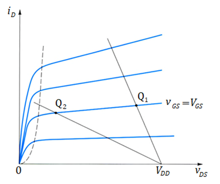
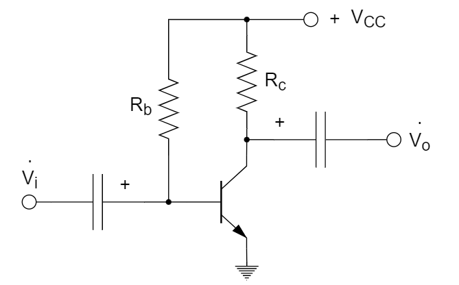
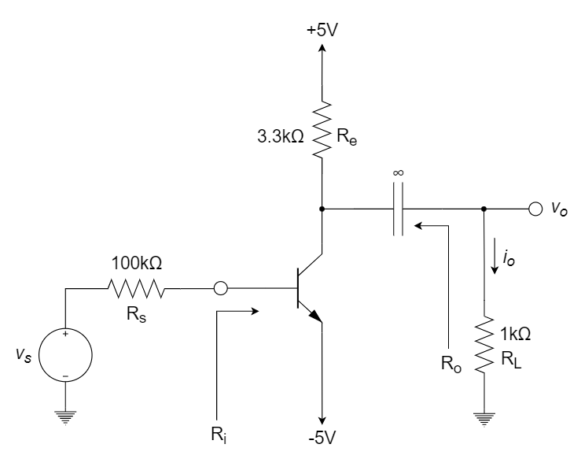
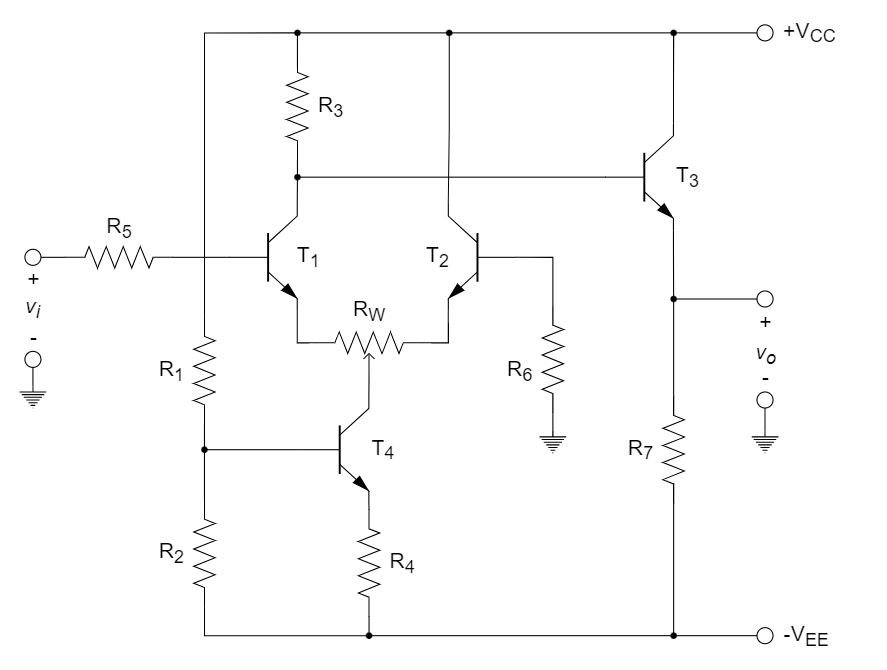
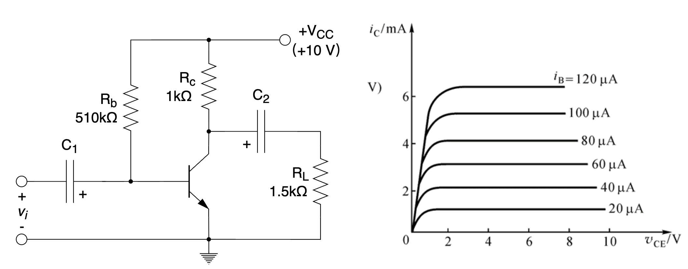
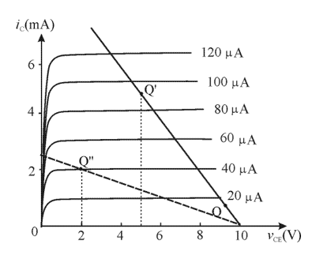

# 三极管

::: tip

三极管结构和原理、NPN与PNP、三极管的特性及等效电路模型、三极管放大电路分析计算（共射、共集、共基）。

:::

# 习题及参考解答

## 知识点1：三极管的结构与工作原理

1、三极管又称为双极型晶体管，因为 ________ 。

2、在放大区，晶体管的集电极电流是 ________ （少数/多数）载流子运动产生的。

3、一个pnp三极管工作在饱和区，则满足 ________ 。

A. 基极射极正偏，基极漏极正偏		B. 基极射极正偏，基极漏极反偏

C. 基极射极反偏，基极漏极正偏		D. 基极射极反偏，基极漏极反偏

4、测得某电路中处于放大状态的BJT的三个电极 A、B 和 C 的对地电位分别为

${V_A} =  - 9{\rm{ V}}$，${V_B} =  - 6{\rm{ V}}$，${V_C} =  - 6.7{\rm{ V}}$，分析 A、B 和 C 分别对应 BJT 三个极中的 ________ ，________ ， ________ ，可判断此 BJT 是 ________ 管（NPN或PNP）。

5、测得 NPN 型三极管上各电极对地电位分别为 ${V_E} =2.1{\rm{ V}}$，${V_B} = 2.8 {\rm{ V}}$，${V_C} = 4.4 {\rm{ V}}$ ，说明此三极管工作在 ________ 。

A. 放大区		B. 饱和区		C. 截止区		D. 反向击穿区

6、在某放大电路中，测得三极管三个电极的静态电位分别为 0 V、-10 V 和 -9.3 V，则这只三极管是 ________ 。

A. NPN 型硅管		B. NPN 型锗管		C. PNP 型硅管		D. PNP 型锗管

7、一个工作在放大区的 npn 三极管，需满足 ________ 。

A. 发射结正偏，集电结正偏		B. 发射结正偏，集电结反偏

C. 发射结反偏，集电结正偏		D. 发射结反偏，集电结反偏

8、已知某晶体管的各极对地电压分别是 $V_B=-6.3{\rm V}$，$V_E=-7{\rm V}$，$V_C=-4{\rm V}$，可以判断这个晶体管是 ________ 管，工作在 ________ 。

A. NPN管，饱和区		B. PNP管，放大区

C. PNP管，饱和区		D. NPN管，放大区

**参考解答**

1. 工作时电子和空穴两种载流子同时参与导电过程

2. 少数

3. A

4. 集电极      发射极      基极      PNP

5. A

6. A

7. B

8. D

   

## 知识点2：三极管的工作特性及其等效模型

1、为使高内阻信号源与低阻负载组成电路，可以在信号源与负载间接入 ________ 。

A. 共射电路		B. 共基电路		C. 共集电路		D. 共集-共基串联电路

2、不考虑管子的频率响应，求下列2个典型电路沿箭头方向的小信号等效电阻。

3、为实现电流的放大，同时电压基本不变，选择的单管放大器为 ________ 。

A. 共射放大电路				B. 共集放大电路

C. 共基放大电路				D. 前三种放大电路都行

4、直接耦合放大电路产生零漂的原因主要是 ________ 。

A. 电阻阻值有误差					B. 晶体管参数的分散性

C. 晶体管参数受温度影响		D. 受输入信号的变化影响

5、一个电压放大器的输入电阻越小，对信号源的影响则 ________ ；输出电阻越小，带负载的能力则越 ________ 。

A. 越大，越强		B. 越小，越强		C. 越大，越弱		D. 越小，越弱

6、如下图所示的放大电路以及晶体管的输出特性曲线、负载线，静态工作点 ________ 情况下最易产生截止失真，静态工作点 ________ 情况下最易产生饱和失真，静态工作点 ________ 情况下输出电压摆幅最大。

A. $Q_1$				B. $Q_2$				C. $Q_3$				D. $Q_4$ 

7、下图是某晶体管的输出特性曲线，说出图中 $Q_1$ 和 $Q_2$ 两个直流工作点的设置分别存在的问题。直流工作点 $Q_1$ 存在的问题是： ________ ；直流工作点 $Q_2$ 存在的问题是： ________ 。

**参考解答**

1. C
2. (b) $r_o + (1 + g_m r_o)(R_E // r_π)$  或  $(1 + g_m r_o)(R_E // r_π)$             (c) $r_π + (\beta + 1) R_E$ 
3. B
4. C
5. A
6. B      C      D
7. 易于截止或输出摆幅受限            易于进入变阻区或易于饱和或输出摆幅受限

## 知识点3：三极管放大电路的分析计算

1、如下图所示放大电路，其中 $R_b=470{\rm{kΩ}}$ ，$R_c=2{\rm{kΩ}}$，若已知 $I_C=1{\rm{mA}}$ ，$V_{CE}=7{\rm{V}}$，$V_{BE}=0.7{\rm{V}}$，$r_{be}=1.6{\rm{kΩ}}$，则说明 ________ 。

A. ${\dot A_V} = \frac{{{{\dot V}_o}}}{{{{\dot V}_i}}} = \frac{{{V_{CE}}}}{{{V_{BE}}}} = \frac{7}{{0.7}} = 10$ 

B. ${\dot A_V} = \frac{{{{\dot V}_o}}}{{{{\dot V}_i}}} = \frac{{ - {I_C}{R_c}}}{{{V_{BE}}}} = \frac{{ - 1 \times 2}}{{0.7}} \approx  - 3$ 

C. ${\dot A_V} = \frac{{{{\dot V}_o}}}{{{{\dot V}_i}}} = \frac{{ - {I_C}{R_c}}}{{{I_b}{R_i}}} =  - \beta \frac{{{R_c}}}{{{R_i}}} =  - \beta \frac{{{R_c}}}{{{R_b}{\rm{//}}{r_{be}}}} \approx  - 62.5$ 

D. ${\dot A_V} = \frac{{{{\dot V}_o}}}{{{{\dot V}_i}}} =  - \beta \frac{{{R_c}}}{{{r_{be}}}} \approx  - 62.5$ 

2、如下图所示，三极管 $Q_1$ 的 $I_S=5×10^{-15}{\rm{A}}$，300 K 时 $V_T≈26{\rm{mV}}$，

(1) 假如 $Q_1$ 处于正向放大区域时，$V_{BE}≈0.8{\rm{V}}$，请分别计算当输入电压 $V_{in}=0.7{\rm{V}}、0.6{\rm{V}}$ 时，流经 $Q_1$ 的电流值；

(2) 若流经 $Q_1$ 的电流只有 $I_1$ 的 1％，请估算此时的输入电压 $V_{in}$ 和输出电压 $V_{out}$ 。

3、如下图所示电路，已知 $V_{CC}=9{\rm V}$ ，假设晶体管的 $\beta$ 值非常大，此时 $R_E$ 和 $R_C$ 上的压降均为 $\frac{1}{3}V_{CC}$ ，$I_E=0.5{\rm mA}$ ，通过分压电阻 $R_1$ 、$R_2$ 的电流为 $0.2I_E$。求当晶体管的 $\beta=100$ 时，$I_E$ 的实际值。

4、电路如下图所示，$v_s$ 是均值为零的正弦波小信号，假设晶体管的 $\beta = 50$ ，计算电路的输入电阻 $R_{in}$ 和电压增益 $v_o/v_s$。若 $v_{be}$ 的信号振幅被限定在 5 mV 以内，则计算信号源信号的最大值 $v_{smax}$ 和输出信号的最大值 $v_{omax}$  （忽略  $r_{bb'}$  ）。

注：$V_T$ 可取 25 mV 或 26 mV，在不同题目中的选取不尽相同。

5、测量某放大电路负载开路时输出电压为 3 V，接入 $2 k\Omega$ 负载后，测得输出电压为 1 V，则该放大电路的输出电阻为 ________ 。

A. 0.5 k$\Omega$		B. 1.0 k$\Omega$		C. 2.0 k$\Omega$		D. 4.0 k$\Omega$

6、电路如下图所示，已知 $v_s$ 的直流分量为 0，假设晶体管 $\beta=120$，$V_T=25{\rm V}$，忽略 $r_o$，求发射极直流电流 $I_E$、输入电阻 $R_i$、输出电阻 $R_o$ 和电压增益 $v_o/v_s$。

7、电路如下图所示，晶体管 $\beta=100$ ，$r_{bb'}=0$ ，$V_T=25{\rm mV}$ ，$C_e=20{\rm \mu F}$ 。

(1)  计算电路的直流偏置，包括 $U_{BQ}$ 、$I_{EQ}$ 、$I_{BQ}$ 和 $U_{CEQ}$ ；

(2)  计算电压放大倍数 $A_u$ 、输入电阻 $R_i$ 和输出电阻 $R_o$ ；

(3)  电容 $C_e$ 对应的低频截止频率 $f_{LC_e}$ 。

8、已知一共射放大器工作在放大区，$\beta=100$，$I_C=1{\rm mA}$，集电极电阻 $R_C=5{\rm k \Omega}$，负载电阻 $R_L=5{\rm k \Omega}$，不考虑厄雷效应和基区电阻，则该共射放大器的小信号增益为 ________ V/V。（$V_T \approx 25{\rm mV}$）

9、放大电路如下图所示，已知：$V_{CC}=12{\rm V}$，$R_S=10{\rm k \Omega}$，$R_{B1}=120{\rm k \Omega}$，$R_{B2}=39{\rm k \Omega}$，$R_C=3.9{\rm k \Omega}$，$R_E=2.1{\rm k \Omega}$，$R_L=3.9{\rm k \Omega}$，$r_{bb'}=200{\rm \Omega}$，$\beta=50$， 电路中电容容量足够大，已知 $V_T=25{\rm mV}$ 。求：

(1)  静态工作点 $I_{BQ}$ 、$I_{CQ}$ 和 $V_{CEQ}$ 。

(2)  电压放大倍数 $A_v=v_o/v_i$ ，输入电阻 $R_i$ ，输出电阻 $R_o$ 。

10、有两个放大倍数相同的电压放大器 X 和 Y ，分别接入内阻非零的相同信号源。在输出端开路情况下，测得放大器 X 的输出电压较小，这说明放大器 X 的 ________ 。

A. 输入电阻大		B. 输入电阻小		C. 输出电阻大		D. 输出电阻小

11、分析下图所示电路，已知三极管的 $\beta=100$ ，当 $R_C$ 和 $R_B$ 阻值分别为 ________ 时，该三极管工作在放大区。

A. 5.6 kΩ，10 kΩ			B. 5.6 kΩ，510 kΩ			C. 5.6 kΩ，1 MΩ			D. 100 kΩ，1 MΩ

12、某放大电路负载开路时，输出电压 $v_o=6{\rm V}$ ，接入 6 kΩ 负载后，输出电压 $v_o=4{\rm V}$ ，说明该放大电路的输出电阻 $R_o=$  ________ 。

13、如下图所示放大电路，已知各晶体管的 $\beta=50$，$V_{BE}=0.7{\rm V}$，电阻 $R_1=150{\rm k \Omega}$，$R_3=7.8{\rm k \Omega}$，$R_4=R_7=2{\rm k \Omega}$，$R_5=R_6=1{\rm k \Omega}$，电位器 $R_W=200{\rm \Omega}$，且滑动端处于中间位置，电源电压 $V_{CC}=V_{EE}=10{\rm V}$。若要求静态时输出电压 $v_O=0{\rm V}$，问电阻 $R_2$ 应选多大？

14、某放大电路负载开路时，输出电压 $V_o=6{\rm V}$ ，接入 3 kΩ 负载后，$V_o=4{\rm V}$ ，说明该放大电路的输出电阻 $R_o=$  ________ 。如果该放大电路接 0.5 kΩ 的负载，输出电压 $V_o=$  ________ 。

15、由于射极跟随器引入了电压串联负反馈，因此电压放大倍数很小。但这种电路具有输入电阻 ________ （大/小）、输出电阻 ________ （大/小）的突出特点。

16、下图所示为共射放大电路及对应三极管的伏安特性图。

(1)	用图解法求出电路的静态工作点，并判断这个工作点选得是否合适？

(2)	在 $V_{CC}$、$R_{c}$ 和三极管参数不变的情况下，如何改变电阻 $R_b$ 使 $V_{CEQ}$ 提高到 $5 {\rm V}$ 左右？（电阻值近似取整）

(3)	在 $V_{CC}$ 和三极管参数不变的情况下，为了使 $I_{CQ}=2{\rm mA}$，$V_{CEQ}=2{\rm V}$，如何改变电路参数？（电阻值近似取整）

17、分析如下所示电路：

(1)	若 $R_B=100{\rm k \Omega}$，$R_C=1.5{\rm k \Omega}$，三极管 $\beta=80$，在静态时，三极管工作在 ________ 。

A. 放大状态			B. 饱和状态			C. 截止状态			D. 状态不定

(2)	若用直流电压表测得 ${V_{CE}} \approx {V_{CC}}$，有可能是因为 ________ 。

A. $R_B$ 开路			B. $R_L$ 短路			C. $R_C$ 开路			D. $R_B$ 过小

**参考解答**

1. D

2. 解：

   (1) $V_{in}=0.7{\rm{V}}$ ⇒ $V_{out}≈-0.1{\rm{V}}$ ⇒ 流经 $R_L$ 的电流为 12.5 mA ⇒ 流经 $Q_1$ 的电流为 20 mA；

   ​	 $V_{in}=0.6{\rm{V}}$ ⇒ $V_{out}≈-0.2{\rm{V}}$ ⇒ 流经 $R_L$ 的电流为 25 mA ⇒ 流经 $Q_1$ 的电流为 7.5 mA；

   (2) $I_{C1}≈0.01I_1=0.325{\rm{mA}}$ 

   ​	 $V_{in}=V_T\ln\frac{I_{C1}}{I_S}+(I_{C1}-I_1)R_L≈390{\rm{mV}}$ 

   ​	 $V_{out}≈-257{\rm{mV}}$ 

3. 解：

   ​	 ${V_C} = {\rm{6V}},{V_E} = {\rm{3V}},{I_E} = {\rm{0}}{\rm{.5mA}}$ 
   ​	 $\therefore {R_E} = \frac{3}{{0.5}} = {\rm{6 k}}\Omega$ 

   ​	 当 $\beta$ 非常大时，${I_C} = {I_E}$ 

   ​	 $\therefore {R_C} = {\rm{6 k}}\Omega$ 

   ​	 $I = 0.2{I_E} = {\rm{0}}{\rm{.1 mA}}$ 

   ​	 $\therefore {R_1} + {R_2} = 90{\rm{ k}}\Omega$ 

   ​	 而 ${R_2}I = 3 + 0.7$ 

   ​	 得到 ${R_2} = {\rm{37 K}}\Omega$ 

   ​	 $\therefore {R_1} = {\rm{53 K}}\Omega$ 

   ​	 ${I_B} \times {R_1}\parallel {R_2} + 0.7 + {I_E} \times 6 = {\rm{3}}{\rm{.7 V}}$ 

   ​	 得到 ${I_E} \approx {\rm{0}}{\rm{.48 mA}}$ 

4. 解：

   ​	 $\beta=50$		$\alpha=0.98$ 

   ​	 ${I_E} = {\rm{0}}{\rm{.2mA}}$		${I_C} = \alpha {I_E} = 0.1{\rm{96mA}}$ 

   ​	 ${r_\pi } = \frac{{\beta {V_T}}}{{{I_C}}} = \frac{{50 \times 0.026}}{{0.196}} \approx 6.63{\rm{K\Omega }}$ 

   ​	 $\therefore {R_{in}} = {r_\pi } + (1 + \beta ) \cdot 0.125 = 6.63 + 6.38 \approx 13.01{\rm{K\Omega }}$ 

   ​	 ${A_{vs}} =  - \frac{{\beta {R_C}\left\| {{R_L}} \right.}}{{{R_S} + {R_{in}}}} = \frac{{ - 50 \times 5}}{{10 + 13.01}} \approx  - 10.86{\rm{V/V}}$ 

   ​	 ${v_{s\max }} = \frac{{{v_{be}}}}{{{r_\pi }}} \times ({R_S} + {R_{in}}) = \frac{5}{{6.63}} \times (10 + 13.01) \approx 17.35{\rm{mV}}$ 

   ​	 ${v_{o\max }} = {v_{s\max }} \cdot {A_{vs}} \approx 188.42{\rm{mV}}$ 

5. D

6. 解：

   ​	 $\frac{{{I_E}}}{{121}} \times 100 + 0.7 + 3.3{I_E} = {\rm{5}}$ 

   ​	 $\therefore {I_E} \approx {\rm{1}}{\rm{.04 mA}}$ 

   ​	 ${r_e} = \frac{{{V_T}}}{{{I_E}}} \approx 24{\rm{ }}\Omega$ 

   ​	 ${R_i} = (1 + \beta )({r_e} + {R_e}//{R_L}) \approx 95.76{\rm{ k}}\Omega$ 

   ​	 ${R_o} = {R_e}{\rm{//}}\left( {{r_e} + \frac{{{R_S}}}{{1 + \beta }}} \right) \approx {\rm{0}}{\rm{.676 k}}\Omega$ 

   ​	 ${A_v} = \frac{{{v_o}}}{{{v_s}}} = \frac{{3.3{\rm{//}}1}}{{\frac{{{R_S}}}{{1 + \beta }} + {r_e} + 3.3{\rm{//}}1}} \approx 0.47$ 

7. 解：

   (1)  静态分析：

   ​	  ${U_{BQ}} \approx \frac{{{R_{b1}}}}{{{R_{b1}} + {R_{b2}}}}{V_{CC}} = \frac{5}{{5 + 25}} \times 12 = 2{\rm{V}}$ 

   ​	  ${I_{EQ}} = \frac{{{U_{BQ}} - {U_{BE}}}}{{{R_f} + {R_e}}} = \frac{{2 - 0.7}}{{0.3 + 1}} = 1{\rm{mA}}$ 

   ​	  ${I_{BQ}} = \frac{{{I_{EQ}}}}{{\beta  + 1}} \approx 0.01{\rm{mA}}$ 

   ${U_{CEQ}} = {V_{CC}} - {I_{CQ}}{R_c} - {I_{EQ}}\left( {{R_f} + {R_e}} \right) \approx {V_{CC}} - {I_{EQ}}\left( {{R_c} + {R_f} + {R_e}} \right) = 12 - 1 \times (5+0.3+1)=5.7{\rm V}$

    (2) 动态分析：

   ​	  ${r_{be}} = {r_\pi } = \frac{{{V_T}}}{{{I_{BQ}}}} = \frac{{25}}{{0.01}} \times \frac{1}{{1000}} = 2.5{\rm{k}}\Omega$ 

   ​	  ${A_u} =  - \frac{{\beta \left( {{R_c}{\rm{//}}{R_L}} \right)}}{{{r_\pi } + \left( {\beta  + 1} \right){R_f}}} =  - \frac{{100 \times \left( {{\rm{5//5}}} \right)}}{{2.5 + 101 \times 0.3}} \approx  - 7.6$ 

   ​	  ${R_i} = {R_{b1}}{\rm{//}}{R_{b2}}{\rm{//}}\left[ {{r_\pi } + \left( {\beta  + 1} \right){R_f}} \right] = 5{\rm{//}}25{\rm{//}}\left( {2.5 + 101 \times 0.3} \right) \approx 3.7{\rm{k}}\Omega$ 

   ​	  ${R_o} = {R_c} = 5{\rm{k}}\Omega$ 

   (3)  ${R_{Ce}} = {R_e}{\rm{//}}\left( {{R_f} + \frac{{{r_\pi } + {R_{b1}}{\rm{//}}{R_{b2}}}}{{\beta  + 1}}} \right) = 1{\rm{//}}\left( {0.3 + \frac{{2.5 + 5{\rm{//}}25}}{{101}}} \right) \approx 0.268{\rm{k}}\Omega$ 

   ​	  ${f_{LCe}} = \frac{1}{{2\pi {R_{Ce}}{C_e}}} = \frac{1}{{2\pi  \times 0.268 \times 20}} \times 1000 \approx 29.7{\rm{Hz}}$ 

8. $-100$

9. 解：

   (1)  ${V_B} = \frac{{{R_{B2}}}}{{{R_{B1}} + {R_{B2}}}} \times {V_{CC}} = \frac{{39}}{{120 + 39}} \times 12 \approx 2.9{\rm{V}}$ 

   ​	  ${V_E} = {V_B} - {V_{BE}} = 2.9 - 0.7 = 2.2V$ 

   ​	  ${I_{CQ}} \approx {I_{EQ}} = \frac{{{V_E}}}{{{R_E}}} = \frac{{2.2}}{{2.1}} \approx 1.05{\rm{mA}}$ 

   ​	  ${I_{BQ}} = \frac{{{I_{EQ}}}}{\beta } = \frac{{1.05}}{{50}} \approx 0.0{\rm{2mA}}$ 

   ​	  ${V_{CEQ}} = {V_{CC}} - \left( {{R_C} + {R_E}} \right) \times {I_C} = 12 - \left( {3.9 + 2.1} \right) \times 1.05 = 5.7{\rm{V}}$ 

   ​	  ${r_{be}} = {r_{bb'}} + (\beta  + 1) \times \frac{{{V_T}}}{{{I_C}}} \approx 1.4{\rm{k\Omega }}$ 

   (2)  ${A_v} =  - \frac{{\beta ({R_C}{\rm{//}}{R_L})}}{{{r_{be}}}} \approx \frac{{ - 50 \times (3.9{\rm{//}}3.9)}}{{1.4}} \approx  - 70$ 

   ​	  ${R_i} = {R_{B1}}//{R_{B2}}//{r_{be}} \approx 120//39//1.4 \approx 1.3{\rm{k\Omega }}$ 

   ​	  ${R_O} = {R_C} = 3.{\rm{9k\Omega }}$ 

10. B

11. C

12. 3 kΩ

13. 解：

    若要求静态时，$v_O=0{\rm V}$，则

    ​		$I_{E3}=\frac{v_o-(-V_{EE})}{R_7}=\frac{0{\rm V}-(-10{\rm V})}{2{\rm k \Omega}}=5{\rm mA}$ 

    ​		$I_{B3}=\frac{I_{C3}}{\beta} \approx \frac{I_{E3}}{\beta}=\frac{5{\rm mA}}{50}=0.1{\rm mA}$ 

    ​		$I_{R_3}=\frac{V_{CC}-V_{BE3}}{R_3}=\frac{10{\rm V}-0.7{\rm V}}{7.8{\rm k \Omega}} \approx 1.2{\rm mA}$ 

    ​		$I_{C1}=I_{R_3}-I_{B3}=1.2{\rm mA}-0.1{\rm mA}=1.1{\rm mA}$ 

    ​		$I_{E4} \approx I_{C4} \approx {I_{C1}}+I_{C2}=2I_{C1}=2.2{\rm mA}$ 

    电阻 $R_2$ 两端电压：

    ​		$V_{R_2}=V_{BE4}+I_{E4}R_4=0.7{\rm V}+2.2{\rm mA} \times 2{\rm k \Omega}=5.1{\rm V}$ 

    另一方面：

    ​		$V_{R_2} \approx [V_{CC}-(-V_{EE})]\frac{R_2}{R_1+R_2}=2V_{CC}\cdot \frac{R_2}{R_1+R_2}$ 

    解出

    ​		$R_2=\frac{R_1V_{R_2}}{2V_{CC}-V_{R_2}}=\frac{150{\rm k \Omega} \times 5.1{\rm V}}{2 \times 10{\rm V}-5.1{\rm V}} \approx 51.3{\rm k \Omega}$ 

14. 1.5 kΩ      1.5 V

15. 大      小

16. 解：

    (1)	${I_B} = \frac{{10 - 0.7}}{{510}} = 18.2\mu {\rm{A}}$ 

    ​		由图可知：基极电流太小，静态工作点不合适。

    

    (2)	为了把三极管的集电极电压 $V_{CEQ}$ 提高到 $5{\rm V}$ 左右。

    ​		${I_C} = \frac{{{V_{CC}} - {V_{CEQ}}}}{{{R_c}}} = \frac{{10 - 5}}{{10}} = 5{\rm{ mA}}$ 

    ​		可将静态工作点设置在 $Q'$ 点，取 $R_b=100{\rm k \Omega}$ ，使 $I_B=90{\rm \mu A}$。

    (3)	应将静态工作点设置在 $Q''$ 点

    ​		${R_c} = \frac{{{V_{CC}} - {V_{CEQ}}}}{{{I_{CQ}}}} = \frac{{10 - 2}}{2} = 4{\rm{ k}}\Omega$ 

    ​		${R_b} = \frac{{{V_{CC}} - {V_{BEQ}}}}{{{I_{BQ}}}} = \frac{{10 - 0.7}}{{40 \times {{10}^{ - 3}}}} \approx 233{\rm{ k}}\Omega$ 

    ​		$R_c$ 可以取 $4{\rm k \Omega}$ ，$R_b$ 可以取 $240{\rm k \Omega}$ 

17. B      A