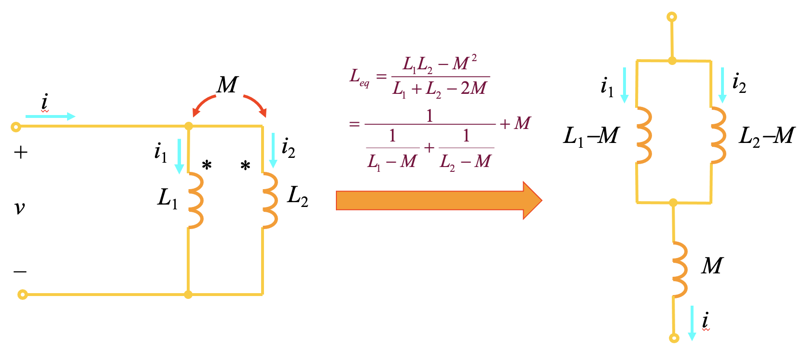
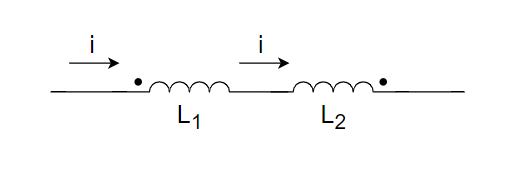
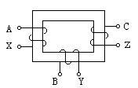
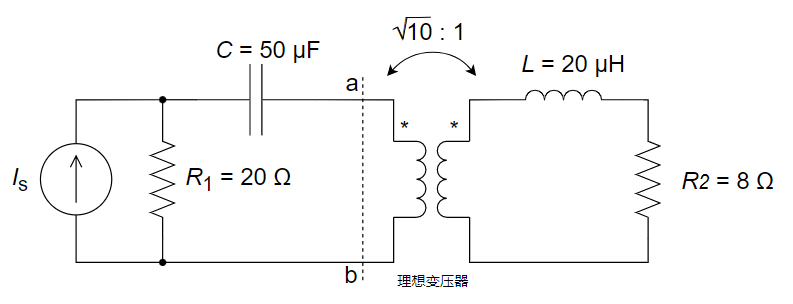
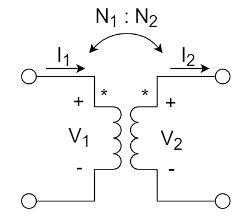
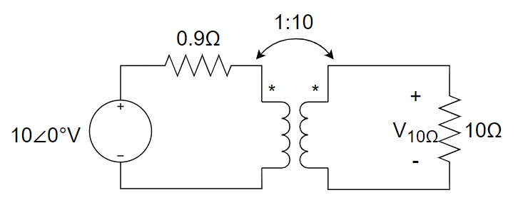
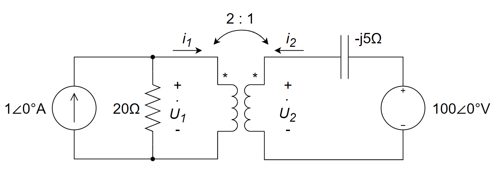
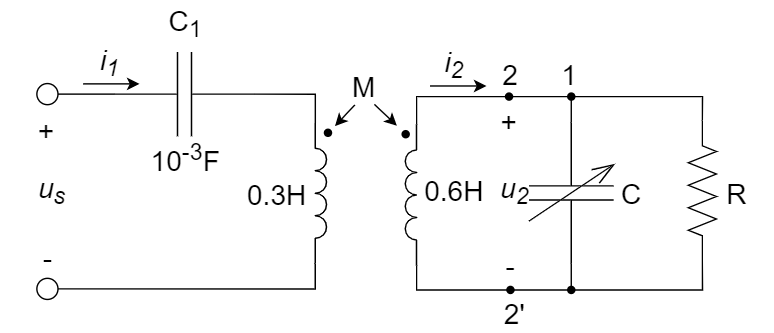
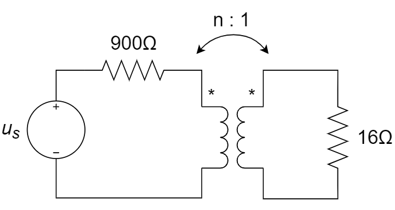
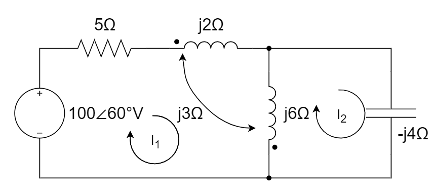

# 磁耦合电路

::: tip

1. 互感：电感对临近电感产生感应电压降的能力；自感：电感自身的电感量

   * 线圈 $L_1$ 和 $L_2$ 临近，在线圈 $L_1$ 上施加电流 $i_1$， 则线圈 $L_1$ 自身的电压降为 $v_{11} = L_1 \frac{di_1}{dt}$，同时因$L_1$留经电流后产生的磁通量有部分耦合到线圈$L_2$ ，线圈$L_2$上会产生感应电压降 $v_{21} = M_{21} \frac{di_1}{dt}$，其中 $M_{21}$定义为线圈1对线圈2的互感系数；
   * 同样，有线圈2对线圈1的互感系数 $M_{12}$，因互易性， $M_{12} = M_{21} = M \leq \sqrt{L_1 L_2}$
   * $M$ 与线圈的形状、几何位置、空间媒质有关，与线圈中的电流无关（电感 $L$  也与流经的电流无关）
   * $L$ 值始终为正，但 $M$ 值可正可负
   * 只有变化的电流才能产生互感电压
   * 耦合系数定义：$k \triangleq \frac{M}{\sqrt{L_1 L_2}} \leq 1$

2. 同名端：电感的绕向影响感应电压的方向，为了解决这个问题，引入同名端的概念

   * 当两个电流分别从两个线圈的对应端子同时流入或流出，若所产生的磁通相互加强时，则这两个对应端子称为两互感线圈的同名端；

   * 电流从线圈1的同名端流进，线圈2的感应电压﹢定义在同名端，则$M$值为正，否则$M$值为负，如下所示

     

   * 顺接串联等效电感：$L = L_1 + L_2 + 2M$

   * 反接串联等效电感：$L = L_1 + L_2 - 2M$

   * 同侧并联等效电感：$L = \frac{L_1 L_2 - M^2}{L_1 + L_2 - 2M}$，也可以用等效电路理解：

   

   *  异侧并联等效电感：$L = \frac{L_1 L_2 - M^2}{L_1 + L_2 + 2M} = \frac{L_1 L_2 - (-M)^2}{L_1 + L_2 - 2(-M)}$ ，即，**异侧并联相当于$M$用$-M$ 替代**          
   * 若非串并联，需要单独分析流经每个电感的电流对其他电感的贡献，同名则增强，非同名则减弱

3. 互感耦合电路的分析

   * 去耦方法，如上面同名端定义所述，电流从同名端流入，则在另一侧相应的同名端同向串联感应电压源

     

4. 理想变压器

   * 理想变压器的三个理想化条件：无损耗、全耦合、自感和互感值无限大（用匝数比替代互感电路的自感互感值）

   * 理想变压器的电压电流约束关系如下，注意①电压﹢定义在同名端；②电流对同名端“一进一出”，同时满足①和②则比值为正，否则比值为负

     

   * 阻抗变换：按匝数比的平方缩放， $Z_{in} = \frac{V_1}{I_1} = \frac{1}{n^2} \frac{V_2}{V_1} = \frac{Z_L}{n^2}$

:::

# 习题及参考解答

## 知识点1： 互感概念及计算

1、下图所示存在互感的电感串联后的总电感是 ________ 。

A.	$L = L_1 + L_2 - 2M$			B.	$L = L_1 + L_2 - M$

C.	$L = L_1 + L_2 + M$		 	D.	$L = L_1 + L_2 + 2M$

2、下图所示串联电路中的互感元件的耦合系数为 ________ 。

3、两互感线圈的耦合系数 $k$ = ________ 。

A. $\frac{\sqrt{M}}{L_1L_2}$ 		B. $\frac{M}{\sqrt{L_1L_2}}$ 		C. $\frac{M}{L_1L_2}$ 		D. $M\sqrt{\frac{L_1}{L_2}}$ 

4、两互感线圈同侧并联时，其等效电感量为 ________ 。

A. $\frac{L_1L_2-M^2}{L_1+L_2-2M}$ 		B. $\frac{L_1L_2-M^2}{L_1+L_2+2M^2}$ 		C. $\frac{L_1L_2-M^2}{L_1+L_2-M^2}$ 		D. $\frac{L_1L_2-M^2}{L_1+L_2+M^2}$ 

5、两互感线圈的电感量分别为 0.5 H 和 2 H ，耦合系数 $k$ 为 0.8，则互感系数为 ________ 。

6、如右图所示电路，电流 $i_1$ 激励下的互感电压 $v_{21}$ 的正确表达式是 ________ 。

A. $v_{21}=-M\frac{di_1}{dt}$ 		B. $v_{21}=M\frac{di_1}{dt}$ 		C. $v_{21}=-M\frac{di_2}{dt}$ 		D. $v_{21}=M\frac{di_2}{dt}$ 

7、计算如下3个串联电感的去耦总电感.

8、两个存在互感的线圈的耦合系数与 ________ 无关。

A. 线圈的形状						B. 线圈的几何位置

C. 线圈中流过的电流			D. 线圈的空间媒质

9、已知 $L_1=4{\rm H}$，$L_2=2{\rm H}$，$L_3=1{\rm H}$，$M_{21}=2{\rm H}$，$M_{32}=1{\rm H}$，求该一端口电路的等效电感。

**参考解答**

1. A

2. 0.2

3. B

4. A

5. 0.8H

6. A

7. 解：

   $L_1=8H,L_2=10H,L_3=6H,M_1=3H,M_2=3H,M_3=2H$ 

   $L_1$ 与 $L_2$ ，$L_1$ 与 $L_3$ 不是同名端，$L_2$ 与 $L_3$ 互为同名端

   那么三个串联电感的总电感量为：

   $L=L_1+L_2+L_3-2M_1+2M_2-2M_3=20H$ 

8. C

9. 解：

   在端口施加一外接正弦信号 $U$，为上正下负；设两个小回路的电流分别为 $I_1$ 和 $I_2$，为顺时针方向。

   列网孔电流方程如下

   $\begin{cases}	-U+j\omega(L_1+L_3)I_1-j\omega L_3I_2+j\omega M_{21}I_2+j\omega M_{32}I_2=0 \\ j\omega (L_2+L_3)I_2-j\omega L_3I_1-j\omega M_{32}I_2+j\omega M_{21}I_1=0	\end{cases}$ 

   代入计算得到：$I_2=-\frac{1}{2}I_1$，$U=4j\omega I_1$ 

   因此该端口电路的等效电感为 $L_{eq}=\frac{U}{j\omega I_1}=4{\rm H}$ 

   

## 知识点2： 同名端的判别

1、下图所示电路中同名端为 ________ 。

A.（A、B、C）		B.（B、Y、C）		C.（A、Y、Z）		D.（A、B、Z）

**参考解答**

1. C

## 知识点3：含变压器电路的分析计算

1、电路如下图所示。

​	①试选择合适的匝数比使传输到负载上的功率达到最大；

​	②求1Ω负载上获得的最大功率。

2、右图所示电路ab端的输入阻抗为 ________ 。

A. 12 - j10 (Ω)			B. 12 (Ω)

C. 10 - j12 (Ω)			D. - j10 (Ω)

3、理想变压器次级线圈上的阻抗如下图所示，若正弦电流源为 $i_s=10\sqrt{2}\cos(10000t)(A)$ ，试求：

​	(1) 从ab端看变压器二端的等效阻抗；

​	(2) 电阻 $R_2$ 的功耗。

4、对于理想变压器，根据下图所示电流电压方向，正确的关系为 ________ 。

A. $\frac{V_2}{V_1}=\frac{N_2}{N_1},\frac{I_2}{I_1}=\frac{N_1}{N_2}$ 			B. $\frac{V_2}{V_1}=\frac{N_2}{N_1},\frac{I_2}{I_1}=-\frac{N_1}{N_2}$ 

C. $\frac{V_2}{V_1}=-\frac{N_2}{N_1},\frac{I_2}{I_1}=\frac{N_1}{N_2}$ 		D.  $\frac{V_2}{V_1}=-\frac{N_2}{N_1},\frac{I_2}{I_1}=-\frac{N_1}{N_2}$

5、如下图包含理想变压器的电路中，求 10 Ω 电阻上的电压 $V_{10Ω}$ 。

6、见下图所示的正弦稳态电路，用叠加定理求电压相量 $\vec{U_1}$ 与 $\vec{U_2}$ ，并求电流源发出的复功率。（图中所有极坐标形式表示的极轴长均为电压或电流的有效值）

7、见下图所示电路，负载阻抗为何值时其输出功率最大，最大功率为多少？

8、已知一个正弦交流电源的开路电压 $U_s=300V$（有效值），内阻 $R=10Ω$ ，负载电阻 $R_L=90Ω$ 。为了使负载获得最大功率，在电源和负载之间接入一个理想变压器。求变压器的匝数比 $n=N_1/N_2$ 、负载的端电压，以及通过负载的电流。

9、已知下图所示电路中 $M=0.2H,R=10Ω,u_s=100\sqrt{2}\cos(100t-30°)V$ ，$C$ 可变动。试求 $C$ 为何值时，$R$ 可获得最大功率？并求出最大功率。

10、如下图中所示电路，欲使 16 Ω负载获得最大功率，则其中理想变压器的匝数比应为 ________ 。

**参考解答**

1. 解：

   方法一：

   设 $U_1$ 和 $U_2$ ，$I_1$ 和 $I_2$ ，则有：
   $$
   \begin{cases}
   100∠0°=I_1*10^4+U_1 \\
   U_2=I_2*1 \\
   I_2:I_1=U_1:U_2=1:n
   \end{cases}
   $$
   解得 $n=0.01$

   方法二：

   根据阻抗变换，$n=0.01$ 时获得最大功率传输；

   理想变压器不损耗功率，所以$P=\frac{100^2}{8 \cdot 10^4}=0.125 W$ 

2. A

3. (a) $Z_{ab}=n^2(R_2+jwL)=(\sqrt{10})^2×(8+j10^4×20×10^{-6})=(80+j2)Ω$ 

   (b) $\vec{I_1}=\frac{R_1}{R_1+\frac{1}{jwC}+n^2(jwL+R_2)}\vec{I_s}=\frac{20}{20-j2+j2+80}×10\sqrt{2}∠0°=2\sqrt{2}∠0°A$ 

   ​	 $\vec{I_2}=n\vec{I_1}=2\sqrt{20}∠0°$ 

   ​	 $P=\frac{1}{2}I_2^2R_2=\frac{1}{2}×(2\sqrt{20})^2×8=320W$ 

4. A

5. 解：

   (1) 方法一：

   

   对于回路1：$10=0.9I_1+V_1$ 

   对于回路2： $V_2=10I_2$ 

   对于理想变压器，有：$V_2=10V_1,I_1=10I_2$ 

   解得：$I_1=10A,I_2=1A,V_1=1V,V_2=10V$ 

   故而 $V_{10Ω}=V_2=10V$ 

   (1) 方法二：

   将次级负载折算到初级线圈，求出初级电流为 10A ，然后根据理想变压器电压电流比例关系，写出 V~10Ω~ = 10 V。

6. 解：

   电流源单独作用时： $\vec{U_1}^{'}=1 \times 20||(-j20)=(10-j10)V,\vec{U_2}^{'}=(5-j5)V$ 

   电压源单独作用时： $\vec{U_2}^{''}=100×\frac{5}{5-j5}=(50+j50)V,\vec{U_1}^{''}=(100+j100)V$ 

   $∴\vec{U_1}=\vec{U_1}^{'}+\vec{U_1}^{''}=(110+j90)V,\vec{U_2}=\vec{U_2}^{'}+\vec{U_2}^{''}=(55+j45)V$ 

   $⇒\vec{S}=(1∠0°A)×\vec{U_1}=(110+j90)VA$ 

7. 解：

   根据最大功率传输定理,

   当 $Z_L=[5^2×(1+j)]^*=(25-j25)Ω$ 时，负载的输出功率最大

   此时 $P_{Lmax}=\frac{1}{2}×(\frac{1}{5}·\frac{5∠0°}{1+j+\frac{1}{5^2}Z_L})^2Z_{L-Re}=\frac{25}{8}W$ （从负载侧算）；也可以从源测算$P_{Lmax} = \frac{5^2}{8\times 1} = \frac{25}{8}$

8. 解：

   因为理想变压器不消耗能量，所以电源输给变压器的功率就等于负载吸收的功率。

   当理想变压器入端电阻 $R^{'}=R=10Ω$ 时，负载吸收最大功率。

   根据变压器的阻抗变换公式

   ​		$n^2=\frac{R^{'}}{R_L}=\frac{10}{90}=\frac{1}{9}$ 

   即理想变压器匝数比 $n=\frac{N_1}{N_2}=\frac{1}{3}$ 时，负载获得的功率最大。

   此时变压器原线圈电流

   ​		$I_1=\frac{U_s}{R+R^{'}}=\frac{300}{20}=15A$ 

   通过负载的电流

   ​		$I_2=nI_1=\frac{15}{3}=5A$ 

   负载端电压

   ​		$U_2=I_2R_L=5×90=450V$ 

9. 解：

   端口 2 - 2' 用电压源 $\vec{U_2}$ 替代，则网孔方程

   ​		$\begin{cases} (jwL_1-j\frac{1}{wC_1})\vec{I_1}-jwM\vec{I_2}=\vec{U_s} \\-jwM\vec{I_1}+jwL_2\vec{I_2}=-\vec{U_2} \end{cases}$ 

   解得：$\vec{I_2}=\frac{1}{j40}\vec{U_s}-\frac{1}{j40}\vec{U_2}$ 

   诺顿等效电路的参数为：

   ​		$\begin{cases} \vec{I_{sc}}=\frac{1}{j40}\vec{U_s}=2.5∠-120°A \\ Y_{eq}=\frac{1}{j40}=-j0.025S \end{cases}$ 

   显然，在电路端口 2 - 2‘ 并联接入 RC 电路后，端电压 $\vec{U_{22'}}$ 最大时，R 获最大功率，其实现条件为

   ​		$\omega C=0.025⇒C=\frac{0.025}{w}=\frac{0.025}{100}F=250μF$ 

   此时，$Y_{eq}+j\omega C=0$ ，$\vec{I_{sc}}$ 全部流入 R，其最大功率应当为

   ​		$P_{max}=(I_{sc})^2R=62.5W$ 

   只有当 $Y_{eq}$ 为感性时，才有实现的可能。

10. 7.5

   

## 知识点4： 互感耦合电路的分析

1、用网孔电流法列下图所示电路的回路方程，线圈$L_1$和$L_2$之间的互感为$M$（列写下图所示电路的网孔电流方程）。

2、列写下图所示电路的网孔电流方程。

3、右图所示电路中的输出电压 $\vec{V_o}=$ ________ 。

4、在下图所示电路中，已知 $R = 2\ohm$，$L_1 = 1$ H，$L_2 = 5$ H，$M = 2$ H，$v_s = 10$ V，当 $t = 0$ 时开关 S 闭合，求零状态响应 $i_o、v_o、i_1和i_2$ 。

5、用网孔电流法求如下电路中的支路电流 $\vec{I_o}$ ，列写网孔电流方程并化简（不需要求解）。

6、求下图中 $I_1$ 和 $I_2$ 的向量表达式。

7、电感耦合电路如图所示。$L_1=L_2=2{\rm H}$，$M=1{\rm H}$，$C=1{\rm F}$，$R_1=R_2=1{\Omega}$，$u_s(t)=100\cos(t+15°){\rm V}$，求电源提供的有功功率。

**参考解答**

1. 解

   列网孔电流方程如下:
   $$
   \begin{cases}
   (R_1+R_2+jwL_1)\vec{I_1} - R_1\vec{I_2} - R_2\vec{I_3} - jwM(\vec{I_2}-\vec{I_3})=0 \\
   -R_1I_1 + (R_1 + jwL_2)\vec{I_2} - jwL_2\vec{I_3} - jwM\vec{I_1}=\vec{V_s} \\
   -R_2\vec{I_1} - jwL_2\vec{I_2} + (jwL_2 + R_2 + R_3)\vec{I_3} + jwM\vec{I_1}=0
   \end{cases}
   $$

2. 解：

   设三个网孔的电流分别为 $\vec{{I_1}}$ 、$\vec{{I_2}}$ 和 $\vec{{I_3}}$，电流方向为顺时针方向。

   列网孔电流方程如下：
   $$
   \begin{cases}
   (R_1+jwL_1)\vec{{I_1}}-jwL_1\vec{{I_3}}+jwM(\vec{{I_2}}-\vec{{I_3}})=-\vec{{V_s}} \\
   (R_2+jwL_2)\vec{{I_2}}-jwL_2\vec{{I_3}}+jwM(\vec{{I_1}}-\vec{{I_3}})=k\vec{{I_1}} \\
   (jwL_1+jwL_2+\frac{1}{jwC})\vec{{I_3}}-jwL_1\vec{{I_1}}-jwL_2\vec{{I_2}}+jwM(\vec{{I_3}}-\vec{{I_1}})+jwM(\vec{{I_3}}-\vec{{I_2}})=0
   \end{cases}
   $$

3. 21.962∠37.7° V

   

4. 解：

   根据题意 $i_o(0_+)=i_o(0_-)=0$ 

   等效去耦电感 $L_{eq}=\frac{L_1L_2-M^2}{L_1+L_2-2M}=0.5H$ 

   $L_{eq}\frac{di_o}{dt}+Ri_o=u_s$ 

   $\frac{1}{2}\frac{di_o}{dt}+2i_o=10$ 

   通解 $i_{oh}=Ke^{-4t}A$ ，根据初始条件，可得 $K=5$ 

   特解 $i_{op}=\frac{u_s}{R}=5A$ 

   故有 $i_o=5(1-e^{-4t})ε(t)A$ 

   根据 KVL 可得： $v_o=v_s-Ri_o=10e^{-4t}ε(t)V$ 

   由电路有 $L_1\frac{di_1}{dt}+M\frac{di_2}{dt}=M\frac{di_1}{dt}+L_2\frac{di_2}{dt}$ 

   得 $\frac{di_1}{dt}=-3\frac{di_2}{dt}$ 

   根据 KCL， $i_o=i_1+i_2$ 

   $\frac{di_o}{dt}=\frac{di_1}{dt}+\frac{di_2}{dt}$ 

   $20e^{-4t}=-2\frac{di_2}{dt}$ 

   由于 $i_2(0)=0$ ，得：$i_2=\int_{0}^{t}-10e^{-4t}dt=-2.5(1-e^{-4t})ε(t)A$ 

   $∴i_1=i_o-i_2=7.5(1-e^{-4t})ε(t)A$ 

   

5. 解：
   $$
   \begin{cases}
   \vec{I_o}(-j50+j60+j40-j20×2)-\vec{I_1}(j60-j20-j30+j10)-\vec{I_2}(j40-j20-j10+j30)=0 \\
   \vec{I_1}(j60+100+j80-j30×2)-\vec{I_0}(j60-j20-j30+j10)-\vec{I_2}(j80-j30-j10+j20)=0 \\
   \vec{I_2}(j40+j80-j10×2)-50-\vec{I_1}(j80-j10-j30+j20)-\vec{I_0}(j40-j20-j10+j30)=0
   \end{cases}
   $$

   $$
   ⇒
   \begin{cases}
   j10\vec{I_o}-j20\vec{I_1}-j40\vec{I_2}=0 \\
   -j20\vec{I_o}+(100+j80)\vec{I_1}-j60\vec{I_2}=0 \\
   -j40\vec{I_o}-j60\vec{I_1}+j100\vec{I_2}=50
   \end{cases}
   ⇒
   \begin{cases}
   \vec{I_o}-2\vec{I_1}-4\vec{I_2}=0 \\
   -j\vec{I_o}+(5+j4)\vec{I_1}-j3\vec{I_2}=0 \\
   -j4\vec{I_o}-j6\vec{I_1}+j10\vec{I_2}=5
   \end{cases}
   $$

   得出：$\vec{I_o}=3.199∠-175.2°A$ 

6. 解：

   列网孔电流方程如下

   $\begin{cases}	-100\angle60°+(5+j2+j6)I_1-j6I_2 +j3I_2-j3I_1=0 \\ (j6-j4)I_2-j6I_1 +j3I_1=0	\end{cases}$ 

   解得：

   $\begin{cases}	I_1=19.90\angle54.29°{\rm A} \\ I_2=29.85\angle54.29°{\rm A}	\end{cases}$ 

7. 解：

   设两回路的电流依次为 $I_1$ 和 $I_2$ ，列网孔电流方程如下

   $\begin{cases}		-u_s+(R_1+j\omega L_1+\frac{1}{j\omega C})I_1-\frac{1}{j\omega C}I_2-j\omega MI_2 = 0 \\ (R_2+\frac{1}{j\omega C}+j\omega L_2)I_2-\frac{1}{j\omega C}I_1-j\omega MI_1 = 0	\end{cases}$ 

   其中，$\omega=1$ 

   电源提供的有功功率为 $P_{Av}=\frac{1}{2}{\rm real}(u_s\times I_1)$

   解得：

   $I_1=\frac{u_s}{1+j}=\frac{100\angle15°}{1+j}=50\sqrt{2}\angle-30°{\rm A}$

   $I_2=0{\rm A}$

   电源提供的有功功率为

   $P_{Av}={\rm real}(u_s\times I_1)={\rm real}(5000\sqrt{2}\angle-15°)=6.83{\rm kW}$

   

   

## 知识点5： 其他

1、以下对于理想变压器的描述，________ 是不正确的。

A. 输入功率等于输出功率         			  B.  互感和自感系数无穷大

C. 初级电流随次级电流增大而减小		D.能同时改变交变信号的电压和电流

2、理想变压器初级与次级的匝数比 $N_1:N_2=10:1$ ，那么 $V_2:V_1=$ ________ ，$I_2:I_1=$ ________  。

**参考解答**

1. C
1. 1:10      10:1