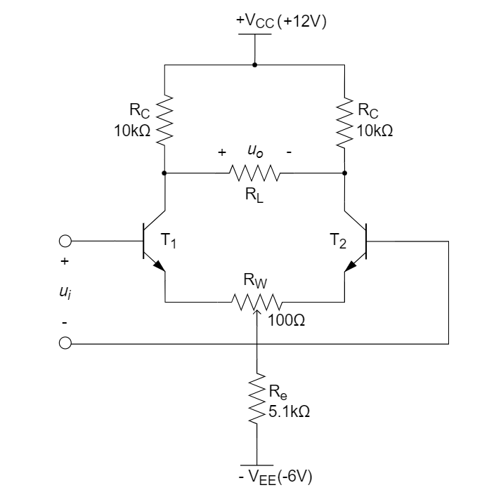
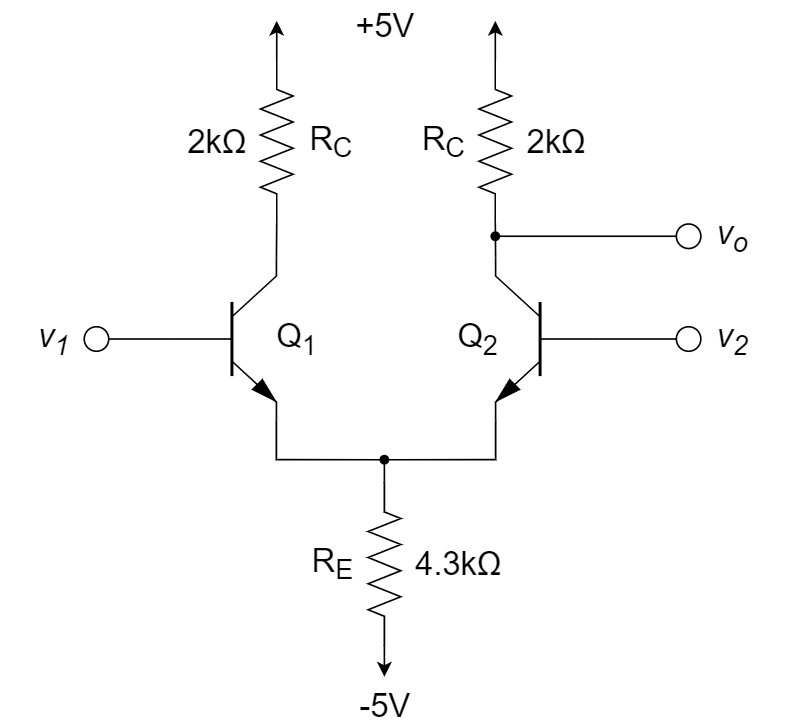
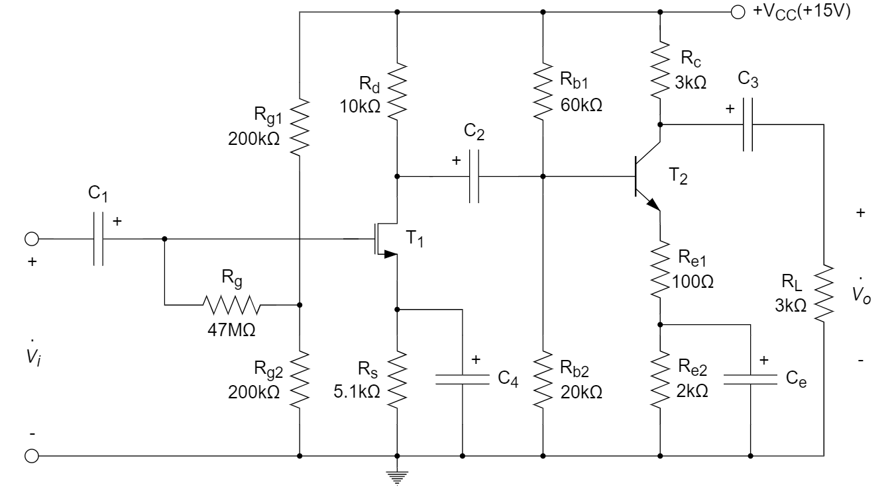

# 差分和多级放大器

::: tip

共模信号与差模信号、BJT差分放大电路结构与电路分析、MOS差分放大电路结构与电路分析、镜像电流源结构及电路分析、多级放大器的耦合方式与电路分析。

:::

# 习题及参考解答

### 知识点1：差分放大器基本概念

1、差分放大器的输入信号可分解为差模信号与共模信号的组合，差分放大器特征是对 ________ 有放大作用，而对 ________ 有抑制作用。

2、已知理想差分放大电路输入端电压 ${v_{i1}} = 100{\rm{ \mu V}}$，${v_{i2}} = 80{\rm{ \mu V}}$，则其差模输入电压 

${v_{id}} =$  __________  μV；共模输入电压 ${v_{ic}} =$  __________  μV。

3、差分放大电路的主要特点是 ________ 。

A. 有效放大差模信号，有力抑制共模信号

B. 既放大差模信号，又放大共模信号

C. 有效放大共模信号，有力抑制差模信号

D. 既抑制差模信号，又抑制共模信号

4、差分放大电路的共模抑制比 CMRR 越大，表明电路 ________ 。

A. 放大倍数越稳定				B. 交流放大倍数越大

C. 直流放大倍数越大			D. 抑制零漂的能力越强

5、简单的差分放大器双端输出时，对 ________ 信号有较强的抑制能力，而对 ________ 信号有较强的放大作用。

6、通用型集成运放的输入级采用差分放大电路，这是因为它的 ________ 。

A. 输入电阻高		B. 输出电阻低		C. 共模抑制比大		D. 电压放大倍数大

7、关于差分电路，以下说法正确的是 ________ 。

A. 抗共模干扰能力强		B. 增益大		C. 占用芯片面积小		D. 以上都正确

8、已知理想差分放大电路两输入端电压分别为 $90{\rm{ \mu V}}$ 和 $80{\rm{ \mu V}}$，则其差模输入电压为  ________  μV；共模输入电压为 ________  μV。

**参考解答**

1. 差模信号      共模信号
2. 20      90
3. A
4. D
5. 共模      差模
6. C
7. A
8. 10      85

## 知识点2：差分放大电路的结构与电路分析

1、如下图所示的差分放大电路，已知 *β* = 100，$V_{BE} = 0.7$ V，$R$ = 8.6 kΩ，$R_C$ = 10 kΩ，求：

(1) 直流电流  $I_{EE}$；

(2) 电压放大倍数 $v_o / v_i$  (忽略厄利效应)；

(3) 差分放大器的输入电阻 $R_{id}$ 和输出电阻 $R_o$ 。

注：$V_T$ 可取 25 mV 或 26 mV，在不同试卷的题目中的选取不尽相同。本题取 $V_T$ = 25 mV 更为便于计算。

2、在下图所示电路中，已知 $V_{CC}$ = 12 V，$V_{EE}$ = 6 V，恒流源 $I$ = 1 mA，$R_{B1} = R_{B2} = 1$ kΩ，$R_{C1} = R_{C2} = 10$ kΩ；两只晶体管特性完全相同，且 $\beta_1 = \beta_2 = 100$，$r_{be1} = r_{be2} = 2$ kΩ。估算：

(1) 电路静态时 $T_1$ 和 $T_2$ 管的集电极电位 $V_{C1}$ 和 $V_{C2}$ ；

(2) 电路的差模放大倍数 $A_d=u_o/u_{id}$ 、差模输入电阻 $R_i$ 和双端输出电阻 $R_o$ 。

3、如下图所示差分放大器电路，假设电路参数理想对称，晶体管的 $\beta$ 均为100，负载电阻 $R_L=10{\rm kΩ}$，滑动电阻 $R_W$ 的滑动端在中点。求电路的差模增益 $A_d$，差模输入阻抗和差模输出阻抗。

4、在图题四所示电路中，设各晶体管均为硅管，$\beta=100$ 。

(1) 为使电路在静态时输出直流电位 $V_{OQ}=0$ ，$R_{C2}$ 应该选多大？

(2) 求电路的差模电压放大倍数 ${\dot A_{vd}}$ ；

(3) 若负电源（－12V）端改接公共地，分析各管工作状态及 $V_O$ 的静态值。

5、如下图所示电路，所有元件理想对称，晶体管的 $\beta$ 均为 100，$r_{bb'}=100{\rm \Omega}$ ，$U_{BEQ} \approx 0.7{\rm V}$ ，$V_T=25{\rm mV}$ 。试计算电位器 $R_W$ 滑动端在中点时 $T_1$ 管和 $T_2$ 管的发射极静态电流 $I_{EQ}$ ，以及放大器增益 $A_d=u_o/u_i$ 和差分输入电阻 $R_i$ 。

6、下图中已知 $I_{SS}=1{\rm mA}$，$\mu_nC_{ox}=0.4{\rm mA/V^2}$，$\mu_pC_{ox}=0.1{\rm mA/V^2}$，$(W/L)_{1,2}=22.5$，$(W/L)_{3,4}=40$。当输入 $v_{in1}$ 和 $v_{in2}$ 为小信号时，求 $v_{out}/(v_{in1}-v_{in2})$。

7、已知如图所示差放电路的 $V_{CC}=V_{EE}=12{\rm V}$，$R_C=R_{EE}=10{\rm k \Omega}$，$\beta=80$，$V_T=25{\rm mV}$。求

(1)  静态工作点 $I_{BQ}$、${I_{CQ}}$ 和 $V_{CEQ}$。

(2)  输入 $v_i=10{\rm mV}$，不接负载 $R_L$ 时的输出电压 $v_o$。

(3)  输入 $v_i=10 {\rm mV}$，接负载 $R_L=20{\rm k \Omega}$ 时的输出电压 $v_o$。

8、如下图所示的差分输入、单端输出放大电路，已知 $I=0.8{\rm mA}$，$V_A=100{\rm V}$，$\beta=160$，求差分输入电阻、输出电阻、差分小信号增益 $\frac{v_o}{v_{B1}-v_{B2}}$ （单位 dB）。（$V_T=25{\rm mV}$）

9、如下图所示电路，已知 $V_{CC}=V_{EE}=6{\rm V}$，$\beta_1=\beta_2=30$，$\beta_3=\beta_4=100$，$V_{BE1}=V_{BE2}=0.6{\rm V}$，$V_{BE3}=V_{BE4}=0.7{\rm V}$，求差分输入电阻 $R_{id}$ ，以及单端输出时的差分电压增益 ${A_{vd1}}$ 、共模电压增益 ${A_{vc1}}$ 和 CMRR。

10、差分放大器如下图所示，假定三极管 $Q_1$ 和 $Q_2$ 参数匹配。$V_{BE}=0.7{\rm V}$，$\beta=99$，$r_{bb'}=0{\rm \Omega}$，$V_T=25{\rm mV}$。

(1)	求三极管发射极静态电流，并计算三极管微变等效电路的 $r_{be}$ （或写为 $r_{\pi}$ ）；

(2)	如果 $v_1=+\frac{v_d}{2}$，$v_1=-\frac{v_d}{2}$，$v_d$ 是均值为 0 的小信号，求差模增益 $A_d$ ；

(3)	如果输入共模信号 ${v_1} = {v_2} = {v_{CM}}$ ，求电路的共模增益 $A_{CM}$ ；

(4)	计算共模抑制比 $CMRR$ ；

(5)	如果 ${v_1} = 0.1\sin \left( {2\pi  \times 60t} \right) + 0.005\sin \left( {2\pi  \times 1000t} \right){\rm V}$ ，${v_2} = 0.1\sin \left( {2\pi  \times 60t} \right) - 0.005\sin \left( {2\pi  \times 1000t} \right){\rm V}$，求电路的输出电压 $v_o$ 。

11、如下图所示电路，晶体管 $T_1$ 和 $T_2$ 参数理想对称， $\beta$ 均为 150，$V_{BE} = 0.7{\rm V}$ 。求电位器 $R_W$ 滑动端在中点时 $T_1$ 管和 $T_2$ 管的发射极静态电流 $I_{EQ}$ ，差模输入电阻 $R_i$ 和差模电压增益 $A_d$ 。（取 $V_T=25{\rm mV}$ ）

**参考解答**

1. 解：

   (1)	${I_{EE}} = \frac{{{V_{EE}} - 0.7}}{R} = \frac{{5 - 0.7}}{R} = {\rm{0}}{\rm{.5 mA}}$ 

   (2)	${I_{E1}} = {I_{E2}} = \frac{1}{2}{I_{EE}} = {\rm{0}}{\rm{.25 mA}}$ 

   ​		${g_{m1}} = {g_{m2}} = \frac{{{I_C}}}{{{V_T}}} \approx {\rm{9}}{\rm{.5 ms}}$ 

   ​		$\frac{{{v_o}}}{{{v_i}}} = \frac{1}{2}{g_m}{R_C} = \frac{1}{2} \times 9.5 \times 10 = 47.5$ 

   (3)	${r_e} = \frac{{{V_T}}}{{{I_{E1}}}} = \frac{{26}}{{0.25}} = 104{\rm{ }}\Omega$ 

   ​		${r_\pi } = (1 + \beta ){r_e} \approx {\rm{10}}{\rm{.5 k\Omega }}$ 

   ​		${R_{id}} = 2{r_\pi } = 2 \times 10.5 = {\rm{21 k\Omega }}$ 

   ​		${R_o} = {R_c} = {\rm{10 k\Omega }}$ 

   

2. 解：

   (1)  ${I_{C1}} \approx {I_{E1}} = 0.5{\rm{ mA}}$ 

   ​	  ${V_{C1}} = {V_{C2}} = {V_{CC}} - {I_{C1}}{R_{C1}} = 7{\rm{ V}}$ 

   (2)  ${A_d} =  - \beta \frac{{{R_C}}}{{{R_B} + {r_{be}}}} \approx  - 333{\rm{ V/V}}$ 

   ​	  ${R_i} = {R_{B1}} + {r_{be1}} + {R_{B2}} + {r_{be2}} = 6{\rm{ k}}\Omega$ 

   ​	  ${R_o} = {R_{C1}} + {R_{C2}} = 20{\rm{ k}}\Omega$ 

   

3. 解：

   先求出静态工作电流 $I_{EQ}$ 

   ${I_{EQ}} = \frac{{{V_{EE}} - {V_{BEQ}}}}{{{R_W}/2 + 2{R_e}}} = \frac{{6 - 0.7}}{{0.1/2 + 2 \times 5.1}} \approx 0.517{\rm mA}$ 

   ${r_{be}} = (1 + \beta )\frac{{{V_T}}}{{{I_{EQ}}}} = 101 \times \frac{{25}}{{0.517}} = 4.88{\rm k\Omega}$ 

   画出交流等效电路

   

   列方程

   ${v_{id}} = {i_{b1}}{r_{be}} + {i_e}{R_W} + {i_{b2}}{r_{be}} = 2{i_{b1}}{r_{be}} + (1 + \beta ){i_{b1}}{R_W}$ 

   ${v_{od}} =  - 2\beta  \times {i_{b1}}({R_c}//\frac{{{R_L}}}{2})$ 

   ${A_d} = \frac{{{v_{od}}}}{{{v_{id}}}} =  - \frac{{2\beta ({R_c}//\frac{{{R_L}}}{2})}}{{2{r_{be}} + (1 + \beta ){R_W}}} =  - \frac{{2 \times 100 \times (10//5)}}{{2 \times 4.88 + 101 \times 0.1}} =  - 33.6$ 

   ${R_i} = 2{r_{be}} + (1 + \beta ){R_W} = 19.9{\rm k\Omega}$ 

   ${R_o} = 2R{}_c = 20{\rm k\Omega}$ 

   

4. 解：

   (1)  当 $V_{OQ}=0$ 时，$I_{CQ3}·R_{C3}=V_{CC}$，$\therefore I_{CQ3}=\frac{V_{CC}}{R_{C3}}=\frac{12}{12}=1{\rm mA}$ 

   ​	  ${I_{BQ3}} = \frac{{{I_{CQ3}}}}{{{\beta _3}}} = \frac{1}{{100}} = 0.01{\rm{ mA}}$ 

   ​	  ${I_{CQ2}} \approx {I_{EQ2}} = \frac{1}{2}{I_{{\mathop{\rm Re}\nolimits} }} = \frac{1}{2} \times \frac{{12 - 0.7}}{{47}} = 0.12{\rm{ mA}}$ 

   ​	  $I_{R_{C2}}=I_{CQ3}-I_{BQ3}=0.12-0.01=0.11{\rm mA}$ 

   ​	  ${R_{c2}} = \frac{{{I_{CQ3}}{R_{e3}} + {V_{BE3}}}}{{{I_{Rc2}}}} = \frac{{1 \times 0.25 + 0.7}}{{0.11}} = 8.64{\rm{ k}}\Omega$ 

   (2)  求差模电压放大倍数 ${\dot A_{vd}}$ 

   ​	  ${r_{be1}} = {r_{be2}} = 101 \times \frac{{26}}{{0.12}} \times \frac{{\rm{1}}}{{{\rm{1000}}}} \simeq 2{\rm{1}}.{\rm{9 k}}\Omega$ 

   ​	  ${r_{be3}} = 101 \times \frac{{26}}{1} \times \frac{{\rm{1}}}{{{\rm{1000}}}} \approx 2.{\rm{6 k}}\Omega$ 

   ​	  第二级（CE反相放大级）输入电阻为 $R_{i2}$：

   ​	  $R_{i2}=r_{be3}+(1+\beta_3)R_{e3}=2.3+101 \times 0.25=27.85{\rm kΩ}$ 

   ​	  差模放大级：

   ​	  ${\dot A_{vd1}} = \frac{{\beta ({R_{c2}}//{R_{i2}})}}{{2{r_{be1}}}} = \frac{{100 \times (8.64//2{\rm{7}}.{\rm{85}})}}{{2 \times 2{\rm{1}}{\rm{.9}}}} \approx 15.{\rm{1}}$ 

   ​	  反相放大级：

   ​	  ${\dot A_{v2}} =  - \frac{{\beta {R_{c3}}}}{{{R_{i2}}}} =  - \frac{{100 \times 12}}{{2{\rm{7}}{\rm{.85}}}} \approx  - 4{\rm{3}}.{\rm{1}}$ 

   ​	  $\therefore {\dot A_{vd}} = {\dot A_{vd1}} \times {\dot A_{v2}} \approx  - 6{\rm{51}}$ 

   (3)  若负电源（-12V）端改为接地，则因静态时 $V_{B1}=V_{B2}=0$ ，故 $T_1$ 、$T_2$ 管处于截止状态，$I_{CQ2}=0$ ，$V_{B3}=12{\rm V}$ ，所以 $T_3$ 管也处于截止状态。故 $V_{OQ}=0$ 。

   

5. 解：

   ​	  $R_W$ 滑动端在中点时，$T_1$ 管和 $T_2$ 管的发射极静态电流分析如下：

   ​	  ${U_{BEQ}} + {I_{EQ}} \cdot \frac{{{R_W}}}{2} + 2{I_{EQ}}{R_e} = {V_{EE}}$ 

   ​	  ${I_{EQ}} = \frac{{{V_{EE}} - {U_{BEQ}}}}{{\frac{{{R_W}}}{2} + 2{R_e}}} = \frac{{6 - 0.7}}{{\frac{{0.1}}{2} + 2 \times 5.1}} \approx 0.517{\rm{ mA}}$ 

   ​	  $A_d$ 和 $R_i$ 分析如下：

   ​	  ${r_{be}} = {r_{bb'}} + \left( {\beta  + 1} \right)\frac{{{V_T}}}{{{I_{EQ}}}} = 0.1 + 101 \times \frac{{25}}{{0.517}} \times \frac{1}{{1000}} \approx 4.98{\rm{k}}\Omega$ 

   ​	  ${A_d} =  - \frac{{\beta {R_c}}}{{{r_{be}} + \left( {\beta  + 1} \right)\frac{{{R_w}}}{2}}} =  - \frac{{100 \times 10}}{{4.98 + 101 \times \frac{{0.1}}{2}}} \approx  - 99.7$ 

   ​	  ${R_i} = 2{r_{be}} + \left( {\beta  + 1} \right){R_w} = 2 \times 4.98 + 101 \times 0.1 = 20.06{\rm{k}}\Omega$ 

   

6. 解：

   ​	  $I_{D1}=I_{D2}=I_{D3}=I_{D4}=\frac{1{\rm mA}}{2}=0.5{\rm mA}$ 

   ​	  $g_{m1,2}=\sqrt{2I_D·\mu_nC_{ox}·\frac{W}{L}}=\sqrt{1 \times 0.4 \times 22.5}=3{\rm mA/V}$ 

   ​	  $g_{m3,4}=\sqrt{2I_D·\mu_pC_{ox}·\frac{W}{L}}=\sqrt{1 \times 0.1 \times 40}=2{\rm mA/V}$ 

   ​	  $\frac{v_{out}}{v_{in1}-v_{in2}}=-g_{m1,2} \times \frac{1}{g_{m3,4}}=-\frac{3}{2}$ 

   

7. 解：

   (1)  静态工作点

   ​	  ${I_{EQ}} = \frac{{{V_{EE}} - {V_{BE}}}}{{2{R_{EE}}}} = \frac{{12 - 0.7}}{{2 \times 10}} = 0.565{\rm{mA}}$ 

   ​	  ${I_{BQ}} = \frac{{{I_{EQ}}}}{{1 + \beta }} = \frac{{0.585}}{{81}} \times {10^3} \approx 7.2{\rm{ \mu A}}$ 

   ​	  ${I_{CQ}} = \beta {I_{BQ}} \approx 0.576{\rm{ mA}}$ 

   ​	  ${V_{CEQ}} = {V_{CC}} - {I_{CQ}}{R_C} - 2{I_{EQ}}{R_{EE}} + {V_{EE}}=12 - 0.576 \times 10 - 2 \times 0.565 \times 10 + 12=6.94{\rm V}$ 

   (2)  不接 $R_L$ 时

   ​	  ${r_\pi } = \frac{{{V_T}}}{{{I_B}}} = \frac{{25}}{{7.2}} \approx 3.47{\rm{ k}}\Omega$ 

   ​	  ${A_d} =  - \frac{{\beta {R_C}}}{{{r_\pi }}} =  - \frac{{80 \times 10}}{{3.47}} \approx  - 230.5$ 

   ​	  ${v_o} = {v_i}{A_d} = 10 \times \left( { - 230.5} \right) \times {10^{ - 3}} \approx  - 2.3{\rm{ V}}$ 

   (3)  接 $R_L$ 时

   ​	  ${A_d} =  - \frac{{\beta \left( {{R_C}{\rm{//}}\frac{{{R_L}}}{2}} \right)}}{{{r_\pi }}} =  - \frac{{80 \times \left( {10{\rm{//10}}} \right)}}{{3.47}} \approx  - 115.3$ 

   ​	  ${v_o} = {v_i}{A_d} = 10 \times \left( { - 115.3} \right) \times {10^{ - 3}} \approx  - 1.2{\rm{ V}}$ 

   

8. 解：

   ​	  $I_C=0.4{\rm mA}$ 

   ​	  $g_m=\frac{I_C}{V_T}=\frac{0.4}{25}=0.016{\rm S}$ 

   ​	  $r_o=\frac{V_A}{I_C}=\frac{100}{0.4}=250{\rm k \Omega}$ 

   ​	  $r_{\pi}=\frac{\beta}{g_m}=10{\rm k \Omega}$ 

   ​	  

   ​	  $R_{id}=2*r_{\pi}=20{\rm k \Omega}$ 

   ​	  $R_o=\frac{r_o}{2}=125{\rm k \Omega}$ 

   ​	  $G_m=g_m=0.016{\rm S}$ 

   ​	  $A_v=G_m*R_o=2000{\rm V/V} \approx 66{\rm dB}$ 

   

9. 解：

   由 ${v_{i1}} = {v_{i2}} = 0$，

   ​	  ${V_{E3}} = {V_{E4}} = 0 - (0.6 + 0.7) =  - 1.3{\rm{ V}}$ 

   ​	  ${I_{E3}} = {I_{E4}} = \frac{1}{2}{I_{{R_e}}} = \frac{1}{2} \times \frac{{{V_{E3}} - \left( { - {V_{EE}}} \right)}}{{{R_C}}} = \frac{1}{2} \times \frac{{ - 1.3 + 6}}{{4.7}} = 0.5{\rm{ mA}}$ 

   ​	  ${I_{E1}} = {I_{E2}} = \frac{{{I_{E3}}}}{{{\beta _3} + 1}} \approx 0.005{\rm{ mA}}$ 

   ​	  ${r_{\pi 3}} = {r_{\pi 4}} = \left( {1 + {\beta _3}} \right)\frac{{{V_T}}}{{{I_{E3}}}} = 101 \times \frac{{25}}{{0.5}} = 5.05{\rm{ k}}\Omega$ 

   ​	  ${r_{\pi 1}} = {r_{\pi 2}} = \left( {1 + {\beta _1}} \right)\frac{{{V_T}}}{{{I_{E1}}}} = 31 \times \frac{{25}}{{0.005}} = 155{\rm{ k}}\Omega$ 

   ${R_{id}} = 2\left[ {{r_{\pi 1}} + \left( {1 + {\beta _1}} \right){r_{\pi 3}}} \right] = 2 \times \left( {155 + 31 \times 5.05} \right) = 623.1{\rm{ k}}\Omega$ 

   ${A_{vd1}} \approx  - \frac{{{\beta _1}{\beta _3}{R_C}}}{{2\left[ {{r_{\pi 1}} + \left( {1 + {\beta _1}} \right){r_{\pi 3}}} \right]}} =  - \frac{{30 \times 100 \times 6.2}}{{2 \times \left( {155 + 31 \times 5.05} \right)}} \approx  - 29.85{\rm{ }}{{\rm{V}} }$ 

   ${A_{vc1}} \approx  - \frac{{{\beta _1}{\beta _3}{R_C}}}{{{r_{\pi 1}} + \left( {1 + {\beta _1}} \right)\left[ {{r_{\pi 3}} + \left( {1 + {\beta _3}} \right)2{R_e}} \right]}} =  - \frac{{30 \times 100 \times 6.2}}{{155 + 31 \times \left( {5.05 + 101 \times 2 \times 4.7} \right)}} \approx  - 0.63{\rm{ }}{{\rm{V}} }$ 

   ${\rm{CMRR}} = \left| {\frac{{{A_{Vd1}}}}{{{A_{Vc1}}}}} \right| = \frac{{29.85}}{{0.63}} \approx 47.4 \approx 33.5{\rm{ dB}}$ 

   

10. 解：

    (1)	${I_{E1}} = {I_{E2}} = {I_E} = \frac{{0 - \left( { - 5} \right) - 0.7}}{{2 \times 4.3}} = 0.5{\rm mA}$ 

    ​		${r_{be}} = {r_{bb'}} + \left( {1 + \beta } \right)\frac{{{V_T}}}{{{I_{EQ}}}} = 0 + 100 \times \frac{{25}}{{0.5}} = {\rm{5 k\Omega }}$ 

    (2)	${A_d} = \frac{{{v_o}}}{{{v_d}}} = \frac{{\beta {R_C}}}{{2{r_{be}}}} = \frac{{99 \times 2}}{{2 \times 5}} = 19.8{\rm{ V/V}}$ 

    (3)	${A_{CM}} = \frac{{{v_o}}}{{{v_{CM}}}} =  - \frac{{\beta {R_C}}}{{{r_{be}} + 2\left( {\beta  + 1} \right){R_E}}} =  - \frac{{99 \times 2}}{{5 + 2 \times {\rm{100}} \times 4.3}} =  - 0.229{\rm{ V/V}}$ 

    (4)	$CMRR = \left| {\frac{{{A_d}}}{{{A_{CM}}}}} \right| = \frac{{19.8}}{{0.229}} \approx 86.5$ 

    (5)	${v_o} = {A_{CM}}{v_{CM}} + {A_d}{v_d}$ 

    ​		${v_{CM}} = 0.1\sin( 2\pi  \times 60t){\rm V}$ 

    ​		${v_d} = 0.01\sin(2\pi  \times 1000t){\rm V}$ 

    ​		${v_o} = [- 0.0229\sin( 2\pi  \times 60t) + 0.198\sin( 2\pi  \times 1000t)]{\rm V}$ 

    

11. 解：

    ​		$\because {V_{BE}} + {I_{EQ}} \cdot \frac{{{R_W}}}{2} + 2{I_{EQ}}{R_e} = {V_{EE}}$ 

    ​		$\therefore {I_{EQ}} = \frac{{{V_{EE}} - {V_{BE}}}}{{\frac{{{R_W}}}{2} + 2{R_e}}} \approx 0.5{\rm{17 mA}}$ 

    ​		${r_\pi } = (1 + \beta )\frac{{{V_T}}}{{{I_{EQ}}}} \approx 7.{\rm{30 k\Omega }}$ 

    ​		${R_i} = 2{r_\pi } + (1 + \beta ){R_W} = 29.{\rm{7 k\Omega }}$ 

    ​		${A_d} =  - \frac{{2\beta {R_c}}}{{2{r_\pi } + (1 + \beta ){R_W}}} \approx  - 101.0$ 

## 知识点3：镜像电流源的结构与电路分析

1、下图所示电流镜中所有三极管的电流放大倍数均为 *β*，且 $I_E ≈ I_C = \beta I_B$。试推导 $I_{copy1}$ 、$I_{copy2}$ 与 $I_{REF}$ 之间的关系表达式。

2、设计右图电路，要求输出电流为 $I_D=100{\rm \mu A}$ 。已知 $V_{DD}=10{\rm V}$ 。假设 $Q_1$ 和 $Q_2$ 完全匹配，$L=10{\rm \mu m}$ ，$W=100{\rm \mu m}$ ，$V_t=1{\rm V}$ ，$k'_n=20{\rm \mu A/V^2}$ ，$V_A=100{\rm V}$ ，计算电阻 $R$ 和电流源的输出电阻。

3、下图中 $I_1$ 和 $I_2$ 分别为 ________ mA 和 ________ mA。

4、参数完全相同的三极管 $T_1$ 和 $T_2$ 组成下图所示的微电流电路。

(1)	推导 $I_{C1}$ 和 $I_{C2}$ 之间的关系式。

(2)	若在 $V_{CC}=15{\rm V}$ 时测得 $I_{C1}=1{\rm mA}$，$I_{C2}=25{\rm \mu A}$，估算电阻 $R_{E2}$ 和 $R$ 的阻值。（取 $V_T=25{\rm mV}$ ）

**参考解答**

1. 解：

   在 X 点写 KCL 方程：

   $I_{C,F}=\frac{I_{C,REF}}{β}+\frac{I_{copy1}}{β}+\frac{I_{copy2}}{β}=\frac{4I_{copy1}}{β}+\frac{I_{copy1}}{β}+\frac{10I_{copy1}}{β}=\frac{15I_{copy1}}{β}$ 

   再在 P 点写 KCL 方程：

   $I_{REF}=\frac{15I_{copy1}}{β^2}+I_{C,REF}=\frac{15I_{copy1}}{β^2}+4I_{copy1}$ 

   因此，$I_{copy1}=\frac{I_{REF}}{4+\frac{15}{β^2}}$ ， $I_{copy2}=\frac{10I_{REF}}{4+\frac{15}{β^2}}$ 

   

2. 解：

   ​	 $\because {I_D} = \frac{1}{2}{k'_n}\frac{W}{L}{\left( {{V_{DS}} - {V_t}} \right)^2}$ 

   ​	 $\therefore {V_{DS}} = 2{\rm{ V}}$ 	or	 ${V_{DS}} = 0{\rm{ V}}$ (舍去)

   ​	 $R = \frac{{{V_{DD}} - {V_{DS}}}}{{{I_D}}} = 80{\rm{ k}}\Omega$ 

   ​	 ${R_o} = {r_o} = \frac{{{V_A}}}{{{I_D}}} = \frac{{100}}{{100 \times {{10}^{ - 6}}}} = {10^6}\Omega  = 1{\rm{M}}\Omega$ 

   

3. 0.2      0.5

4. 解：

   (1)	由 $I_C=I_S \cdot e^{V_{BE}/V_T}$ 可得：

   ​		${V_{BE}} = {V_T}\ln \frac{{{I_C}}}{{{I_S}}}$ 

   ​		$\left\{ {\begin{array}{*{20}{c}}
   {{V_{BE1}} = {V_T}\ln \frac{{{I_{C1}}}}{{{I_S}}}}\\
   {{V_{BE2}} = {V_T}\ln \frac{{{I_{C2}}}}{{{I_S}}}}
   \end{array}} \right.$ 

   ​		$\because {V_{BE1}} = {V_{BE2}} + {I_{E2}}{R_{E2}}$ 

   ​		$\therefore {I_{C2}} \approx {I_{E2}} = \frac{{{V_{BE1}} - {V_{BE2}}}}{{{R_{E2}}}}= \frac{{{V_T}}}{{{R_{E2}}}}\ln \frac{{{I_{C1}}}}{{{I_{C2}}}}$ 

   (2)	已知 $I_{C1}=1{\rm mA}$，$I_{C2}=25{\rm \mu A}$，估算电阻 $R_{E2}$ 和 $R$ 的阻值

   ​		${R_{E2}} = \frac{{{V_T}}}{{{I_{C2}}}}\ln \frac{{{I_{C1}}}}{{{I_{C2}}}} \approx 3.69{\rm{ k}}\Omega$ 

   ​		根据电路，得基准电流： ${I_R} \approx {I_{C1}} = \frac{{{V_{CC}} - {V_{BE1}}}}{R}$ 

   ​		得：$R \approx \frac{{{V_{CC}} - {V_{BE1}}}}{{{I_{C1}}}} \approx 14.3{\rm{ k}}\Omega$ 

## 知识点4：多级放大器

1、若三级放大电路中 ${A_{v1}} = {A_{v2}} = 30{\rm{ dB}}$，${A_{v3}} = 20{\rm{ dB}}$，则其总电压增益为  ________ dB，折合为 ________ 倍。

2、如下图所示电路，已知 $\beta  = 100$，${V_{BE}} = 0.7{\rm{ V}}$。

(1)  求静态电流 $I_{C1}$ 和 $I_{C2}$ ；

(2)  求中频增益 $A_M=V_o/V_i$ ；

(3)  见 第11章-知识点2-题3。

3、假设由三极管构成的两级放大器中（两级组态不同），电压增益 $A_{v1}$ = 20，$A_{v2}$ = 0.99，则可猜测这两个放大器的组态分别为：第一级是 ________ 放大器，第二级是 ________ 放大器。

4、在双极型晶体管构成的多级放大电路中，为了增加电压增益，中间级一般采用 ________ 。

A. 共基放大电路				B. 共射放大电路

C. 共集放大电路				D. 共源放大电路

5、某学生设计了一个小信号电压放大电路，调试时发现电压增益很小，进一步分析后发现电路的输出阻抗较大，请问该学生可以采取以下哪种改进措施？ ________ 。

A. 在负载之前插入一个单位增益运放				B. 在负载之前插入一个射极跟随电路

C. 在负载之前插入一个源极跟随电路				D. 以上都可行

6、下图所示是一个运算放大器的内部电路，其中输入级是由两个MOS管 ________ 组成的 ________ 结构，输出级是由MOS管 ________ 组成的 ________ 结构；三个MOS管 ________ 构成两个镜像电流源分别为输入级和输出级提供直流偏置；两个MOS管 ________ 构成镜像电流源作为输入级的 ________ 。

7、如图所示为两级阻容耦合放大电路，已知 $T_1$ 为 N 沟道耗尽型绝缘栅场效应管，$g_m=2{\rm mS}$，$T_2$ 为双极型晶体管，$\beta=50$，$r_{be}=1{\rm k \Omega}$，忽略 $r_o$，求：

(1)	第二级电路的静态工作点 $I_{CQ2}$ 和 $V_{CEQ2}$ ；

(2)	整个电路的中频电压放大倍数 ${\dot A_v}$ ；

(3)	整个放大电路的输入电阻 $R_i$ 和输出电阻 $R_o$ 。

**参考解答**

1. 80      $10^4$ 

2. 解：

   (1)  ${I_{C1}} = \frac{{{V_{CC}} \cdot \frac{{{R_{B2}}}}{{{R_{B1}} + {R_{B2}}}} - {V_{BE1}}}}{{{R_{E1}}}} = \frac{{5 \times \frac{{27}}{{56 + 27}} - 0.7}}{2} \approx 0.46{\rm{ mA}}$ 

   ​	  ${I_{B2}} = \frac{{{V_{CC}} - {V_{BE2}}}}{{{R_{B3}}}} = \frac{{5 - 0.7}}{{500}} = 0.0086{\rm{ mA}}$ 

   ​	  ${I_{C2}} = \beta {I_{B2}} = 0.86{\rm{ mA}}$ 

   (2)  $r_{π1}=\frac{V_T}{I_{B1}}=β\frac{V_T}{I_{C1}}=100×\frac{25}{0.46}/1000≈5.43kΩ$ 

   ​	  $r_{π2}=\frac{V_T}{I_{B2}}=\frac{25}{0.0086}/1000≈2.91kΩ$ 

   ​	  ${R_{i2}} = {R_{B3}}{\rm{//}}{r_{\pi 2}} = 500{\rm{//}}2.91 \approx 2.89{\rm{ k}}\Omega$ 

   ​	  ${A_v} = \left[ { - \frac{{\beta \left( {{R_{C1}}{\rm{//}}{R_{i2}}} \right)}}{{{r_{\pi 1}}}}} \right]\left[ { - \frac{{\beta ({R_{C2}}{\rm{//}}{R_L}}}{{{r_{\pi 2}}}}} \right] = \frac{{100\left( {2{\rm{//}}2.89} \right)}}{{5.43}} \times \frac{{100 \times (3{\rm{//}}3)}}{{2.91}} \approx 1122.1{\rm{ V/V}}$ 

   

3. 共基      共集

4. B

5. D

6. $T_3$ 和 $T_4$       差分      $T_8$       共源      $T_1$、$T_2$ 和 $T_7$      $T_5$ 和 $T_6$        有源负载

7. 解：

   (1)	求第二级的静态工作点：

   ​		${I_{CQ2}} \approx {I_{EQ2}} = \frac{{\frac{{{R_{b2}}}}{{{R_{b1}} + {R_{b2}}}}{V_{CC}} - {V_{BE2}}}}{{\frac{{{R_{b1}}//{R_{b2}}}}{{1 + \beta }} + {R_{e1}} + {R_{e2}}}} = \frac{{3.75 - 0.7}}{{\frac{{60//20}}{{51}} + 2.1}} = 1.27{\rm{ mA}}$ 

   ​		(或 ${I_{CQ2}} = \alpha {I_{EQ2}} = \frac{\beta }{{1 + \beta }}{I_{EQ2}} = \frac{{50}}{{51}} \times 1.27 \approx 1.245{\rm{ mA}}$ )

   ​		${V_{CEQ2}} = {V_{CC}} - {I_{CQ2}}({R_c} + {R_{e1}} + {R_{e2}}) = 15 - 1.27 \times 5.1 = 8.5{\rm{ V}}$ 

   ​		(或 ${V_{CEQ2}} = {V_{CC}} - {I_{CQ2}}{R_C} - {I_{EQ2}}\left( {{R_{e1}} + {R_{e2}}} \right) \approx 8.6{\rm{ V}}$ )	

   或

   ​		${I_{CQ2}} \approx {I_{EQ2}} \approx \frac{{\frac{{{R_{b2}}}}{{{R_{b1}} + {R_{b2}}}}{V_{CC}} - {V_{BE2}}}}{{{R_{e1}} + {R_{e2}}}} \approx 1.45{\rm{ mA}}$ 

   ​		${V_{CEQ}} = {V_{CC}} - {I_{CQ2}}\left( {{R_C} + {R_{e1}} + {R_{e2}}} \right) \approx 7.6{\rm{ V}}$ 

   (2)	求电压放大倍数：

   ​		${\dot A_{v1}} =  - {g_m}({R_d}//{R_{i2}})$ 

   其中， ${R_{i2}} = {R_{b1}}//{R_{b2}}//[{r_{be}} + (1 + \beta ){R_{e1}}] = 60//20//(1 + 51 \times 0.1)] = 4.33{\rm{ k}}\Omega$ （或 $\approx 4.34{\rm k \Omega}$ ）

   ​		${\dot A_{v1}} =  - {g_m}({R_d}//{R_{i2}}) =  - 2 \times (10//4.33) =  - 6.0$ （或 $\approx -6.1$ ）

   ​		${\dot A_{v2}} =  - \frac{{\beta ({R_c}//{R_L})}}{{{r_{be}} + (1 + \beta ){R_{e1}}}} =  - \frac{{50 \times 1.5}}{{1 + 51 \times 0.1}} =  - 12.3$ 

   所以， ${\dot A_v} = {\dot A_{v1}} \cdot {\dot A_{v2}} =  - 6.0 \times ( - 12.3) = 73.8$ （或 $\approx 75.0$ ）

   (3)	求输入电阻 $R_i$ 和求输出电阻 $R_o$ ：

   ​		${R_i} = {R_g} + {R_{g1}}//{R_{g2}} = 47.1{\rm{ M}}\Omega$ 

   ​		${R_o} = {R_c} = 3{\rm{ k}}\Omega$ 

