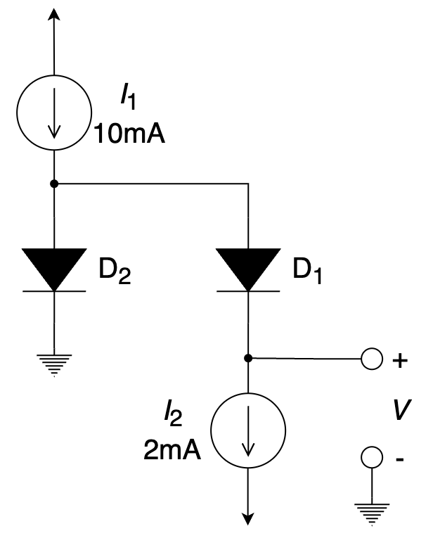

# 二极管

::: tip

PN结原理、二极管电路模型（恒压降模型、小信号模型）、齐纳（稳压）二极管应用电路、二极管应用电路（整流器、限幅和钳位电路、电压倍增器等）、逻辑门。

:::

# 习题及参考解答

## 知识点1：二极管的结构与工作原理

1、在常温下，杂质半导体中多数载流子主要由 ________ 而产生，而少数载流子由 ________ 产生。

2、PN结加正向电压时，内电场方向与外加电场方向 ________ ，PN结宽度变 ________ 。

3、半导体PN结有单向导电的特性表现为：PN结加 ________ 电压时导通，而加 ________ 电压时截止；构成稳压二极管时，要获得稳压作用，该PN结应该 ________ 偏置。

4、二极管的正向电压变化 ________ 时，电流约变化 10 倍。

A. 20 mV		B. 40 mV		C. 60 mV		D. 80 mV

5、当稳压管在正常稳压工作时，其工作状态（两端施加的外部电压的特点）为 ________ 。

A. 反向偏置但不击穿				B. 正向偏置但不击穿

C. 反向偏置且被击穿				D. 正向偏置且被击穿

6、稳压二极管处在稳压工作状态是工作在 ________ 。

A. 导通状态		B. 截止状态		C. 反向击穿状态		D. 任意状态

7、所谓理想二极管，就是当其正偏时，其电阻为 ________ ；当其反偏时，其电阻为 ________ 。

8、稳压二极管稳压和发光二极管发光时，它们分别工作在 ________ 。

A. 正向导通区、反向截止区		B. 反向截止区、正向导通区

C. 正向导通区、反向击穿区		D. 反向击穿区、正向导通区

9、PN 结加反向电压时，内电场方向与外加电场方向 ________ （相同/相反），PN 结变 ________ （宽/窄）。

10、若温度不变，二极管加正向电压时，其动态电阻 $r_d$ 随工作电流的增大而 ________ 。

A. 增大			B. 减小			C. 不变			D. 按对数规律变化

**参考解答**

1. 杂质      电离本征激发
2. 相反      窄
3. 正向      反向      反向
4. C
5. C
6. C
7. 0      无穷
8. D
9. 相同      宽
10. B

## 知识点2：二极管应用电路的分析计算

1、下图所示电路中稳压管的稳定电压 $V_Z=6{\rm{V}}$ ，最小稳定电流 $I_{Zmin}=5{\rm{mA}}$ ，最大稳定电流 $I_{Zmax}=25{\rm{mA}}$ 。

（1）分别计算 ${V_I}$ 分别为 10 V、15 V 和 35 V 三种情况下输出电压 ${V_O}$ 的值；

（2）若 ${V_I} = {\rm{35 V}}$ 时负载开路，则会出现什么现象？为什么？

2、二极管整流电路主要有 ________ 整流、 ________ 整流和 ________ 整流三种类型。

3、在下图所示的串联型线性稳压电路中，若要求输出电压为 18 V，调整管压降为 6 V，采用桥式整流电容滤波，则电源变压器副边电压的有效值应选为 ________ 。

A. 6 V		B. 18 V		C. 20 V		D. 24 V

4、如右图所示电路，已知 ${u_i} = \sin \left( t \right){\rm V}$ ，二极管导通电压 $U_D=0.7 {\rm V}$ ，输出电压 $u_o$ 的最大值为 ________ ，最小值为 ________ 。

5、如下图所示的整流滤波电路，已知变压器副边电压有效值为 10 V，电容足够大。正常工作时，输出电压平均值 $V_{O(AV)}\approx$ __________ ；负载电阻 $R_L$ 开路时， $V_{O(AV)}\approx$ __________ ；电容 $C$ 开路时，$V_{O(AV)\approx}$ __________ ；二极管 $D_1$ 开路时，$V_{O(AV)\approx}$  __________ 。

6、如下图所示电路，假设二极管和 3 V 齐纳二极管导通时的压降为 0 V，求 $ - 10{\rm{ V}} \le {v_i} \le  + 10{\rm{ V}}$ 时输出电压 $v_o$ 、输入电流 $i_i$ 与输入电压 $v_i$ 的关系。

7、关于稳压器，以下哪个说法是正确的 ________ 。

A. 在电源电压波动时，可以提供恒定的输出电压；

B. 在负载变化时，可以提供恒定的输出电压；

C. 可以与整流器、滤波器配合工作；

D. 以上说法都对。

8、右图所示电路中，若流经二极管电流为 1 mA，其两端的电压降约为 0.7 V，现假设电阻 *R* = 10 kΩ，那么流经该电阻的 $I_D$ = ________ mA；若 10 V 供电电压上附加有 50 Hz、峰值 1 V 的干扰电压信号，那么该干扰信号在输出端表现为频率 50 Hz、电压峰值 ________ mV 的交变信号。（ $V_T$ ≈ 25 mV ）

9、采用恒压降模型（$V_{D,on}$）分析下方二极管电路，画出输入输出特性曲线（$V_{D,on}=0.7{\rm V}$，$R_1=R_2$，图中必须标注线段的斜率和端点坐标）。

10、已知二极管的导通电压为 0.7 V，常温下 $V_T$ ≈ 25 mV，问在下图中，当输入 $v_i$ 为有效值是 10 mV 的正弦波小信号时，试求二极管中流过的交流电流的有效值是 ________ 。

11、采用恒压降模型（$V_{D,on}$）分析下方二极管电路，画出输入输出特性曲线（$V_{D,on}=0.7{\rm V}$，$R_1=R_2$，图中必须标注线段的斜率和端点坐标）。

12、假设下图所示二极管是理想的，下列所述正确的是 ________ 。

A. $D_1$ 和 $D_2$ 均截止				B.$D_1$ 导通， $D_2$ 截止

C. $D_1$ 截止， $D_2$ 导通			 D. $D_1$  和 $D_2$  均导通

13、二极管电路下图所示，二极管的工作状态是 ________。

A. $D_1$导通， $D_2$ 导通				B. $D_1$ 导通， $D_2$ 截止

C. $D_1$ 截止， $D_2$  导通				D. $D_1$ 截止， $D_2$ 截止

14、若桥式整流电路的交流输入电压有效值为 10 V ，则其中每个二极管的反峰电压约为 ________ （二极管的压降恒定为 0.7 V ）。

15、下图所示为将交流电转换成直流电的电源，其中 A、B、C 三个主要组成部分分别是 ________ 、 ________ 和稳压器。

16、分析下图所示电路，已知二极管 $D_1$ 的反向饱和电流是二极管 $D_2$ 的 10 倍，求电压 $V$ ；若要求 $V=50{\rm mV}$ ，则需要调整电流源 $I_2$ 为何值。（取 $V_T=25{\rm mV}$ ）

17、若半波整流电路的交流输入电压有效值为 10 V ，则整流二极管的反峰电压约为 ________ （二极管的压降恒定为 0.7 V ）。

18、如下图所示电路中，输入电压 $V_I=20{\rm V}$，限流电阻 $R=510{\rm \Omega}$，稳压管 $\rm 2CW16$ 具有下列特性：稳定电压 $\rm 9 V$，允许最大耗散功率 $\rm 250 mW$，稳压管电流小于 $\rm 1 mA$ 时不能稳压，且动态电阻不大于 $20 \Omega$ 。

(1)  当 $R_L=1{\rm k \Omega}$ ，求电流 $I_R$ 、$I_Z$ 和 $I_L$ 。

(2)  当电源电压 $V_I \pm 20%$ 时，输出电压 $V_O$ 最多变化几伏？

(3)  在输入电压 $V_I$ 和负载电阻 $R_L$ 变化至何值时稳压管功耗最大？其值是否已超过其允许值？（ $V_I$ 的变化范围不超过 $\pm20%$ ，$R_L$ 可任意变化。）

19、下图所示为包含理想二极管的电路及其输入信号曲线，则输出信号曲线应为 ________ 。

20、在桥式整流电源电路中，滤波电容的电容值不能选择过大，主要原因是 ________ 。

A. 大电容不安全				B. 通过二极管的整流电流太大

C. 充电时间太长				D. 滤波输出电压平均值增大过多

21、如下图所示电路，已知集成二极管导通时的压降 $V_D=800{\rm mV}$，取 $V_T=25{\rm mV}$，则电源电压 $V_{ad}$ 变化时 $100{\rm mV}$ 时，输出电压 $V_{out}$ 的变化量约为 ________ 。

22、在线性直流电源中，由理想二极管组成桥式整流电路，在没有加入滤波电容时，二极管的导通角 ________ 180°；加入滤波电容后，二极管的导通角 ________180°。

A. =, <				B. =, >				C. <, >				D. >, <

23、假设二极管的导通电压 $V_{on}$ 为 0.7 V，则下图所示电路中节点 A 的电压 $V_A$ 等于 ________ ，支路电流 $I_D$ 等于 ________ 。

24、如下图所示电路，当输入电压 $v_I$ 从 -10 V 增大到 + 10 V 时，求输入电压 ${v_O}$ 和输入电流 ${i_I}$ 的变化情况，并分别画出 ${v_O} : {v_I}$ 和 ${i_I} : {v_I}$ 的关系曲线。已知二极管 D 的导通电压为 0 V，稳压二极管 $D_Z$ 的 $V_Z=3{\rm V}$ 。

**参考解答**

1. 解：

   (1)  只有当加在稳压管两端的电压大于其稳压值时，输出电压才为6V。

   所以 当 $V_I=10{\rm{V}}$ 时， ${V_O} = \frac{{{R_L}}}{{R + {R_L}}}{V_I} = 3.3{\rm{V}}$ ；

   ​		 当 $V_I=15{\rm{V}}$ 时， ${V_O} = \frac{{{R_L}}}{{R + {R_L}}}{V_I} = 5{\rm{V}}$ ；

   ​		 当 $V_I=35{\rm{V}}$ 时， ${V_O} = \frac{{{R_L}}}{{R + {R_L}}}{V_I} \approx {\rm{11}}{\rm{.7V}} > {V_Z}$ ；$∴V_O=V_Z=6{\rm{V}}$ 。

   (2)  当负载开路时，${I_Z} = \frac{{{V_I} - {V_Z}}}{R} = 2{\rm{9mA}} > {I_{Z\max }} = 25{\rm{mA}}$，稳压管将被烧毁。

   

2. 半波      全波      桥式

3. C

4. +1V      - 1V

5. 12 V      14 V      9 V      6 V

6. 解：

   当 $ - 10{\rm{ V}} \le {v_i} < 0{\rm{ V}}$ 时，二极管和齐纳二极管均正向导通，则

   ​				${v_O} = 0{\rm{ V}}$ 

   ​				$i_i=v_i/10=0.1 v_i {\rm mA}$ 

   当 $0{\rm{ V}} \le {v_i} < 3{\rm{ V}}$ 时，齐纳二极管截止，则

   ​				${v_O} = 0{\rm{ V}}$ 

   ​				${i_i} = 0{\rm{ mA}}$ 

   当 $3{\rm{ V}} \le {v_i} \le 10{\rm{ V}}$ 时，二极管截止，齐纳二极管工作在反向击穿区，则输出电压 $v_o$ 为

   ​				${v_O} = \left( {{v_i} - {V_Z}} \right) \times \frac{{10}}{{10 + 10}} = \frac{{{v_i} - 3}}{2}{\rm{ V}}$ 

   输入电流 $i_i$ 为

   ​				${i_i} = \frac{{{v_i} - {V_Z}}}{{10 + 10}} = \frac{{{v_i} - 3}}{{20}}{\rm{ mA}}$ 

   

7. D

8. 0.93      2.68

9. 解：

   

   

10. 2 mA

11. 解：

    

    

12. C

13. B

14. 13.44 V

15. 整流器      滤波器

16. 解：

    ​		$10{I_S}{e^{\frac{{{V_{D2}} - V}}{{{V_T}}}}} \approx 2$ 

    ​		${I_S}{e^{\frac{{{V_{D2}}}}{{{V_T}}}}} \approx 10 - 2$ 

    ​		$V = {V_T}\ln 40 \approx 92.22{\rm{ mV}}$ 

    ​		$10{e^{ - \frac{V}{{{V_T}}}}} = \frac{{{I_2}}}{{10 - {I_2}}}$ 

    ​		${I_2} \approx 5.75{\rm{ mA}}$ 

    

17. 14.14 V

18. 解：

    (1)	${I_R} = \frac{{20 - 9}}{{510}} = 21.6{\rm mA}$ 

    ​		${I_L} = \frac{{9{\rm{V}}}}{{1{\rm{k}}\Omega }} = 9{\rm mA}$ 

    ​		${I_Z} = 21.6 - 9 = 12.6{\rm{ mA}}$ 

    (2)	$\Delta {V_O} = \frac{{20\Omega //1{\rm{k}}\Omega }}{{510\Omega  + (20\Omega //1{\rm{k}}\Omega {\rm{)}}}} \times ( \pm 4{\rm{V}}) \approx  \pm 0.15{\rm V}$ 

    (3)	当 $V_I$ 变化 +20% 和 $R_L \rightarrow \infty$ 时稳压管的功耗最大。

    ​		$P_{Z(max)}=\frac{{24 - 9}}{{510}} \times 9 = 265{\rm mW} > P_{Zmax}$ ，超过允许的最大耗散功率。

    

19. D

20. B

21. 11.1 mV

22. A

23. -5.3 V         1.295 mA

24. 解：

    当 $ - 10{\rm{ V}} \le {v_I} < 0{\rm{ V}}$ 时，$D$ 和 $D_Z$ 同时正向导通。因此，${v_O} = 0{\rm{ V}}$ ，$i_I=v_I/10=0.1 v_I {\rm mA}$ 

    当 $0{\rm{ V}} \le {v_I} < 3{\rm{ V}}$ 时，$D_Z$ 截止。因此，${v_O} = 0{\rm{ V}}$ ，${i_I} = 0{\rm{ mA}}$ 

    当 $3{\rm{ V}} \le {v_I} \le 10{\rm{ V}}$ 时，$D$ 截止，$D_Z$ 工作在反向击穿区，因此，

    ​				${v_O} = \left( {{v_I} - {V_Z}} \right) \times \frac{{10}}{{10 + 10}} = \frac{{{v_I} - 3}}{2}{\rm{ V}}$ 

    ​				${i_I} = \frac{{{v_I} - {V_Z}}}{{10 + 10}} = \frac{{{v_I} - 3}}{{20}}{\rm{ mA}}$ 

    

