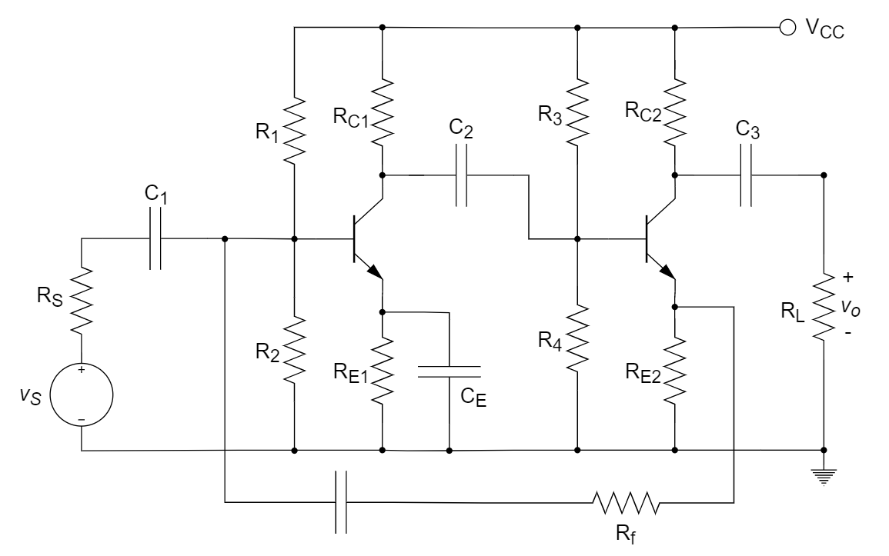
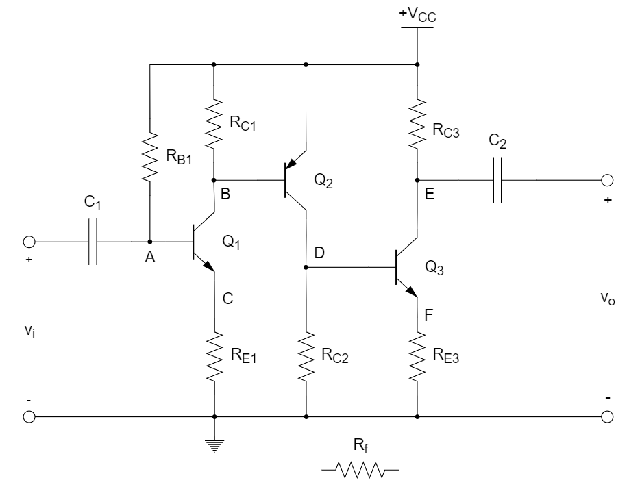
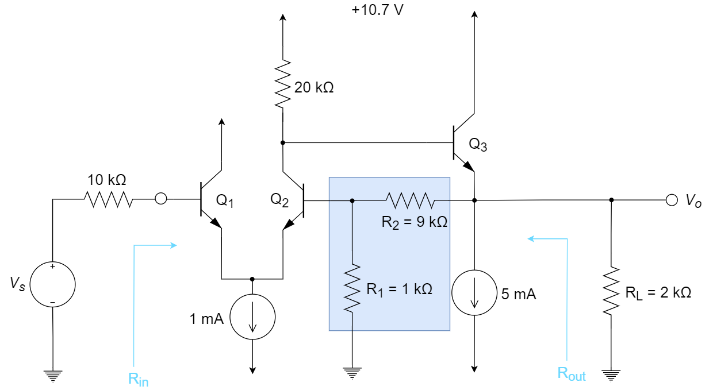
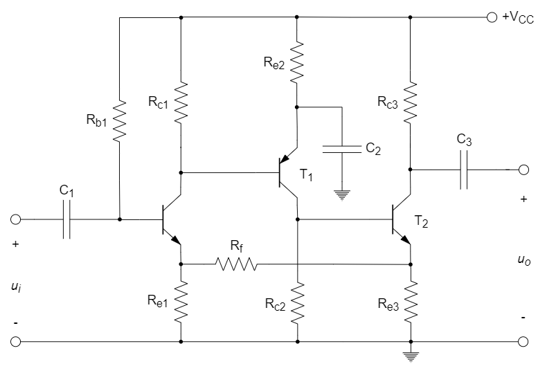
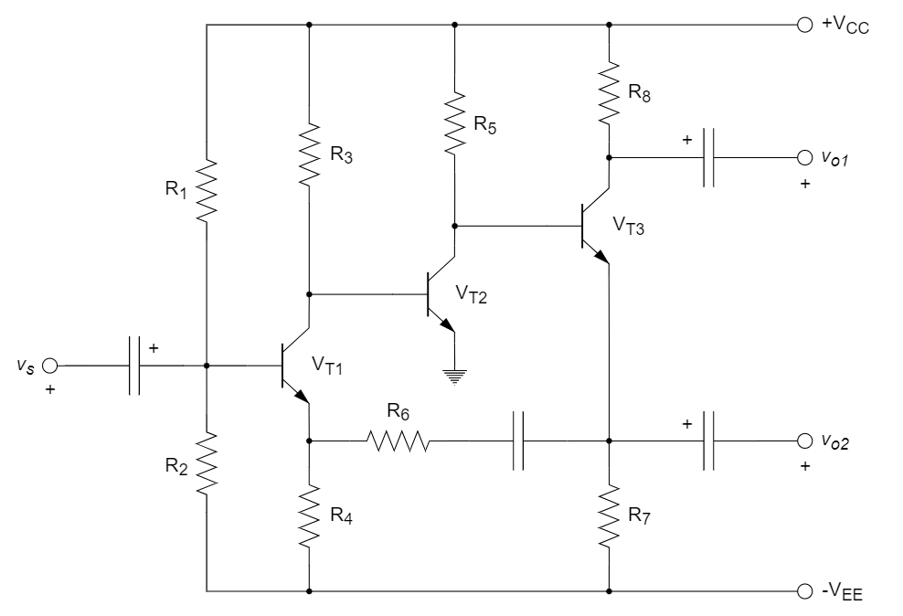
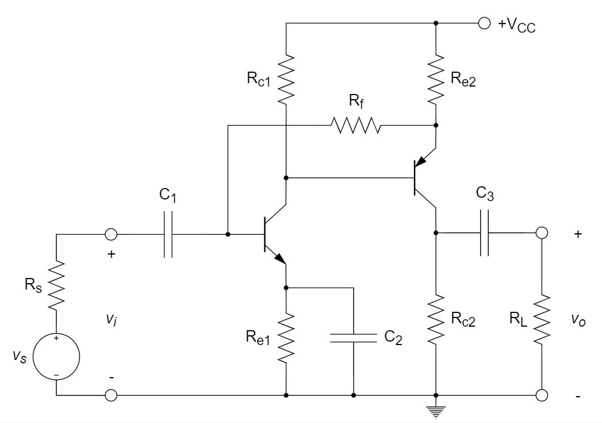
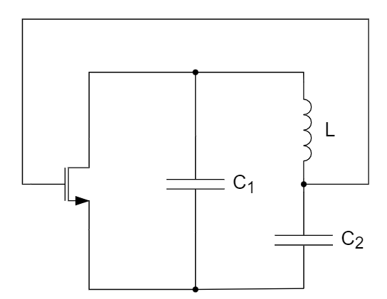

# 反馈

::: tip

​		负反馈的四种组态及判别方式、负反馈的影响分析（增益、带宽、稳定性、信噪比、输入输出阻抗）、负反馈电路的拆环与闭环分析、稳定性分析、自激振荡及补偿。

* 掌握反馈类型的判断
  * 名称的范式：“【输出端感知什么】【输入端怎么连接】”，如“电压串联负反馈”，输出端感知电压，输入端串联（即返回电压，与输入电压相减）
  * 常见的串联负反馈（输入电压相减）电路结构：差分对：non-inverting的运算放大器；输入和返回构成BE或GS；
* 负反馈牺牲增益，获得其他性能的提升，缩放因子皆为 $(1+A\beta)$
* 拆坏：并联 destroy 则短路；串联 destroy 则开路

:::

# 习题及参考解答

## 知识点1：负反馈原理与组态分析

1、某仪表放大电路，要求输入电阻大，输出电流稳定，应选 ________ 型电路。

A. 电流串联负反馈		B. 电压并联负反馈

C. 电流并联负反馈		D. 电压串联负反馈

> A。输入电阻大，则说明输入信号是电压信号；输出已明确指出是电流信号。

2、对于放大电路，所谓开环是指 ________ 。

A. 无信号源		B. 无反馈通路		C. 无电源		D. 无负载

> B

3、放大器深度负反馈的条件是 ________ 。

A. │1+*AF*│ >> 1		B．│*A*│ >> 1		C．│*F*│ >> 1		D．│1/*F*│ >>1

> A

4、一个负反馈放大电路采样电压返回电流，则以下叙述正确的是 ________ 。

A. 输入阻抗变小，输出阻抗变小		B. 输入阻抗变小，输出阻抗变大

C. 输入阻抗变大，输出阻抗变小		D. 输入阻抗变大，输出阻抗变大

> A。输出信号是电压信号，输入信号是电流信号。负反馈使输入输出电阻更加理想化。

5、判断下图所示电路 (a) 和 (b) 引入的反馈分别是 ________ 和 ________ ，其反馈系数分别为 ________ 和 ________ 。

> 电压并联负反馈      电压串联负反馈      $-\frac{1}{R_f}$      $\frac{R_s}{R_s+R_f}$

6、某传感器产生的是电压信号（几乎不能提供电流），经过放大后希望输出电压与信号成正比，这时放大电路应选 ________ 。

A. 电流串联负反馈				B. 电压并联负反馈

C. 电流并联负反馈				D. 电压串联负反馈

> D

7、判断下图所示电路中包含电阻 $R_f$ 的反馈网络的反馈类型为 ________ 。

A. 电压串联负反馈				B. 电压并联负反馈

C. 电流串联负反馈				D. 电流并联负反馈

> D。输出为集电极电压， $R_{E2}$ 感知电流 $I_C$。

8、射极跟随器是典型的 ________ 负反馈。

A. 电压串联		B. 电流并联		C. 电流串联		D. 电压并联

> A

9、判断下图所示电路的反馈类型为 ________ 。

A. 电压串联负反馈				B. 电压并联负反馈

C. 电流串联负反馈				D. 电流并联负反馈

> C。发射极退化结构，发射极电阻感知$I_C$，返回$V_E$（与 $V_B$ 相减）。

10、如下图所示电路，要求达到以下目的，需要如何构建反馈网络。

(1) 希望提高 A 端和地之间的输入电阻，则可以将电阻 $R_f$ 接在 ________ 和 ________ 之间；

(2) 在给定输入电压 $v_i$ 下，希望输出端接上负载 $R_L$ 后输出电压 $v_o$ 基本不变，则可以将电阻 $R_f$ 接在 ________ 和  ________ 之间。

> C   F         A   E。（1）提高输入电阻，即输入为电压信号；极性判断：若A点为+，则B点为-，D点为+，F点为+，E点为-，故接CF；（2）接上负载后希望输出电压基本不变，即输出为电压信号，加反馈后输出电阻降低；故感知电压，接E，极性判断：E为-，故接A。

11、对于电压串联负反馈电路，由于反馈的引入，电路的 ________ 。

A. 输入阻抗变小，输出阻抗变小		B. 输入阻抗变小，输出阻抗变大

C. 输入阻抗变大，输出阻抗变小		D. 输入阻抗变大，输出阻抗变大

> C

12、以下对于负反馈结构特性的描述，错误的是 ________ 。

A. 可以提高增益				B. 可以增加带宽

C. 可以稳定增益				D. 可以改善非线性

> A。负反馈牺牲增益，获得其他方面性能的提升。

13、设某个放大器开环时 $\frac{d|A_v|}{|A_V|}$ 为 20%，若要求 $\frac{d|A_v|}{|A_V|}$ 不超过 1%，且 $|A_{vf}|=100$，则要求开环增益 $|A_v|$ 大于 ________ ，反馈系数 $|F|$ 大于 ________ 。

> 2000      0.0095（0.01）。采用深度负反馈近似，负反馈缩放因子 $(1+A\beta) \approx A\beta$， $\beta = 1/100$，所以开环增益 A =2000。  

14、在输入量不变的情况下，若引入反馈后 ________ ，则说明引入的反馈是负反馈。

A. 输入电阻增大			B. 输出量增大			C. 净输入量增大			D. 净输入量减小

> D

15、由于射极跟随器引入了电压串联负反馈，因此电压放大倍数很小。但这种电路具有输入电阻 ________ （大/小）、输出电阻 ________ （大/小）的突出特点。

> 大  小。射极跟随电路的负反馈解释。

## 知识点2：负反馈电路的分析

1、已知三极管共射放大电路如下图所示，设三极管在静态工作点附近的 *β* ＝ 50，$V_T$  =  26  mV，试计算：

(1) 电压增益 $A_v$ 和输入输出电阻 $R_i$ 、$R_o$ 

(2) 为了提高输入电阻，降低输出电阻，应该引入什么类型负反馈？

(3) 设引入负反馈的反馈系统的 $A_v F$ = 9，请问该电路系统的输入、输出电阻相对原开环放大器变化多少倍？

> (1)	 ${V_B}^\prime  = \frac{{{R_{b2}}}}{{{R_{b1}} + {R_{b2}}}}{V_{CC}} = \frac{{6.2}}{{15 + 6.2}} \times 12 \approx {\rm{3}}{\rm{.5V}}$ 
>
> ​		 ${R_b} = {R_{b1}}{\rm{//}}{R_{b2}} = 15{\rm{//}}6.2 \approx 4.4{\rm{ k}}\Omega$ 
>
> ​		 ${I_{EQ}} \approx \beta {I_{BQ}} = \beta \frac{{V_B^{'} - 0.7}}{{{R_b} + (1 + \beta ){R_e}}} = 1.3\;{\rm{mA}}$ 
>
> ​		 ${r_{be}} = (1 + \beta )\frac{{26}}{{{I_{EQ}}}} = 51 \times \frac{{26}}{{1.3}} = 1.02\;{\rm{k\Omega}}$ 
>
> $\Rightarrow \left\{ {\begin{array}{*{20}{c}}
> {{{\dot A}_v} =  - \frac{{\beta ({R_c}{\rm{//}}{R_L})}}{{{r_{be}}}} \approx  - 73.5\quad}\\
> {{R_i} = {R_{b1}}{\rm{//}}{R_{b2}}{\rm{//}}{r_{be}} \approx {\rm{0}}{\rm{.83 k\Omega}}}\\
> {{R_o} = {R_c}{\rm{//}}{r_{ce}} \approx {R_c} = {\rm{3 k\Omega }}\quad \quad}
> \end{array}} \right.$ 
>
> (2)	引入电压串联负反馈电路。输入输出皆为电压信号
>
> (3)	输入电阻增加10倍，而输出电阻下降了10倍。缩放因子皆为 $(1+A\beta)$

2、如下图所示电路，问：

(1) 判断反馈类型

(2) 画出拆环后的电路

(3) 求出反馈系数

(4) 假定反馈为深度负反馈，求放大器电压增益 $v_o/v_i$ 、输入电阻和输出电阻。

> (1)	电压串联负反馈。感知电压，返回电压
>
> (2)	拆环后的电路如下图所示：输出并联，destroy则短路；输入串联，destroy则开路
>
> 
>
> (3)	反馈系数 $F = \frac{{{R_{E1}}}}{{{R_{E1}} + {R_f}}}$ 。输入destroy（开路），输出加电压激励，求输入的电压响应，即电阻分压
>
> (4)	${A_v} \approx \frac{1}{F} = \frac{{{R_{E1}} + {R_f}}}{{{R_{E1}}}}$，${R_{if}} \approx \infty$，${R_{of}} \approx 0$ 

3、分析如下图所示的负反馈电路，其中输入信号 $V_s$ 的直流偏置电压为 0 V，$Q_3$ 的 $V_{BE}$ ≈ 0.7 V。

(1)  指出这是什么类型的负反馈电路；

(2)  假设管子的电流放大倍数很大，写出三个晶体管的直流偏置电流 $I_{C1}$、$I_{C2}$、$I_{C3}$，以及输出电压 $V_o$ 的直流偏置值；

(3)  假设 $V_T$  ≈ 25 mV，管子的电流放大倍数 $\beta_1$ = $\beta_2$ = $\beta_3$ =100，画出该电路的开环电路，并计算开环增益 A ；

(4)  计算电路反馈系数 *β* ( *F* )，并计算闭环增益 $A_f$，及如图所示的输入输出电阻 $R_{in}$ 和 $R_{out}$。

> (1)  电压串联负反馈电路；感知的是电压信号，返回构成差分对；
>
> (2)  $I_{C1}=I_{C2}=0.5{\rm mA}$；$I_{C3}=5{\rm mA}$ 
>
> ​	  $V_{C2}=10.7-0.5×20=0.7{\rm V}$ 
>
> ​	  $V_o=0.7-0.7=0{\rm V}$ 
>
> ​    【注】假设差分对的管子均工作在放大区，则忽略厄雷效应时，电流依旧可看作平分；输入 $V_s$ 的直流偏置为0V，则Q1的基极电压小于0V，从而Q2的基极电压也小于0V，而Q2的集电极电压为0.7V，满足工作在放大区的假设。
>
> (3)  拆坏，输出并联，destroy则短路；输入串联，destroy则开路
>
> 
>
> ​	  $g_{m1}=\frac{I_{C1}}{V_T}=(50{\rm Ω})^{-1}$；$g_{m2}=(50{\rm Ω})^{-1}$；$g_{m3}=(5{\rm Ω})^{-1}$ 
>
> ​	  $A=\frac{V'_o}{V'_i}=\frac{[20||(\beta_2+1)(r_{e3}+2||10)]}{r_{e1}+r_{e2}+\frac{10}{\beta_1+1}+\frac{(1||9)}{\beta_2+1}} \times \frac{(2||10)}{r_{e3}+(2||10)}=85.7{\rm V/V}$ 
>
> ​	  $R_i=R_s+(\beta+1)(r_{e1}+r_{e2})+R_E||R_4=10+101\times(50+50)+(1||9)=21{\rm kΩ}=21{\rm kΩ}$ 
>
> ​	  $R_o=2||10||[r_{e3}+\frac{20}{\beta_2+1}]=181{\rm Ω}$ 
>
> (4)  
>
> 
>
> ​	  $\beta=\frac{V'_f}{V'_o}=\frac{1}{9+1}=0.1{\rm V/V}$ 
>
> ​	  $A_f=\frac{V_o}{V_s}=\frac{A}{1+A\beta}=\frac{85.7}{1+85.7\times0.1}=8.96{\rm V/V}$ 
>
> ​	  $R_{if}=R_i(1+A\beta)=21\times9.57=201{\rm kΩ}$ 
>
> ​	  $R_{in}=R_{if}-R_s=201-10=191{\rm kΩ}$ 
>
> ​	  $R_{of}=(R_{out}||R_L)=\frac{R_o}{1+A\beta}=\frac{181}{9.57}=18.8{\rm Ω}$ 
>
> ​	  $⇒R_{out}=19.1{\rm Ω}$ 

4、已知一个负反馈放大电路的基本放大电路的幅频和相频特性如下图所示，反馈网络由纯电阻组成。若要求电路稳定工作，即不产生自激振荡，则反馈系数（$20\lg \left| {\dot F} \right|$）的上限值为<u>__  __</u>。

> -60 dB。题目中没有指定 Phase Margin，按 Phase Margin 为 0 的临界情况分析，-180度时 $A\beta = 0 dB$，即 $1/\beta$ 为 60 dB。 

5、如下图所示电路，问：

(1)  若要实现电压串联反馈，$R_f$ 应接向何处？

(2)  若要实现电压串联负反馈，运放的输入端极性如何确定？

(3)  若引入的电压串联负反馈为深度负反馈，求闭环电压放大倍数。

> (1)  要实现电压串联反馈，$R_f$ 应接向晶体管 $T_2$ 的基极，见下图。【输入差分对构成电压相减】
>
> (2)  要实现电压串联负反馈，$R_f$ 运放的输入端极性为上正下负，见下图。
>
> 
>
> (3)  若引入的为深度负反馈，则
>
> 
>
> ​	  $F = \frac{{{v_f}}}{{{v_o}}} = \frac{{{R_{b2}}}}{{{R_{b2}} + {R_f}}} = 0.1$ 
>
> ​	  ${A_{vf}} = \frac{1}{F} = 1 + \frac{{{R_f}}}{{{R_{b2}}}} = 10$

6、对于如下电路：

(1)  判断由 $R_f$ 、$R_{e1}$ 和 $R_{e3}$ 引入了什么交流反馈？

(2)  深度负反馈条件下，推导反馈系数 $F$ 和闭环增益 $A_{uf}=u_o/u_i$ 。

> (1)  电流串联负反馈。感知电流，返回电压
>
> (2)  $F = \frac{{{v_f}}}{{{i_o}}} = \frac{{{R_{e1}}{R_{e3}}}}{{{R_{e1}} + {R_f} + {R_{e3}}}}$ 
>
> ​	  ${A_{uf}} = \frac{{{u_o}}}{{{u_I}}} =  - \frac{{{i_o}{R_{c3}}}}{{{u_I}}} =  - \frac{{{R_{c3}}}}{F} =  - \frac{{{R_{e1}} + {R_f} + {R_{e3}}}}{{{R_{e1}}{R_{e3}}}} \cdot {R_{c3}}$ 

7、已知电容耦合的放大器的中频增益为 1000 V/V，高频单极点在 10 kHz，低频单极点在 100 Hz。放大器加入负反馈后中频增益减小到 10 V/V，则闭环增益的 3 dB 低频和高频截止频率分别为 ________ 和 ________ 。

> 1 Hz      1000 kHz。负反馈的缩放因子皆为 $(1+A\beta) = 100$，所以低频和高频截止频率分别也缩放100倍，低频更低，高频更高。

8、有一反馈电路如下图所示，问：

(1) 该电路是什么类型的负反馈电路？

(2) 假设 $g_{m1}=g_{m2}=4{\rm mA/V}$，$R_{D1}=R_{D2}=10{\rm k \Omega}$，$R_1=1{\rm k \Omega}$，$R_2=9{\rm k \Omega}$，忽略沟道调制效应，画出拆环电路和反馈网络，求输入阻抗 $R_{in}$、输出阻抗 $R_{out}$ 和电压增益 $v_o/v_i$ 。

> (1)  电压串联负反馈。感知电压，返回电压
>
> (2)  拆分 A 电路、$\rm \beta$ 电路。输出并联，destroy则短路；输入串联，destory则开路
>
> 
>
> ​	  $A_1=\frac{V_{d1}}{V_i}=-\frac{R_{D1}}{1/g_{m1}+(R_1||R_2)}=-\frac{g_{m1}R_{D1}}{1+g_{m1}(R_1||R_2)}$ 
>
> ​	  $A_2=\frac{V_o}{V_{d1}}=-g_{m2}[R_{D2}||(R_1+R_2)]$ 
>
> ​	  $A=\frac{V_o}{V_{d1}}=A_1A_2=\frac{g_{m1}R_{D1}g_{m2}[R_{D2}||(R_1+R_2)]}{1+g_{m1}(R_1||R_2)}=\frac{4 \times 10 \times 4 \times [10||(1+9)]}{1+4 \times (1||9)}=173.9{\rm V/V}$ 
>
> ​	  $\beta=\frac{V_f}{V_o}=\frac{R_1}{R_1+R_2}=0.1$ 
>
> ​	  $\frac{V_o}{V_s}=A_f=\frac{A}{1+A\beta}=\frac{173.9}{1+173.9 \times 0.1}=9.46{\rm V/V}$ 
>
> ​	  $R_{out}=R_{of}=\frac{R_o}{1+A\beta}=272{\rm \Omega}$ 
>
> ​	  $R_{in}=\infty$ 

9、判断如下图所示电路的反馈类型，求反馈系数 $F$ ，并计算在深度负反馈条件下该电路的闭环电压增益 $A_v$ 、输入电阻 $R_i$ 和输出电阻 $R_o$ 。

> (1)  电压串联负反馈。感知电压，返回电压
>
> (2)  反馈系数 $F = \frac{{{R_1}}}{{{R_1} + {R_2}}} = 0.1$ 
>
> (3)  ${A_v} = \frac{1}{F} = 10$ 
>
> ​	  ${R_i} = \infty$ 
>
> ​	  ${R_o} = 0$ 

10、如下图所示电路，已知 $R_3=300{\rm \Omega}$，$R_4=2{\rm k \Omega}$，$R_5=5.1{\rm k \Omega}$，$R_6=3{\rm k \Omega}$，$R_7=1{\rm k \Omega}$，$R_8=1{\rm k \Omega}$，问：

(1)	当采用 $V_{o1}$ 输出时，该电路属于何种类型与极性的反馈放大电路？

(2)	当采用 $V_{o2}$​ 输出时，该电路属于何种类型与极性的反馈放大电路？

(3)	假设满足深度负反馈条件，试求两种情况下的电压增益 $A_{vf}$ 。

> (1)	电流串联负反馈。感知电流（$R_7$ ），返回电压
>
> (2)	电压串联负反馈。感知电压，返回电压
>
> (3)	第一种情况：${V_{o1}} \approx  - {I_{o1}}{R_8}$ 
>
> ​		反馈网络的结构可看成 $R_4$ 与 $R_6$ 串联后与 $R_7$ 并联，$V_f$ 为 $R_4$ 上的分压。
>
> ​		即 $V_f=I_o\frac{R_4 \cdot R_7}{R_4+R_6+R_7}$  
>
> ​		$F=\frac{V_f}{I_o}=\frac{R_4 \cdot R_7}{R_4+R_6+R_7}=\frac{1}{3}{\rm V/A}$ 
>
> ​		$A_{vf}=\frac{V_{o1}}{V_s} \approx \frac{- {I_{o}}{R_8}}{V_f}=-\frac{R_8}{F}=-3{\rm V/V}$ 
>
> ​		第二种情况：
>
> ​		该反馈为电压串联深度负反馈，因此 $V_f$ 为 $R_4$ 在 $R_4$ 和 $R_6$ 串联回路中的分压。
>
> ​		$F=\frac{V_f}{V_s}=\frac{R_4}{R_4+R_6}=0.4{\rm V/V}$ 
>
> ​		$A_{vf}=\frac{v_{o2}}{v_s} \approx \frac{v_{o2}}{v_f}=\frac{1}{F}=\frac{R_4+R_6}{R_4}=2.5{\rm V/V}$ 

11、如下图所示电路，回答如下问题：

(1)	判断电路中所引入的级间反馈类型；

(2)	求出反馈系数；

(3)	求出深度负反馈条件下该电路的电压增益、输入电阻和输出电阻。

> (1)	电压串联负反馈。感知电压，返回电压
>
> (2)	反馈系数为 $F = \frac{{100}}{{100 + 900}} = 0.1{\rm{ V/V}}$ 
>
> (3)	${A_v} = \frac{1}{F} = 10{\rm{ V/V}}$ 
>
> ​		${R_i} = \infty $ 
>
> ​		${R_0} = 0$ 

12、分析下图所示电路：

(1)	判断电路中引入了哪种组态的交流负反馈。

(2)	推导深度负反馈下电压增益 ${A_{vf}} = \frac{{{v_o}}}{{{v_s}}}$ 的表达式。

> (1)	电流并联负反馈。感知电流，返回电流
>
> (2)	$F = \frac{{{i_f}}}{{{i_o}}} = \frac{{{R_{e2}}}}{{{R_{e2}} + {R_f}}}$ 
>
> ​		${A_{if}} \approx \frac{1}{F} = 1 + \frac{{{R_f}}}{{{R_{e2}}}}$ 
>
> ​		${A_{vf}} = \frac{{{v_o}}}{{{v_s}}} \approx \frac{{{i_o}\left( {{R_{c2}}//{R_L}} \right)}}{{{i_i}{R_s}}} = {A_{if}}\frac{{{R_{c2}}//{R_L}}}{{{R_s}}} = \left( {1 + \frac{{{R_f}}}{{{R_{e2}}}}} \right)\frac{{{R_{c2}}//{R_L}}}{{{R_s}}}$ 

## 知识点3：正反馈与振荡器 【考试不作要求】

1、一个正弦波振荡电路的反馈系数 *F* = 1/5∠180°，若该振荡器能够产生稳定的振荡，则该电路开环电压放大器的倍数 $A_V$ 必须大于等于 ________ 。

A.  *F* = 1/5∠360°		B.  *F* = 5∠−180°		C.  *F* = 1/5∠180°		D.  *F* = 5∠0°

> B

2、振荡器的输出信号最初是由 ________ 而来的。

A. 基本放大器		B. 选频网络		C. 干扰或噪声信号

> C

3、下列三点式LC振荡器电路不满足基本振荡条件的电路为 ________ 。

A.  				B.  

C.  				 D.  

> D

4、在 *RC* 桥式正弦波振荡电路中，当相位平衡条件满足时，放大电路的电压放大倍数 ________ 时电路可以起振。

A. 等于1/3		B. 等于1		C. 等于3		D. 略大于3

> D

5、如下图所示的电路中，设运放是理想器件，$R_f$ 和 $R_i$ 的阻值合适，*R* = 100 kΩ，*C* = 0.01 µF，则其振荡频率约为 ________ 。

A. 999 Hz		B. 159 Hz		C. 99.9 Hz		D. 15.9 Hz

> B

6、振荡器（其基本放大器的增益幅度为 $A$ ，相角为 $\phi_A$ ；反馈系数为 $F$ ，相角为 $\phi_F$ ）的振幅起振条件是 ________ ，相位起振条件是 ________ 。

> 环路增益 $T=AF>1$      相移 $\phi_T = \phi_A + \phi_F = 2n\pi$ 

7、为了满足振荡的相位条件， 文氏电桥振荡电路中放大电路的输出信号与输入信号之间的相位差，合适的值是 ________ 。

A. 90°		B. 180°		C. 270°		D. 360°

> D

8、正弦波振荡电路属于正反馈电路，它主要由放大器、________ 、 ________ 和 ________ 组成。

> 正反馈网络      选频电路（或网络）      限幅电路

