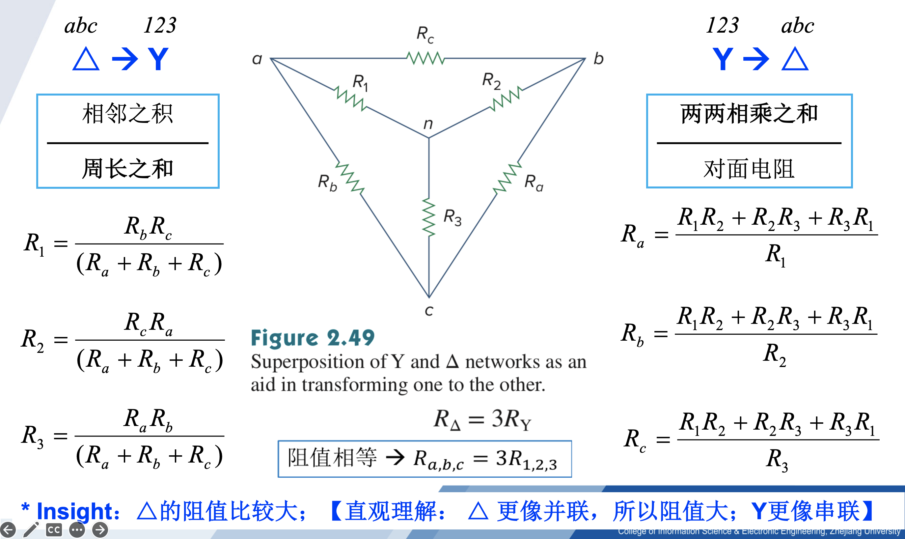

## 电路分析的基本方法和定理

::: tip

1. 电路等效概念：接口处电压、电流保持不变；

2. 电路等效计算，即**输入电阻/等效电阻**计算（针对一端口网络）

   * 	若仅含电阻，等效化简即可；

   * 	若含受控源，但不含独立源，施加电压求电流，或者施加电流求电压；

   * 	若含独立源，则先将其 turn off（电压源短路，电流源开路），再计算；

3. 电阻电路的分析：串联分压，总电阻为各电阻之和；并联分流，总电导为各电导之和；

4. 电容电感串并联

   * 电感类似于电阻，串联则电感值相加，并联则电感值的倒数相加；

   * 电容并联则电容值相加，类似于电阻串联；电容串联则电容值倒数相加，类似于电阻并联

1. Y-Δ等效变换

5. 网孔电流法

   * 以 *l* 个 网孔电流为变量，对 *l* 个网孔列KVL方程，求解线性方程组；

   * 若含电流源，因电流源两端电压不能确定，故采用超级网孔避开电流源，再列线性方程求解；

5. 节点电压法

   *  以 *n*-1 个节点电压为变量，对 *n*-1 个节点列 *n*-1 个KCL方程，求解线性方程组；

   *  若含电压源，因流过电压源的电流不能确定，故采用广义节点把电压源包含进来，再列线性方程组求解；

6. 叠加定理（线性电路齐次性）

   * 线性：齐次性、可加性

   * 分别计算每个独立源的贡献（考虑一个独立源时，其他独立源均设为零/turn off），再线性叠加；适用于有多个独立源的线性电路

7. 替代定理：保持接口电压或电流不变，用电压源或电流源替代

9. 戴维南定理：开路电压 & 等效电阻
10. 诺顿定理：短路电流 & 等效电阻
11. 最大功率传递定理：对于电阻网络，负载电阻 = 戴维南等效电阻
12. 电源变换。”电压源串联电阻“ 等价于 ”电流源并联电阻“

:::

## 习题及参考解答

### 知识点1： 电路等效及相关计算

1、右图所示电路的等效电阻为 ________ 。

A. 4 Ω	B. 1 Ω	C. ﹣2 Ω	D. 2 Ω

2、右图所示电路的等效电阻 $R_{AB}$ = ________ 。

3、理想电压源和理想电流源串联，其等效电路为 ________ 。

4、右图的等效电容为 ________ 。

5、右图所示电路的等效电路为<u>__  __</u>。

A. 	B. 	C. 	D. 

**参考解答**

1. C
2. $\frac{R}{1-a}$
3. 电流源        电压源
4. 8 F
5. A