# 电路分析的基本方法和定理

::: tip

1. 电路等效概念：接口处电压、电流保持不变；

2. 电路等效计算，即**输入电阻/等效电阻**计算（针对一端口网络）

   * 	若仅含电阻，等效化简即可；

   * 	若含受控源，但不含独立源，施加电压求电流，或者施加电流求电压；

   * 	若含独立源，则先将其 turn off（电压源短路，电流源开路），再计算；

3. 电阻电路的分析

   * 串联分压，总电阻为各电阻之和；并联分流，总电导为各电导之和；
   * Weatstone电桥：平衡时电阻成比例，流过电流计电流为零；

4. 电容电感串并联

   * 电感类似于电阻，串联则电感值相加，并联则电感值的倒数相加；

   * 电容并联则电容值相加，类似于电阻串联；电容串联则电容值倒数相加，类似于电阻并联

5. Y-Δ等效变换

   * $\Delta$ to Y: $\frac{相邻之积}{周长之和}$

   * Y to $\Delta$: $\frac{两两相乘之和}{对面电阻}$
   * $\Delta$ 阻值比较大，更像并联；Y 阻值比较小，更像串联；当阻值相等时，$R_{\Delta} = 3R_Y$

6. 网孔电流法

   * 以 $l$ 个网孔电流为变量，对 $l$ 个网孔列KVL方程，求解线性方程组；

   * 若含电流源，因电流源两端电压不能确定，故采用超级网孔避开电流源，再列线性方程求解；

7. 节点电压法

   *  以 *n*-1 个节点电压为变量，对 *n*-1 个节点列 *n*-1 个KCL方程，求解线性方程组；

   *  若含电压源，因流过电压源的电流不能确定，故采用广义节点把电压源包含进来，再列线性方程组求解；

8. 叠加定理（线性电路齐次性）

   * 线性：齐次性、可加性
   * 功率不可直接叠加

   * 分别计算每个独立源的贡献（考虑一个独立源时，其他独立源均设为零/turn off），再线性叠加；适用于有多个独立源的线性电路

9. 替代定理：保持接口电压或电流不变，用电压源或电流源替代

10. 戴维南定理：开路电压 & 等效电阻

11. 诺顿定理：短路电流 & 等效电阻
12. 最大功率传递定理：
    * 对于电阻网络，负载电阻 = 戴维南等效电阻
    * 最大功率传输时，效率并不一定等于50%

13. 电源变换。”电压源串联电阻“ 等价于 ”电流源并联电阻“

:::

# 习题及参考解答

## 知识点1： 电路等效及相关计算

1、右图所示电路的等效电阻为 ________ 。

A. 4 Ω	B. 1 Ω	C. ﹣2 Ω	D. 2 Ω

2、右图所示电路的等效电阻 $R_{AB}$ = ________ 。

3、理想电压源和理想电流源串联，其等效电路为 ________ 。

4、右图的等效电容为 ________ 。

5、右图所示电路的等效电路为 ________ 。

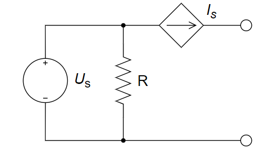

A. 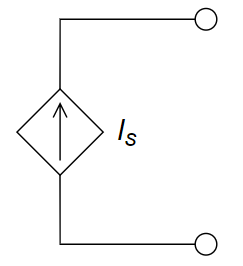	B. 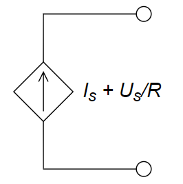	C. 	D. 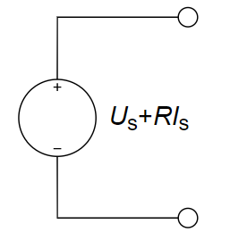

6、下图所示电路 ab 端的等效电阻 $R_{ab}$ 等于 ________ 。

A. 10 Ω				B. 9.5 Ω				C. 9 Ω				D. 8.5 Ω

7、下图所示电路的端口等效电阻等于 ________ Ω。

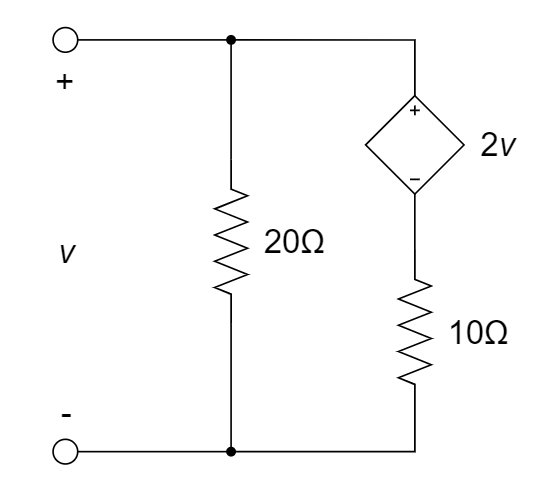

**参考解答**

1. C
2. $\frac{R}{1-a}$
3. 电流源        电压源
4. 8 F
5. A
6. B
7. $-20$

## 知识点2：电阻电路的分析

1、右图中，电流 $I$ 为 ________ 。

2、计算右图中的 $v_o$ 值为 ________ 。

3、下图所示电路中，电压 U 为 ________ 。

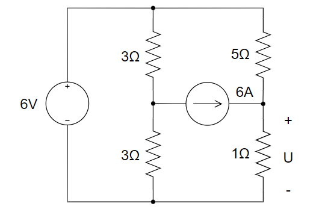

A. 4V		B. 5V		C. 6V		D. 3V

4、下图中受控电流源的转移电导 $g=0.01mS$ ，则20 KΩ电阻两端的电压为<u>__  __</u>。

5、Wheatstone 电桥广泛应用于电阻测量，已知待测电阻 $R_x$ 的阻值范围为 0 ─ 10 Ω，某同学设计了如下电路，其中 *G* 是电流计，问：

(a) 该同学的设计思路是什么（即如何实现电阻测量）？

(b)  $R_1$ 和 $R_3$ 应如何选取？

6、求下图所示电路中电流 $I_1$ 和 $I_2$ ，并计算各电源的功率，同时判断该电源是吸收还是发出功率。

7、欲使下图所示电路中的支路电流 $I$ = 1 A，试求电流源的输出电流 $I_S$ 。

8、如下图所示电路，支路电流 $I$ 的值为 ________ 。

9、利用如下图所示的惠斯登电桥可以较为精确地测量中等阻值的电阻，其中 $R_1=R_3=1{\rm k \Omega}$ ，调节可调电阻 $R_2$ 使电流表的指示为零，此时称电桥处于平衡状态， ${R_2} = 4{\rm{k}}\Omega$ ，则被测电阻 $R_x$ 的阻值为 ________ 。

10、下图所示电路中，电流 $I$ 的值为 ________ 。

11、根据图中的参数，计算 $v_o$。

**参考解答**

1. $-0.2$ A

2. 3.2 V

3. C

4. 2 V

5. (a) 调节 50 Ω 变阻器，当电桥平衡（电流计电流为0）时，通过比值关系获得待测电阻 $R_x$ 的阻值；

   (b) $R_1$ : $R_3$ 应为 5:1，可选取 100 Ω、20 Ω。

6. 方法一：

   根据各电流量之间的关系、18 V 和 20 V 电压源在负载上的电压降关系，以及左侧大回路的回路电压降关系，列方程组如下：
   $$
   \begin{cases}
   I_1+I_3+I_4=0 \\
   I_1+2=I_2 \\
   I_4=I_5+I_6 \\
   I_5=\frac{18}{2} \\
   (-I_3×3)+I_1×3+I_2×4=20 \\
   I_4×6+I_5×2=I_3×3
   \end{cases}
   $$
   解得：$I_1=2A,I_2=4A,I_3=\frac{2}{3}A,I_4=-\frac{8}{3}A,I_5=9A,I_6=-\frac{35}{3}A$ 

   

   20 V 电压源的功率为： $P=(I_2-2)×(-20V)=-40W$ ，发出功率

   2 A 电流源的功率为： $P=(-2A)×U=(-2A)×(I_2×4Ω+5Ω×2A)=-52W$ ，发出功率

   18 V 电压源的功率为：$18V×I_6=-210W$ ，发出功率

   方法二：

   (1) 等效电路

   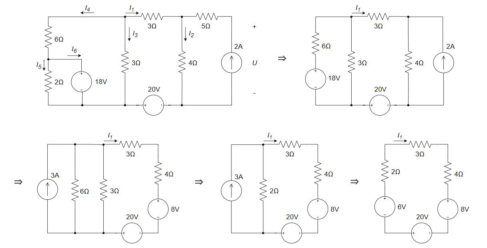

   得：$I_1=\frac{6+20-8}{2+3+4}=2A$ 

   20 V 电压源的功率为 $P=-20V×2A=-40W$ ，发出功率

   (2) 等效电路

   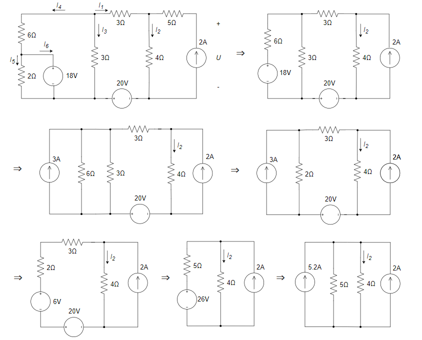

​    得：$I_2=\frac{5}{5+4}×(5.2+2)=4A$ 

​    原电路 $U=5×2+4×4=26V$ 

​    2 A 电流源的功率为 $P=(-2A)×26V=-52W$ ，发出功率

​    (3) 18 V 电压源的功率为

​    $∵3×2+4×4-20-3I_3=0,∴I_3=\frac{2}{3}A$ 

​    $∵I_4=-(2+\frac{2}{3})=-\frac{8}{3}A ,I_5=\frac{18}{2}=9A$ 

​    $∴I_6=I_4-I_5=-\frac{8}{3}-9=\frac{-35}{3}A$ 

​    $∴P=18V×I_6=18×(-\frac{35}{3})W=-210W$ ，发出功率

7. $V_{ca}=1Ω×1A=1V,V_{cb}=V_{ca}+V_{ab}=1+2=3V,I_{cb}=\frac{V_{cb}}{1Ω}=3A$ 

   $I_{dc}=I+I_{cb}=1+3=4A,V_{da}=V_{dc}+V_{ca}=(I_{dc}×1Ω-2V)+V_{ca}=3V$ 

   $I_{da}=\frac{V_{da}}{3Ω}=1A,I_s=I_{da}+I_{dc}=1A+4A=5A$ 

8. 3 A

9. 4 kΩ

10. $\frac{10}{9}{\rm A}$ 。与电流源串联的电阻不改变电流值；与电压源并联的电阻不改变电压值。

11. 解：

    列方程组如下

    $\begin{cases}	-12+4i+2v_o-4+6i=0 \\ i=-\frac{v_o}{6}	\end{cases}$ 	$\Rightarrow$	 $\begin{cases}	i=-8{\rm A} \\ v_o=48{\rm V}	\end{cases}$ 

    

## 知识点3：Y-$\Delta$ 等效变换

1、已知电路中 $\Delta$ 形电路中三个电阻均为 120Ω ，那么转换后的 Y 形电路中的三个电阻分别为 ____ 。

A. 40 Ω、40 Ω、40 Ω				B. 360 Ω、360 Ω、360 Ω

C. 120 Ω、120 Ω、120 Ω		 D. 360 Ω、360 Ω、40 Ω

2、求下图电路的等效电阻 $R_{eq}$ 。

3、求下图所示电路中的支路电流 $I_1、I_2和I_3$ 。

**参考解答**

1. A

2. 

3. 首先 $Z_Y=2Ω$ 变换为 $Z_Δ=6Ω$ ； $6Ω$ 与 $1Ω$ 并联得到 $\frac{6}{7}Ω$ ；在 $Δ→Y$ 转换得到 $\frac{2}{7}Ω$ 。

   通过叠加定理或者网孔电流法可计算得到：

$$
\begin{cases}\frac{2}{7}I_1+\frac{2}{7}I_3=12 \\\frac{2}{7}I_2+\frac{2}{7}I_3=30 \\I_1+I_2=I_3\end{cases}⇒\begin{cases}I_1=-7A \\I_2=56A \\I_3=49A\end{cases}
$$

## 知识点4：网孔电流法

1、用网孔电流法求解下图所示电路中的三个网孔电流 $I_1$、$I_2$ 和 $I_3$ 。

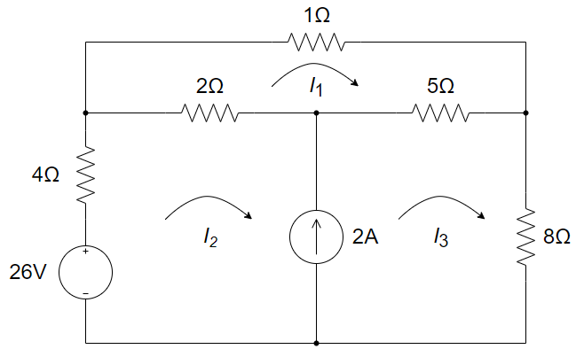

2、回路电流法是根据 ________ 定律列出的；节点电压法是根据 ________ 定律列出的。

3、用网孔法求下图所示电路中支路电流 $I_4$ 。

4、用网孔电流法求解下图所示电路中的支路电流 $i$ 。

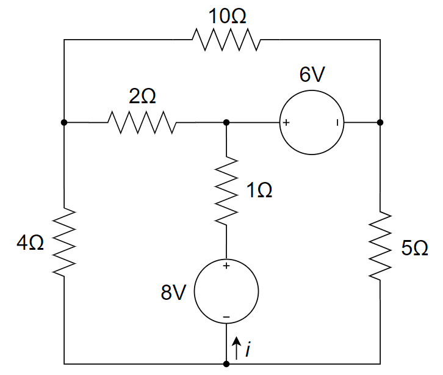

5、用网孔电流法求下图所示电路中的电流 $I_1$ 和 $V_o$ 。

6、用网孔电流法求如下图所示电路中的电压 $v$。

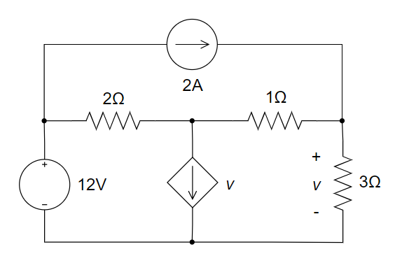

7、使用网孔电流法求解下图中 $i_1$、$i_2$、$i_3$。

8、用网孔电流法求解下图中的 $\vec{I_o}$ 。

9、列出图示电路的网孔电流方程,并求 $I$。

**参考解答**

1. 解：

$$
\begin{cases}
(1+2+5)I_1-2I_2-5I_3=0 \\
-26 + (2+4)I_2 - 2I_1 + (5+8)I_3 - 5I_1 = 0 \\
I_3-I_2=2
\end{cases}
$$

​        计算得： $I_1=1.84A,I_2=0.68A,I_3=2.68A$ 

2. KVL    KCL

3. 解：

   设回路电流 $I_a$ 、$I_b$ 和 $I_c$ ，参考方向如图所示。

   

   (1)将VCVS看作独立源建立方程：
   $$
   \begin{cases}
   -2 + 4I_a - 3I_b = 0 \\
   -3I_a + 6I_b - I_c + 3U_2 = 0 \\
   -3U_2 -I_b + 3I_c = 0
   \end{cases}
   $$
   (2)找出控制量和回路电流关系：
   $$
   U_2 = 3(I_b - I_a)
   $$
   将其代入 (1) 中的方程租，可以解得：
   $$
   \begin{cases}
   I_a = 1.186 A \\
   I_b = 0.915 A \\
   I_c = -0.508 A
   \end{cases}
   $$
   故有 $I_4 = I_b - I_c = 1.42 A$ 

   

   

4. 设回路电流$I_1$ 、$I_2$ 和 $I_3$ ，参考方向如图所示。

   

   列网孔电流方程如下：
   $$
   \begin{cases}
   6 = 12i_1 - 2i_2 \\
   -8 = 7i_2 -2i_1 -i_3 \\
   -8 + 6 + 6i_3 -i_2 = 0
   \end{cases}
   $$
   解得： $i_1=0.329A,i_2=-1.026A,i_3=0.162A$ 

   故而 $i=i_3-i_2=1.19A$ 

   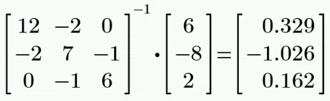

   

5. 解：

   设回路电流 $I_1$ 、$I_2$ 和 $I_3$ ，参考方向如图所示。

   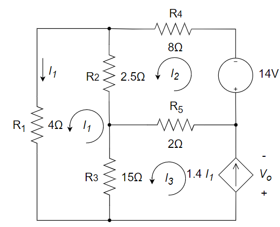

   用网孔分析法列出电路方程
   $$
   \begin{cases}
   (R_1+R_2+R_3)I_1-R_2I_2-R_3I_3=0 \\
   -R_2I_1+(R_2+R_4+R_5)I_2-R_5I_3=-14 \\
   I_3=1.4I_1
   \end{cases}
   $$
   将元件参数代入上述方程，得：
   $$
   \begin{cases}
   21.5I_1-2.5I_2-15I_3=0 \\
   -2.5I_1+12.5I_2-2I_3=-14 \\
   I_3=1.4I_1
   \end{cases}
   $$
   求解方程组，得：$I_1=5A,I_2=1A,I_3=7A$ 

   故而 $V_o=R_3(I_1-I_3)+R_5(I_2-I_3)=15×(5-7)+2×(1-7)=-42V$ 

   

   

6. 解：

   网孔电流都取顺时针方向，设受控电流源 $v$ 的电压为 $v_x$ ，参考极性上正下负.

   

   则根据网孔法有：
   $$
   \begin{cases}
   2(i_{1}-i_3)+v_x-12=0 \\
   -v_x+(1+3)i_2-1×i_3=0 \\
   i_3=2
   \end{cases}
   $$
   因受控电流源引入附加方程为 $i_1-i_2=v$ 

   因受控源控制量 $v$ 引入的附加方程为 $v=3i_2$ 

   联立解得：$\begin{cases} i_1=6A \\ i_2=1.5A \\ i_3 = 2A \end{cases}$ 	因此，$v=3i_2=4.5V$ 

   

7. 解：

   考虑到独立电流源的存在，将 $i_1$ 和 $i_2$ 所在的网孔并作一个 $supermesh$ 看待。

   列网孔电流方程如下：

   $\begin{cases}	-8 +2(i_1-i_3)+4(i_2-i_3) + 8i_2 = 0 \\ 2(i_3-i_1)+2i_3+4(i_3-i_2)=0 \\ 	\end{cases}$ 

   增补方程 $i_1-i_2=4$ 

   联立解得：

   $i_1=\frac{88}{19}{\rm A},i_2=\frac{12}{19}{\rm A},i_3=\frac{28}{19}{\rm A}$ 

   

8. 解：

   设三个网孔的电流从左往右依次为 $\vec{I_1}$、$\vec{I_2}$、$\vec{I_3}$，方向为顺时针。

   则有网孔电流方程

   $\begin{cases}	-20\angle60°+40\vec{I_1}+(-j20)(\vec{I_1}-\vec{I_2})=0 \\ (-j20 \times2 +j60)\vec{I_2}-(-j20)\vec{I_1}-(-j20)\vec{I_3}=0 \\ -j20(\vec{I_3}-\vec{I_2})+40\vec{I_3}+10\angle0°=0	\end{cases}$ 

   计算得到 $\begin{cases} \vec{I_1}=(0.01347+j0.3398){\rm A} \\ \vec{I_2}=(0.2-j0.1332){\rm A} \\ \vec{I_3}=(-0.2133-j0.2066){\rm A} \end{cases}$ 

   $\vec{I_o}=\vec{I_2}=(0.2-j0.1332){\rm A}$    

   

9. 解：

   设左、右、上方的三个网孔的电流依次为 ${I_1}$、${I_2}$、${I_3}$，方向为顺时针。

   列网孔电流方程如下

   $\begin{cases}	5I_1-25+5(I_1-I_3)+20(I_1-I_2)=0 \\ 20(I_2-I_1)+4(I_2-I_3)+15I=0 \\ 5(I_3-I_1)+10I_3+4(I_3-I_2)=0 	\end{cases}$ 

   其中，$I=I_1-I_2$ 

   解得：$I=\frac{40}{81},I_1=\frac{155}{81},I_2=\frac{115}{81},I_3=\frac{65}{81}$ 

   

## 知识点5：节点电压法

1、用节点电压法求下图所示电路中的电压*U* 。

2、用节点电压法求解下图中的电流 $I_0$ 及电压 $V_1,V_2,V_3$ 。

3、求以下无源单口网络的输入电阻 $R_i$ 。已知 $R_1$ = $R_2$ = $R_3$ = $R_4$ = $R_5$ = 3Ω，$R_6$ = 1Ω。

4、使用节点电压法求解下图中的 $v_1$ 、$v_2$ 和 $v_3$ 。

5、列写图示电路的节点电压方程。

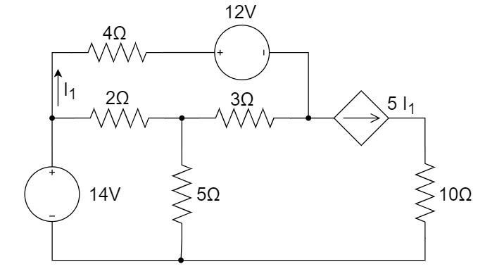

6、用节点电压法分析如下电路，列出足够求解的方程。

7、用节点电压法求下图所示电路的节点电压 $V_{na}、V_{nb}、V_{nc}和i_x$ 。

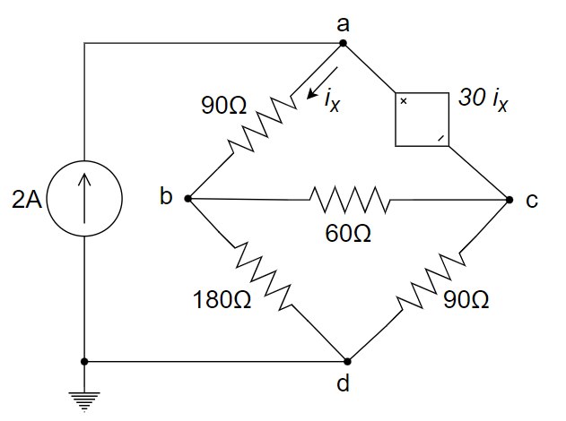

8、用节点电压法求解下图所示电路中的支路电流 $I_b$ 。

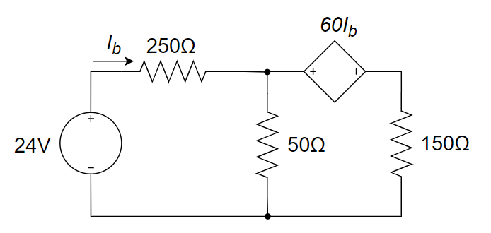

9、用节点电压法求以下电路中各节点的电压。

10、用节点电压法求下图所示电路中电流源两端的电压 *v* 。

11、列出图示电路的节点电压方程,并求 $I$。

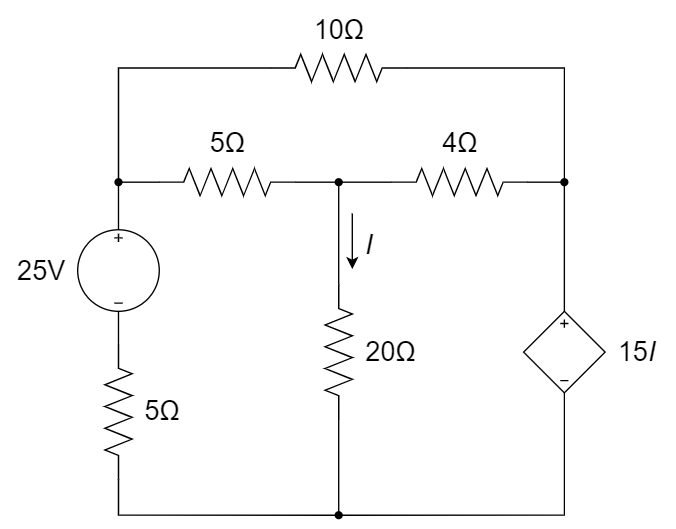

12、如下图所示电路，设 $v_{s1}=40\cos(2000t-36.87°){\rm V}$，$v_{s2}=100\sin(2000t-16.26°){\rm V}$，用节点电压法求 $v_o(t)$ 的稳态表达式。

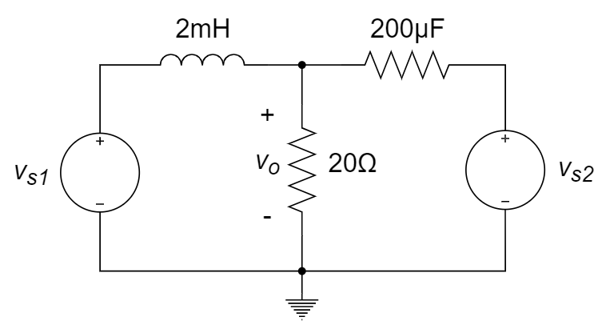

**参考解答**

1. 解：

   

2. 解：

   列节点电压方程如下：
   $$
   \begin{cases}
   V_1=10 V \\
   (V_2-V_1)/5+(V_2-V3)/2-2I_0=0 \\
   -I_0+(V_3-V_2)/2+V_3/8=0
   \end{cases}
   $$
   增补方程 $I_0=(V_1-V_3)/4$ 

   解得： $V_1=10 V,V_2=10 V_3=\frac{60}{7} V,I_0=\frac{5}{14} A$ 

   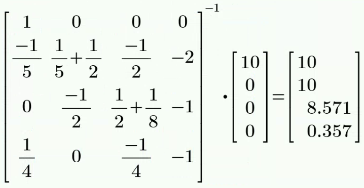

   

3. 解：

   方法1：

   选取参考地，并对图中的节点电压进行标记如下：

   

   列节点电压方程如下：
   $$
   \begin{cases}
   V_1/R_2+(V_1-V_2)/R_5+(V_1-V_3)/R_1=0 \\
   V_2/R_4+(V_2-V_1)/R_5+(V_2-V_3)/R_3=0 \\
   V_3=3I×R_6 
   \end{cases}
   $$
   为简化计算过程，可取 $I=1 A$ 

   计算得到： $V_1=V_2=\frac{3}{2}V,V_3=3V,I_{in}=I+V_1/R_2+V_2/R_4=2A$ 

   故而输入电阻 $R_i=\frac{U}{I_{in}}=\frac{V_3}{I_{in}}=\frac{3}{2}Ω$ 

   

   方法2：

   左边电路用Y-$\Delta$ 化简，等效为3Ω电阻；右边电路令$I = 1A$, 电压=3V，即右边等效为3Ω，故整体等效电阻为1.5Ω

   

4. 解：

   列节点电压方程如下：
   $$
   \begin{cases}
   \frac{1}{2}V_1+\frac{1}{4}V_2+\frac{1}{3}V_3=0 \\
   V_1-V_2=25 \\
   V_3-V_2=5×\frac{1}{2}V_1
   \end{cases}
   $$
   解得： $V_1=7.61V,V_2=-17.39V,V_3=1.63V$ 

   

   

5. 解：

   标记节点①~④如下图所示：

   

   列节点电压方程如下：
   $$
   \begin{cases}
   V_1=14 \\
   (\frac{1}{2}+\frac{1}{3}+\frac{1}{5})V_2-\frac{1}{2}V_1-\frac{1}{3}V_3=0 \\
   (\frac{1}{3}+\frac{1}{4})V_3-\frac{1}{4}V_1-\frac{1}{3}V_2=-\frac{12}{4}-5I_1
   \end{cases}
   $$
   增补方程 $I_1=\frac{V_1-V_3-12}{4}$ 

   

6. 解：

   列三个节点方程如下：
   $$
   \begin{cases}
   (\frac{1}{R_1}+\frac{1}{R_2})U_1 - \frac{1}{R_2}U_2 = I_s \\
   -\frac{1}{R_2}U_1 + (\frac{1}{R_2}+\frac{1}{R_3})U_2 = g_mU_{R_2} \\
   \frac{1}{R_4}U_3 = -g_mU_{R_2}
   \end{cases}
   $$
   另需要一个补充方程
   $$
   U_{R_2} = U_1 - U_2
   $$

7. 解：

   方法1：

   设受控电压源流出的电流为 $i$ 
   $$
   \begin{cases}
   \frac{1}{90}V_{na}-\frac{1}{90}V_{nb}=2+i \\
   -\frac{1}{90}V_{na}+(\frac{1}{90}+\frac{1}{60}+\frac{1}{180})V_{nb}-\frac{1}{60}V_{nc}=0 \\
   -\frac{1}{60}V_{nb}+(\frac{1}{90}+\frac{1}{60})V_{nc}=-i \\
   V_{na}-V_{nc}=30i_x \\
   i_x=\frac{1}{90}(V_{na}-V_{nb})
   \end{cases}
   $$
   解得： $V_{na}=135V,V_{nb}=108V,V_{nc}=126V,i=-1.7A,i_x=0.3A$ 

   方法2：
   $$
   \begin{cases}
   \frac{1}{90}V_{na}-(\frac{1}{90}+\frac{1}{60})V_{nb}+(\frac{1}{90}+\frac{1}{60})V_{nc}=2 \\
   对点b:-\frac{1}{90}V_{na}+(\frac{1}{90}+\frac{1}{60}+\frac{1}{180})V_{nb}-\frac{1}{60}V_{nc}=0 \\
   另外,V_{na}-V_{nc}=30i_x=\frac{30}{90}(V_{na}-V_{nb})
   \end{cases}
   $$

   $$
   ⇒
   \begin{cases}
   2V_{na}-5V_{nb}+5V_{nc}=360 \\
   -2V_{na}+6V_{nb}-3V_{nc}=0 \\
   2V_{na}+V_{nb}-3V_{nc}=0
   \end{cases}
   ⇒
   \left(
   \begin{matrix}
   	2 & -5 & 5 \\
   	-2 & 6 & -3 \\
   	2 & 1 & -3
   	\end{matrix}
   \right)
   
   \left(
   \begin{matrix}
   	V_{na} \\
   	V_{nb} \\
   	V_{nc}
   	\end{matrix}
   \right)
   =
   \left(
   \begin{matrix}
   	360 \\
   	0 \\
   	0
   	\end{matrix}
   \right)
   $$

   解得：
   $$
   \left(
   \begin{matrix}
   	V_{na} \\
   	V_{nb} \\
   	V_{nc}
   	\end{matrix}
   \right)
   =
   \left(
   \begin{matrix}
   	135 \\
   	108 \\
   	126
   	\end{matrix}
   \right)V,i_x = 0.3
   $$
   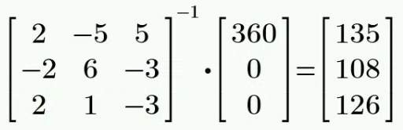

   

8. 解：

   单节点
   $$
   \begin{cases}
   (\frac{1}{250}+\frac{1}{50}+\frac{1}{150})V=\frac{24}{250}+\frac{60I_b}{150} \\
   I_b=\frac{24-V}{250}
   \end{cases}
   $$
   解得： $I_b=\frac{48}{605}≈0.079A$ 

   

   

9. 解：

   假设 $v_{n3}=0V$ ，则有
   $$
   \begin{cases}
   (\frac{1}{2}+\frac{1}{3+2})v_{n1}-\frac{1}{2}v_{n2}=4-10 \\
   -\frac{1}{2}v_{n1}+(\frac{1}{2}+3+\frac{2×6}{2+6})v_{n2}=10
   \end{cases}
   $$
   整理后，得到：
   $$
   \begin{cases}
   0.7v_{n1}-0.5v_{n2}=-6 \\
   -0.5v_{n1}+5v_{n2}=10
   \end{cases}
   $$
   解得：
   $$
   \begin{cases}
   v_{n1}≈-7.69V \\
   v_{n2}≈1.23V
   \end{cases}
   $$
   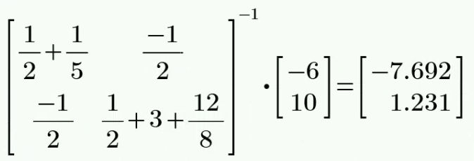

   

10. 解：

    以底端节点作为参考节点，上端三个节点的节点电压分别为 $v_{n1}$ 、 $v_{n2}$ 和 $v_{n3}$ 。

    因为与第一个节点相连接的 3 Ω 为多余电阻，则有：
    $$
    \begin{cases}
    (\frac{1}{2}+\frac{1}{2})v_{n1}-\frac{1}{2}v_{n2}-\frac{1}{2}v_{n3}=2 \\
    v_{n2}=8 \\
    -\frac{1}{2}v_{n1}-\frac{1}{2}v_{n2}+(\frac{1}{2}+\frac{1}{2}+\frac{1}{1})v_{n3}=v
    \end{cases}
    $$
    因受控源引入的附加方程为：
    $$
    v_{n1}=v-2×3
    $$
    解得：$\begin{cases} v_{n1}=13.6V \\ v_{n2}=8V \\ v_{n3}=15.2V \end{cases}$ 	得：$v=19.6V$ 

    

11. 解：

    考虑到独立电压源的存在，将独立电压源及上方节点看做一个 $supernode$ 。记 $supernode$ 上、下方电压分别为 $v_a$ 和 $v_b$ 。

    以底端节点为参考节点，$supernode$ 右侧的两个节点分别标记为 $v_1$ 和 $v_2$ 。

    列节点电压方程如下：

    $\begin{cases}	\frac{v_a-v_2}{10}+\frac{v_a-v_1}{5}+\frac{v_b}{5}=0 \\ \frac{v_1-v_a}{5}+\frac{v_1-v_2}{4}+\frac{v_1}{20}=0 \\ v_2=15I	\end{cases}$ 

    增补方程 $v_a-v_b=25$ ，$I=\frac{v_1}{20}$ 

    联立解得：

    $v_a=\frac{1250}{81}{\rm V}$，$v_b=\frac{-775}{81}{\rm V}$，$v_1=\frac{800}{81}{\rm V}$，$v_2=\frac{600}{81}{\rm V}$，$I=\frac{40}{81}{\rm A}$ 

12. 解：

    以底端节点作为参考节点，则上方节点电压为 $v_o$ 。

    列节点电压方程

    $\frac{v_o}{20}+\frac{v_o-v_{s1}}{j \omega L}+\frac{v_o-v_{s2}}{\frac{1}{j \omega C}}=0$ 

    其中，$\omega = 2000$，代入 $C,L,v_{s1},v_{s2}$ 计算得：

    $v_o(t)=j\frac{0.4v_{s2}-0.25v_{s1}}{0.05+j0.15}=238.2\angle-102.2°{\rm V}=238.2\cos(2000t-102.2°){\rm V}$ 

    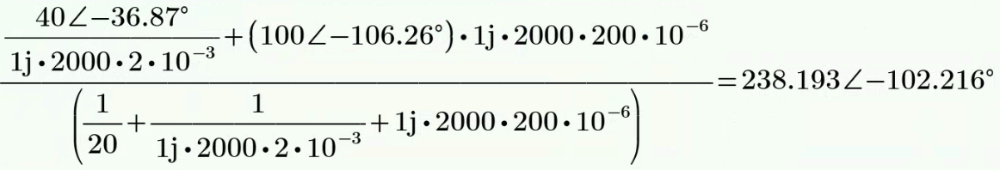

## 知识点6：叠加定理

1、线性电路中，无法用叠加定理求解的物理量为 ________ 。

A. 功率	B. 电压	C. 电流	D. 相位

2、右图所示电路中，电压U为 ________ 。

A. 4V	B. 5V	C. 6V	D. 3V

3、叠加定理仅适用于 ________ 电路；在各分电路中，要把不作用的独立电源置零。不作用的独立电压源用 ________ 代替，不作用的独立电流源用 ________ 代替。

4、叠加定理适用于 ________ 。

A. 线性电路		B. 非线性电路		C. 线性或非线性电路		D. 无受控源的电路

5、下列物理量中不可用叠加定理计算的是 ________ 。

A. 电流			B. 电压			C. 功率

6、使用叠加原理计算下图所示电路中的电流 $I$。

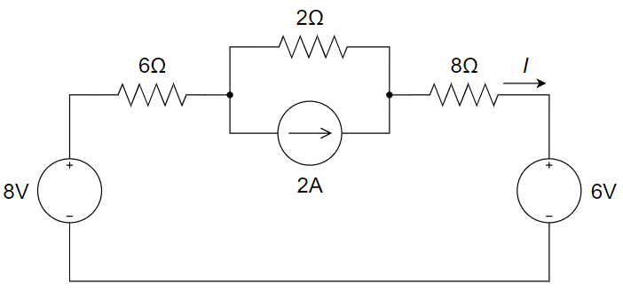

7、用叠加定理求下图所示电路中电流源两端的电压 *U*。

**参考解答**

1. A

2. C

3. 线性    短路    开路

4. A

5. C

6. 解：

   (1) 保留 8 V 的电压源，turn off 2 A 的电流源和 6 V 的电压源

   ​	  $I_1=\frac{8}{16}=\frac{1}{2}A$ 

   (2) 保留 6 V 的电压源，turn off 2 A 的电流源和 8 V 的电压源

   ​	  $I_2=-\frac{6}{16}=-\frac{3}{8}A$ 

   (3) 保留 2 A 的电流源，turn off 6 V 的电压源和 8 V 的电压源

   ​	  $I_3=2×\frac{2}{14+2}=\frac{1}{4}A$ 

   则  $I = I_1 + I_2 + I_3 = \frac{3}{8}A$ 

7. 解：

   (1) 保留 2 A 的电流源，turn off 30 V 的电压源

   ​	  $R_{eq}=2Ω||3Ω+3Ω||6Ω=\frac{2×3}{2+3}+\frac{3×6}{3+6}=3.2Ω$ 

   ​	  $U_1=R_{eq}×2A=6.4V$ 

   (2) 保留 30 V 的电压源，turn off 2 A 的电流源

   ​	  $U_2=(30-30×\frac{3}{3+2})-(30-30×\frac{6}{6+3})=12V-10V=2V$ 

   ​	  $U=U_1+U_2=8.4V$ 
   
   

## 知识点7：戴维南定理

1、用戴维南定理求 $V$ 。

2、下图所示电路的戴维南等效电路是 ________ 。

A. 	B. 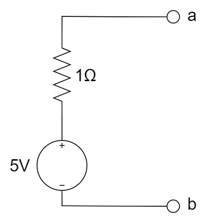	C. 	D. 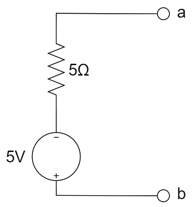

3、将下图 (a) 电路等效为图 (b) 电路，可求得输出端短路电流 $I$ = ________ 。

4、求下图所示电路的戴维南等效电路。

5、如下图所示电路，当 $R_x=20Ω$ 时，求电流 $I_x$ 。

6、求下图所示单口网络的戴维南等效电路。

7、求如图所示电路的戴维南等效电路。

**参考解答**

1. 解：

   (1) 求开路电压：a、b 开路， $I=0,V_{oc}=10V$ 

   (2) turn off 独立源，求 $R_o$ ：加压求流法

   

   得到： $V_o=(I_o-0.5I_o)×10^3+I_o×10^3=1500I_o$ 

   故而	$R_o=V_o/I_o=1.5kΩ$ 

   (3) 等效电路：

   将 $R_0=1.5kΩ,V_{oc}=10V$ 代入右侧的等效电路图中，

   得到： $V=V_{oc}×500/(1500+500)=2.5V$ 

2. A

3. 开路电压：$\frac{-4}{15}V$，等效电阻：$\frac{-8}{15}\ohm$， 所以短路电流为 $-0.5$ A

4. 解：

   (1) 首先求开路电压 $v_{OC}$ 。采用节点分析法来求解。

   

   
   $$
   \begin{cases}
   (\frac{1}{1}+\frac{1}{2})v_{OC}-\frac{1}{1}×v_{n2}-\frac{1}{2}×v_{n3}=\frac{3}{4}v_{OC} \\
   -(\frac{1}{1}+\frac{1}{2})v_{OC}+(\frac{1}{1}+\frac{1}{1})v_{n2}+(\frac{1}{1}+\frac{1}{2})v_{n3}=0 \\
   v_{n2}-v_{n3}=1
   \end{cases}
   $$
   解得： $v_{OC}=\frac{4}{3}V≈1.33V$ 

   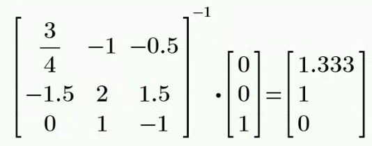

   (2) 然后求等效电阻 $R_o$ 

   ​	 在端口施加一电压 $v$ ，独立电压源短路，与受控电流源串联的电阻可以视为短路，得到：

   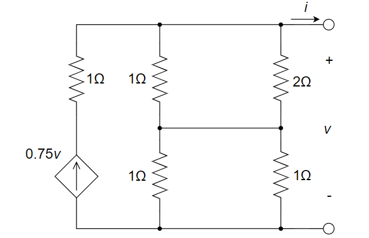

   ​	  则 $i=0.75v+\frac{-v}{1Ω||2Ω+1Ω||1Ω}=0.75v+\frac{-v}{\frac{2}{3}+\frac{1}{2}}⇒v=-\frac{28}{3}i$ 

   ​		 $R_o=-\frac{v}{i}=\frac{28}{3}Ω≈9.33Ω$ 

   ​	  因此，原电路的戴维南等效电路如下所示：

   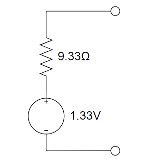

   

5. 解：

   求出 $I_x$ 所在支路之外电路的戴维宁等效电路。
   $$
   \begin{cases}
   u_{oc}=\frac{6}{3+6}×18-\frac{3}{3+6}×18=6V \\
   R_{eq}=\frac{3×6}{3+6}+\frac{6×3}{6+3}=4Ω \\
   ∴I_x=\frac{U_{oc}}{R_{eq}+20}=\frac{6}{4+20}=0.25A
   \end{cases}
   $$
   等效电路：

   

6. 解：

   (1) 先求开路电压：

   根据节点法有：

   $\begin{cases} (\frac{1}{10}+\frac{1}{10})v_{n1}-\frac{1}{10}v_{oc}=2 \\ -\frac{1}{10}v_{n1}+(\frac{1}{20}+\frac{1}{10})v_{oc}=1+\frac{5}{20} \end{cases}$ 	解得：$v_{oc}=22.5V$ 

   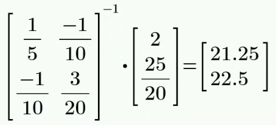

   (2) 再求戴维南等效电阻：

   $R_o=20Ω||(10Ω+10Ω)=\frac{20×20}{20+20}=10Ω$ 

   (3) 等效电路图如下：

   

7. 解：

   (1)  求开路电压

   ​	  规定顺时针为电流正方向，则根据 KCL 流经 5 Ω 的电流为 $-I_1$ ， 流经 1 Ω 的电流为 $I_1$ ，则有

   ​	  $-12+1 \times I_1+5 \times (-I_1) + 10 \times I_1=0$ 

   ​	  解得：$I_1=2{\rm A}$ 

   ​	  $V_{Th}=10I_1=20{\rm V}$ 

   (2)  求等效电阻

   ​	  在端口施加一电压 $U$ ，独立电压源短路。

   ​	  规定顺时针为电流正方向，则根据 KCL 流经 5 Ω 的电流为 $-(I + I_1)$ ， 流经 1 Ω 的电流为 $I_1 - I$  ，得到：

   ​	  $-12+1 \times (I_1-I)+5 \times (-I-I_1)+10 \times I_1 = 0$ 

   ​	  不妨取 $I=1{\rm A}$，则 $I_1=3A$，$U=10I_1+5I=35{\rm V}$ 

   ​	  $R_{Th}=\frac{U}{I}=35{\Omega}$ 

   (3)  画出戴维南等效电路

   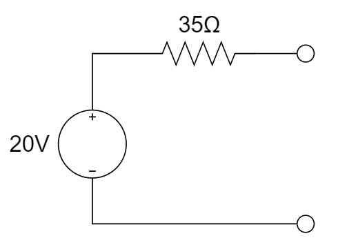

## 知识点8：诺顿定理

1、下图所示电路中，ab 两端的诺顿等效电路是 ________ 。

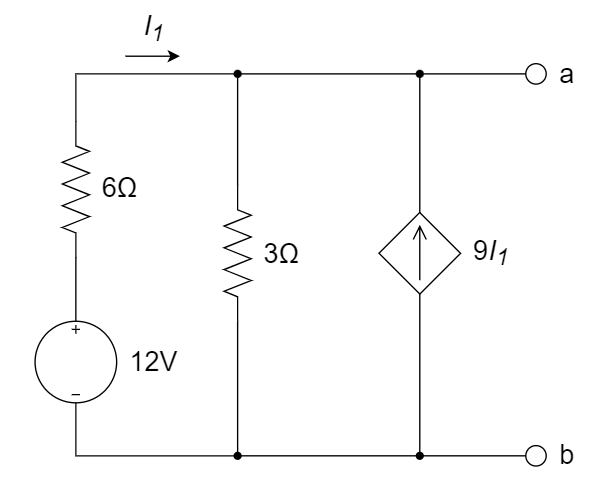

A. 				B. 

C. 				D. 

 **参考解答**

1. C

## 知识点9： 最大功率传输

1、当负载获取最大功率时，电路的传输效率 ________ 是50%。

A. 一定		B. 不一定

2、下图所示电路中负载电阻 $R_L$ 为何值时获得最大功率。

3、当负载获取最大输出功率时，电路的传输效率一定是 ________ 。

A. 100％				B. 50％				C. 25％				D. 不能确定

**参考解答**

1. B，一端口网络等效电阻消耗的功率有可能不等于等效前网络内部电阻消耗的功率，因此当负载获取最大功率时，电路的传输效率并不一定等于50%；比如下图最大功率传输时，效率仅16.7%

2. 解：

   先求等效电阻。

   

   $i=i_1+\frac{3i_1}{6}=1.5i_1$ 

   $v=6i_1+3i_1=9i_1$ 

   $R_{in}=\frac{v}{i}=\frac{9i_1}{1.5i_1}=6Ω$ 

   因此，当 $R_L=R_{in}=6Ω$ 时负载电阻 $R_L$ 可获得最大功率。
   
3. D

