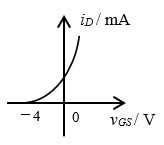
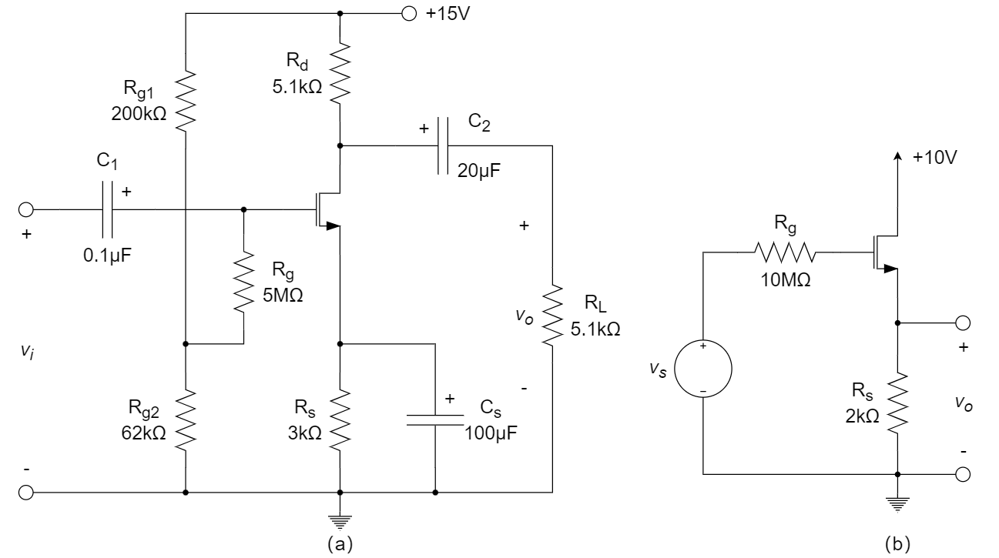

# 场效应晶体管

::: tip

MOSFET结构与原理、MOSFET的特性和等效电路模型、沟道长度调制效应、MOSFET放大电路分析计算（共源、共漏、共栅）。

:::

# 习题及参考解答

## 知识点1：场效应管的结构与工作原理

1、某场效应管的转移特性如下图所示，该管为 ________ 。

A. P沟道增强型MOS管		B. P沟道结型场效应管

C. N沟道增强型MOS管		D. N沟道耗尽型MOS管

2、场效应管又称为单极型晶体管，因为 ________ 。

3、在放大区，场效应管的漏极电流仅仅取决于 ________ （少数/多数）载流子运动产生的。

4、场效应管发生预夹断后，管子 ________ 。

A. 损坏		B. 进入截止区		C. 进入饱和区		D. 进入可变电阻区 

5、当场效应管的栅源电压为零时，漏源之间存在导电沟道的称为 ________ 型场效应管；漏源之间不存在导电沟道的称为 ________ 型场效应管。

6、单极型半导体器件是 ________ 。

A. 二极管		B. 三极管		C. 场效应管		D. 稳压管

7、如下图所示场效应管的转移特性曲线，它属于 ________ 场效应管。

A. N沟道耗尽型				B. N沟道增强型

C. P沟道耗尽型				D. P沟道增强型

8、MOSFET 本质上可以看作 ________ 。

A. 电压控制电流源				B. 电流控制电压源

C. 电压控制电压源				D. 电流控制电流源

9、增强型 n-MOSFET 的阈值电压 $V_{th}$ ______ 0 ，耗尽型 n-MOSFET 的阈值电压 $V_{th}$  ______  0 。（填 $>$ 或 $<$ ）

10、MOSFET 发生沟道夹断时，其工作在 ________ 。

A. 饱和区			B. 线性区			C. 截止区			D. 可变电阻区

11、增强型 n-MOSFET 的阈值电压 $V_{t}$  __________ 0 ，耗尽型 n-MOSFET 的 $V_{t}$   __________  0 ，增强型 p-MOSFET 的 $V_{t}$  __________ 0 ，耗尽型 p-MOSFET 的 $V_{t}$  __________  0 。  __________ 。

A. >，<，<，>			B. <，>，<，>			C. >，<，>，<			D. <，>，>，<

12、下图所示的曲线是 ________ 场效应晶体管的转移特性曲线。

A. N沟道增强型			B. N沟道耗尽型			C. P沟道增强型			D. P沟道耗尽型

**参考解答**

1. D
2. 只有一种载流子参与导电过程
3. 多数
4. C
5. 耗尽      增强
6. C
7. B
8. A
9. $>$       $<$ 
10. A
11. A
12. B

## 知识点2：场效应管的工作特性及其等效模型

1、电路如下图所示，N沟道增强型MOSFET的特性如下：${V_t} = 1{\rm{ V}}$，$k'_n(W/L)=0.05{\rm{mA/V^2}}$，$V_T=26{\rm{mV}}$，已知 ${v_{GS}} = 3{\rm{ V}}$ ，请计算当 ${v_{DS}} = 1{\rm{ V}}$ 和 ${v_{DS}} = 4{\rm{ V}}$ 时 $i_D$ 的大小。

2、一个NMOS管工作在饱和区，其漏极电压不得低于 ________ 。

(2015-2016年秋冬学期-期末卷A&B-选择题2)；(2016-2017年秋冬学期-期末卷B-选择题2)

A. 栅极电压		B. 源极电压		C. 栅极电压＋ $V_t$		D. 栅极电压－ $V_t$ 

3、不考虑管子的频率响应，求下列2个典型电路沿箭头方向的小信号等效电阻。

4、一个工作在饱和区的 NMOS 管，阈值电压为 $V_t$ ，则其漏极电压的下限为 ________ 。

A. 栅极电压		B. 源极电压		C. 栅极电压＋ $V_t$		D. 栅极电压－ $V_t$ 

5、场效应管作为放大管使用时，应使其工作在其输出特性的 ________ ，在该区域，场效应管的漏极电流主要取决于场效应管 ________ 之间的电压。

**参考解答**

1. 解：

   当 ${v_{DS}} = 1{\rm{V}}$ 时，${v_{GS}} - {v_t} = 3 - 1 = 2{\rm{V}}$ 

   所以 ${v_{DS}} < {v_{GS}} - {v_t}$ 工作在线性区

   $⇒{i_D} = {k_n}'\frac{W}{L}[({v_{GS}} - {v_t}){v_{DS}} - \frac{1}{2}{v_{DS}}^2] = 0.05[2 \times 1 - \frac{1}{2} \cdot {1^2}] = 0.075{\rm{mA}}$ 

   当 ${v_{DS}} = 4{\rm{V}} > {v_{GS}} - {v_t}$ 时，工作在饱和区

   $⇒{i_D} = \frac{1}{2}{k_n}'\frac{W}{L}{({v_{GS}} - {v_t})^2} = \frac{1}{2} \cdot 0.05 \cdot {2^2} = 0.1{\rm{mA}}$ 

2. D

3. (a) $1/g_m$       (d) $r_o$ 

4. D

5. 饱和区      栅极和源极

## 知识点3：MOSFET放大电路的分析计算

1、如下图所示 MOSFET 放大电路，已知 T1 和 T2 管的参数分别为 $(W/L)_1=1$ ，$(W/L)_2=1/4$，$μC_{ox}=20{\rm{{\mu}A/V^2}}$ （两管相同），$V_A=50{\rm{V}}$ （两管相同），静态偏置电流 $I_D=200{\rm{{\mu}A}}$ 。求该电路的输出电阻 $R_o$ 和电压增益 $A_v$ 。

2、在下图所示的 NMOS 电路中，管子参数为阈值电压 $V_t=1{\rm V}$，$W/L=5$，$μ_nC_{ox}=0.2{\rm{mA/V^2}}$，则直流偏置电流 $I_D=$ ________ mA。

3、如下图所示电路，已知耗尽型 NMOS 管的 $g_m=0.9{\rm mS}$，$U_{DD}=12{\rm V}$，$R_1=2{\rm M \Omega}$，$R_2=300{\rm k \Omega}$，$R_4=12{\rm k \Omega}$，电容 $C_1$ 和 $C_2$ 近似为无穷大。求电压增益 $A_u$、输入电阻 $R_i$ 和输出电阻 $R_o$ 。

4、如下图所示电路，已知两个 NMOS 管的跨导均为 $g_m=10{\rm mA/V}$，不考虑沟道长度调制效应，求该放大器的电压增益 $v_o/v_i$ 。

5、如图所示电路，已知 MOSFET 的参数为 $V_{tn}=0.5{\rm V}$，$\mu_nC_{ox}=0.4{\rm mA/V^2}$，$W/L=0.72{\rm \mu m/0.18 \mu m}$，不考虑沟道调制效应，设计要求电压 $V_D$ 为 0.7 V，则电阻 $R$ 应选为 ________ 。

6、由 FET 组成的两个基本放大电路如图 (a)、(b) 所示，已知各 FET 的 $g_m=2{\rm mS}$，分别求两个放大器的电压放大倍数 $A_v$、输入电阻 $R_i$ 和输出电阻 $R_o$ 。

 **参考解答**

1. 解：

   ​	${r_{o1}} = {r_{o2}} = \frac{{{V_A}}}{{{I_D}}} = \frac{{50}}{{200 \times {{10}^{ - 6}}}} = 250{\rm{ k}}\Omega$ 

   ​	${R_o} = {r_{o1}}{\rm{//}}{r_{o2}} = 125{\rm{ k}}\Omega$ 

   ​	${g_m} = \mu {C_{ox}}\frac{W}{L}\left( {{V_{GS}} - {V_t}} \right)$ 

   ​	${I_D} = \frac{1}{2}\mu {C_{ox}}\frac{W}{L}{\left( {{V_{GS}} - {V_t}} \right)^2}$ 

   ​	$\begin{array}{l}
   {A_v} =  - {g_m}{R_o} =  - \sqrt {2{I_D} \cdot \mu {C_{ox}} \cdot {{\left( {\frac{W}{L}} \right)}_1}}  \times {R_o}\\
   {\rm{    }} =  - \sqrt {2 \times 200 \times {{10}^{ - 6}} \times 40 \times {{10}^{ - 6}} \times 1}  \times 125 \times {10^3}\\
   {\rm{    }} \approx  - 15.8
   \end{array}$ 

2. 0.5

3. 解：

   ​	等效电路如下：

   

   ​	${A_u} = \frac{{{g_m}{R_4}}}{{1 + {g_m}{R_4}}} = \frac{{0.9 \times 12}}{{1 + 0.9 \times 12}} \approx 0.92$ 

   ​	${R_i} = {R_1} + {R_2}{\rm{//}}{R_3} \approx 2075{\rm{ k}}\Omega$ 

   ​	${R_o} = \frac{1}{{{R_4}^{ - 1} + {g_m}}} \approx 1.02{\rm{ k}}\Omega$ 

4. 解：

   ​	$A_{v1}=\frac{v_{o1}}{v_i}=\frac{10||10||\frac{1}{g_m}}{\frac{1}{g_m}+10||10||\frac{1}{g_m}}\approx 0.49{\rm V/V}$ 

   ​	${A_{v2}} = \frac{{{v_o}}}{{{v_{i2}}}} = {g_m}\left( {{\rm{5//2}}} \right) \approx 14.29{\rm{ V/V}}$ 

   ​	${A_v} = {A_{v1}} \times {A_{v2}} \approx 7.0{\rm{ V/V}}$ 

5. 34.4 kΩ

6. 解：

   (a)	${\dot A_v} = \frac{{{{\dot V}_o}}}{{{{\dot V}_i}}} = \frac{{ - {g_m}{{\dot V}_{gs}}({R_d}//{R_L})}}{{{{\dot V}_{gs}}}} =  - {g_m}({R_d}//{R_L}) =  - 2 \times (5.1//5.1) =  - 5.1{\rm V/V}$ 

   ​		${R_i} = \frac{{{{\dot V}_i}}}{{{{\dot I}_i}}} = {R_g} + {R_{g1}}//{R_{g2}} = 5+\frac{200//62}{1000}=5 + 47 \approx 5{\rm{ M}}\Omega$ 

   ​		${R_o} = {R_d} = 5.1{\rm{ k}}\Omega$ 

   (b)	${\dot A_{vs}} = \frac{{{{\dot V}_o}}}{{{{\dot V}_s}}} = \frac{{{g_m}{{\dot V}_{gs}}R}}{{{{\dot V}_{gs}} + {g_m}{{\dot V}_{gs}}R}} = \frac{{2 \times 2}}{{1 + 2 \times 2}} = 0.8$ 

   ​		$R_i=\infty$ 

   ​		${R_o} = {R_s}{\rm{//}}\frac{1}{{{g_m}}} = 2{\rm{//}}\frac{1}{2} = 0.4{\rm{ k}}\Omega$ 

