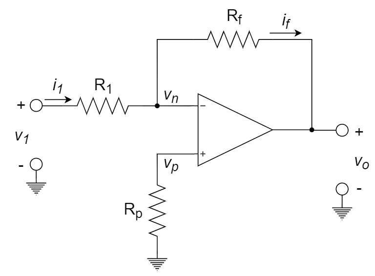
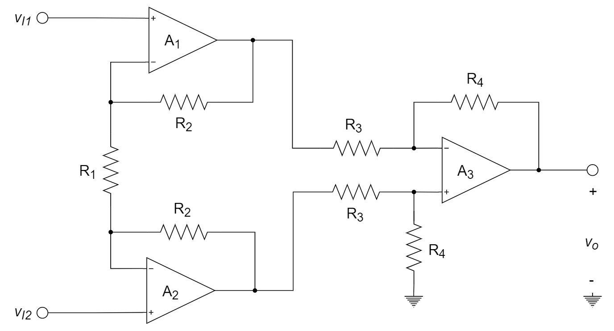
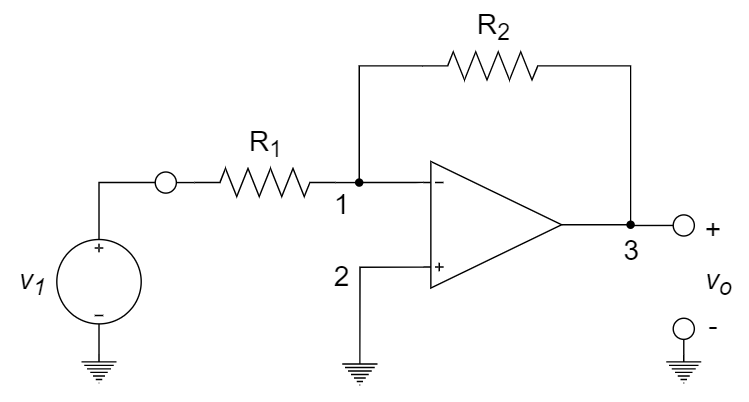
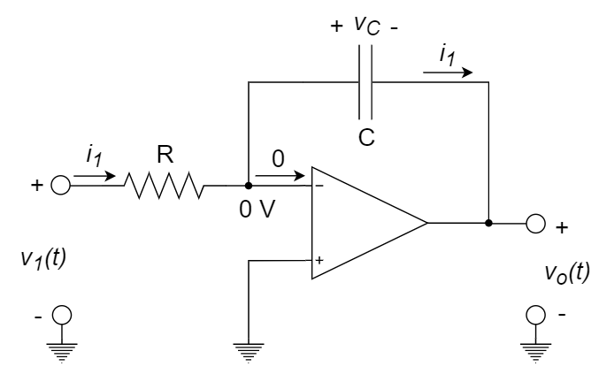
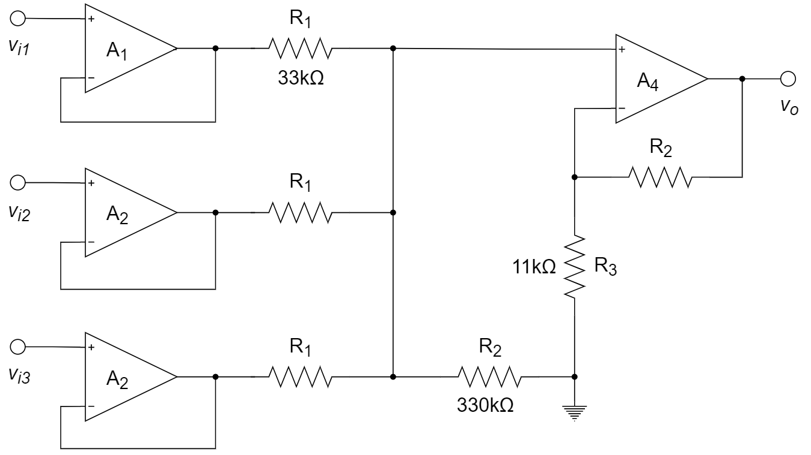
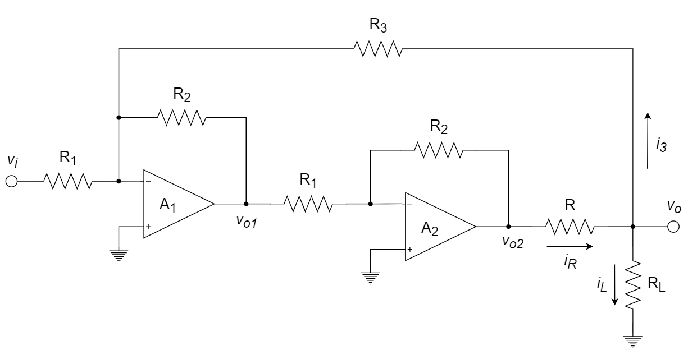

# 运算放大器

::: tip

理想运放特性、同相接法与反相接法的电路分析、运算放大器的应用及电路分析（信号运算、处理与发生）、有限开环增益及分析。

:::

# 习题及参考解答

## 知识点1：理想运放的特性

1、关于理想的运算放大器，下列陈述不正确的是 ________ 。

A. 输出阻抗趋于零           	B. 开环放大增益趋于无穷大

C. 输入阻抗趋于无穷大       D. 闭环差模增益趋于无穷大

2、理想运放的两个输入端可以看成 “ 虚短 ” 是因为 ________ ，“ 虚断 ” 是因为 ________ 。

A．差模增益趋于无穷大       B．输入阻抗趋于无穷大

C．输出阻抗趋于零           	D．共模抑制比趋于无穷大

**参考解答**

1. D
2. A      B

## 知识点2：运算放大器的应用及电路分析

1、欲将方波电压转换成三角波电压，应选用 ________ 。

A. 对数运算电路				B. 加减运算电路

C. 微分运算电路				D. 积分运算电路

2、求解下图所示电路的运算关系。

3、如下图所示电路，其输出电压与输入电压的关系近似为 ________ 。

A. $10{v_{I1}} + 10{v_{I2}} + {v_{I3}}$ 				B. $10{v_{I1}} - 10{v_{I2}} - {v_{I3}}$ 

C. $-10{v_{I1}} + 10{v_{I2}} + {v_{I3}}$ 			 D. $-10{v_{I1}} - 10{v_{I2}} - {v_{I3}}$ 

4、下列哪个电路是由理想运放器构成的微分电路 ________ 。

A. 		B.  

C. 		D.  

5、写出如下图所示电路输出电压的表达式 ${v_O} = f\left( {{v_{I1}} + {v_{I2}} + {v_{I3}}} \right)$ 。

6、推导下图所示电路的运算关系。

7、以下运算放大器中，哪一个实现积分功能 ________ 。

A. 			B.  

C. 				 D. 

8、如下图所示电路，设电源电压、各电阻阻值和三极管 $\beta$ 均已知，求输出电压 $V_o$ 的表达式。

9、设下图为理想集成运放，$u_1=0.5{\rm V}$，负载电阻 $R_L$ 上的电压 $u_o=$ ________ ，电流 $i_L=$ ________ 。

10、下图所示电路中，电压增益 $v_o/v_i$ 的幅度是 ________ dB。

11、如下图所示电路，当电路中各个电阻的阻值相等时，求电路增益 $A=v_o/v_i$ 。

12、一个反向运算放大器如下图所示，其电压增益为 −4，且所用电阻的总和为 100 kΩ ，则 $R_1$ = ________ ，$R_2$ =  ________ 。

13、如下图所示运算放大器组成的应用电路，求

(1)  中频增益 $A_u=\frac{u_o}{u_{i2}-u_{i1}}$​ 的表达式（用符号表示）。

(2)  最大中频增益 $A_{umax}$ 和 最小中频增益 $A_{umin}$。

14、已知某电路输入电压和输出电压的波形如下图所示，该电路可能是 ________ 。

A. 积分电路			B. 微分电路			C. 过零比较器			D. 迟滞比较器

15、如下图所示电路，A1 ~ A5 均为理想运放，当开关 S1 打开以后，电路处于稳态情况下输出电压 $v_o=$ ________ ；当开关闭合时，$v_o=$ ________ 。

16、配置下图所示电路中所有电阻的阻值，使电路增益 $A=v_o/v_i=-50$ 。实验能提供阻值小于等于 100 kΩ 的任意电阻，图中每个电阻符号只对应一个电阻，要求使放大器的输入电阻最大，同时要求选择的电阻规格的种类最少，以简化工艺，降低成本。

17、由理想运放组成的电路如下图所示，其输出电压 $v_o$ 与输入电压 $v_{i1}$、$v_{i2}$ 的关系为 ________ 。

A. $v_o=8(v_{i1}+v_{i2})$ 				B. $v_o=8(v_{i1}-v_{i2})$ 

C. $v_o=8(v_{i2}-v_{i1})$ 				D. $v_o=4(v_{i1}+v_{i2})$ 

18、下图为运算放大器的两种基本电路，若图中的 $R_1$ 均为 $1{\rm k \Omega}$，$R_2$ 均为 $5{\rm k \Omega}$，则图（a）和图（b）电路的输入电阻分别为 ________ 和 ________ 。

19、电路如下图所示，其中运算放大器均为理想运算放大器。

(1)  计算该电路的输出电压与输入电压的运算关系；

(2)  计算该电路的输出电阻。

20、试用一个理想运算放大器实现运算电路 $v_o=15v_1+6v_2$ ，要求画出电路，并确定电路元件参数。

21、如下图所示放大电路中，已知 $A_1$、$A_2$ 均为理想运算放大器，$R_1=R_2$。

(1)	推导负载电流 $i_L$ 的表达式；

(2)	若要求 $i_L=\frac{v_i}{R}$，$R_3$ 的值应满足什么关系？

22、求由理想运放组成的如下电路的电压增益 $v_o/v_i$ 。

(2020-2021年秋冬学期-期末卷补考-第八题)

**参考解答**

1. D

2. 解：

   设 $R_3$、$R_4$、$R_5$ 的公共点为 M。

   利用虚短、虚断，列出基尔霍夫定律方程如下：

   $\frac{{{v_{i1}}}}{{{R_1}}} + \frac{{{v_{i2}}}}{{{R_2}}} = \frac{{ - {v_M}}}{{{R_3}}}$ 

   $\frac{{{v_M}}}{{{R_3}}} + \frac{{{v_M}}}{{{R_5}}} = \frac{{{v_o} - {v_M}}}{{{R_4}}}$ 

   利用上述两个方程，得到：

   ${v_o} =  - {R_3}{R_4}(\frac{1}{{{R_3}}} + \frac{1}{{{R_4}}} + \frac{1}{{{R_5}}})(\frac{{{v_{i1}}}}{{{R_1}}} + \frac{{{v_{i2}}}}{{{R_2}}}) =  - ({R_3} + {R_4} + \frac{{{R_3}{R_4}}}{{{R_5}}})(\frac{{{v_{i1}}}}{{{R_1}}} + \frac{{{v_{i2}}}}{{{R_2}}})$ 

   

3. C

4. D

5. 解：

   ​		$∵υ_{O1} = υ_{I1},  υ_{O2} = υ_{I2},  υ_{O3} = υ_{I3}$ 

   ​		$∴v_O = \frac{{{R_2}//{R_3}}}{{{R_1} + {R_2}//{R_3}}} \cdot {v_{I1}} + \frac{{{R_1}//{R_3}}}{{{R_2} + {R_1}//{R_3}}} \cdot {v_{I2}} + \frac{{{R_1}//{R_2}}}{{{R_3} + {R_1}//{R_2}}} \cdot {v_{I3}}$ 

   ​		或 ${v_O} = \left( {{R_1}{\rm{//}}{R_2}{\rm{//}}{R_3}} \right)\left( {\frac{{{v_{I1}}}}{{{R_{\rm{1}}}}}{\rm{ + }}\frac{{{v_{I{\rm{2}}}}}}{{{R_{\rm{2}}}}}{\rm{ + }}\frac{{{v_{I{\rm{3}}}}}}{{{R_{\rm{3}}}}}} \right)$ 

   ​		或 ${v_O} = \frac{{\frac{{{v_{I1}}}}{{{R_{\rm{1}}}}}{\rm{ + }}\frac{{{v_{I{\rm{2}}}}}}{{{R_{\rm{2}}}}}{\rm{ + }}\frac{{{v_{I{\rm{3}}}}}}{{{R_{\rm{3}}}}}}}{{\frac{{\rm{1}}}{{{R_{\rm{1}}}}}{\rm{ + }}\frac{{\rm{1}}}{{{R_{\rm{2}}}}}{\rm{ + }}\frac{{\rm{1}}}{{{R_{\rm{3}}}}}}}{\rm{ = }}\frac{{{R_{\rm{2}}}{R_{\rm{3}}}{v_{I1}}{\rm{ + }}{R_{\rm{1}}}{R_{\rm{3}}}{v_{I{\rm{2}}}}{\rm{ + }}{R_{\rm{1}}}{R_{\rm{2}}}{v_{I{\rm{3}}}}}}{{{R_{\rm{2}}}{R_{\rm{3}}}{\rm{ + }}{R_{\rm{1}}}{R_{\rm{3}}}{\rm{ + }}{R_{\rm{1}}}{R_{\rm{2}}}}}$ 

   

6. 解：

   两级电路

   第一级：

   ${I_{R1}} = \frac{{{v_{I1}} - {v_{I2}}}}{{{R_1}}}$ 		方向从上往下

   ${v_{o1}} = {v_{I1}} + {I_{R1}}{R_2} = {v_{I1}} + \frac{{{v_{I1}} - {v_{I2}}}}{{{R_1}}}{R_2}$ 

   ${v_{o2}} = {v_{I2}} - {I_{R1}}R2={v_{I2}} - \frac{{{v_{I1}} - {v_{I2}}}}{{{R_1}}}{R_2}$ 

   第二级是差动放大器，故而

   ${v_o} = \frac{{{R_4}}}{{{R_3}}}({v_{o2}} - {v_{o1}}) = \frac{{{R_4}}}{{{R_3}}}\left( {1 + \frac{{2{R_2}}}{{R1}}} \right)({v_{I2}} - {v_{I1}})$ 

   

7. C

8. 解：

   ${V_{ + A1}} = {V_{ - A1}} = \frac{{{V_{CC}}}}{2}$ 

   $I_C=\frac{V_{CC}-V_{CC}/2}{R_C}=\frac{V_{CC}}{2R_C}$ 

   $\frac{{{V_2} - {V_1}}}{{{R_1}}} = \frac{{{V_1} - {V_B}}}{{{R_1}}} = {I_B}$ 

   $\therefore {V_1} = {I_B}{R_1} + {V_B},{\rm{ }}{V_2} = 2{I_B}{R_1} + {V_B}$ 

   $\frac{{{V_O} - {V_{ - A2}}}}{{{R_2}}} = \frac{{{V_{ - A2}} - {V_{OA3}}}}{{{R_2}}},{\rm{  }}\frac{{{V_{OA3}} - {V_{ - A3}}}}{{{R_3}}} = \frac{{{V_{ - A3}}}}{{{R_3}}}$ 

   $Q{V_{ - A2}} = {V_{ + A2}} = {V_2},{\rm{  }}{V_{ - A3}} = {V_{ + A3}} = {V_1}$ 

   化简得到：

   ${V_O} = 2{I_B}{R_1} = \frac{{{V_{CC}}{R_1}}}{{\beta {R_C}}}$ 

   

9. -1V      -0.1mA

10. 20

11. 解：

    设从左至右的R排列为1-6，流过的电流分别对应1-6

    则 ${i_1} = {i_2} = {i_3}$，${i_4} = {i_2} + {i_3} = 2{i_1}$ 

    又 ${i_4}R + {i_3}R = {i_5}R$ 

    即 ${i_4} + {i_3} = {i_5} = 3{i_1}$ 

    ${i_6} = {i_4} + {i_5} = 5{i_1}$ 

    ${v_I} = {i_1}R$ 

    ${v_O} =  - ({i_2}R + {i_4}R + {i_6}R) =  - 8{i_1}R$ 

    $A = \frac{{{v_O}}}{{{v_I}}} =  - 8{\rm{V}}/{\rm{V}}$ 

    

12. 20 kΩ      80 kΩ

13. 解：

    (1)  $A_u=\frac{\vec{U_o}}{\vec{U_{i2}}-\vec{U_{i1}}}=\frac{{\vec{U_{o2}}-\vec{U_{o1}}}}{\vec{U_{i2}}-\vec{U_{i1}}} \times \frac{\vec{U_o}}{\vec{U_{o2}}-\vec{U_{o1}}}=A_{u1} \times A_{u2}$ 

    ​	  其中

    ​	  	$A_{u1}=\frac{i_G(R_2+R_G+R_2)}{\vec{U_{i2}}-\vec{U_{i1}}}=\frac{(\frac{\vec{U_{i2}}-\vec{U_{i1}}}{R_G})(R_G+2R_2)}{\vec{U_{i2}}-\vec{U_{i1}}}=(1+\frac{2R_2}{R_G})$		($R_G=R_1+R_W$) 

    ​	  	$A_{u2}=\frac{\vec{U_o}}{\vec{U_{o2}}-\vec{U_{o1}}}=\frac{R_4}{R_3}$		($A_3$ 接成相减器)

    ​	  故

    ​	  	$A_u=A_{u1} \times A_{u2}=\frac{R_4}{R_3}(1+\frac{2R_2}{R_G})$ 

    (2)  	$R_{Gmax}=10{\rm k \Omega}$ ，$R_{Gmin}=1{\rm k \Omega}$ 

    ​	  	$A_{umin}=\frac{R_4}{R_3}(1+\frac{2R_2}{R_Gmax})=5 \times (1+\frac{2 \times 20}{10})=25$ 

    ​	  	$A_{umax}=\frac{R_4}{R_3}(1+\frac{2R_2}{R_Gmin})=5 \times (1+\frac{2 \times 20}{1})=205$ 

    

14. A

15. 0 V         -6 V

16. 解：

    

    $R_i=R_1$，取 $R_1=100{\rm k \Omega}$ 

    $v_o=-i_2R_2-i_4R_4$ 

    $v_i=R_1i_1$ 

    $i_1=i_2=\frac{v_i}{R_1}$ 

    ${i_3} =  - \frac{{{R_2}}}{{{R_3}}}{i_2}$ 

    ${i_4} = {i_2} - {i_3} = \frac{{{R_2} + {R_3}}}{{{R_1}{R_3}}}{v_i}$ 

    ${v_o} =  - \frac{{{R_2}{R_3} + {R_2}{R_4} + {R_3}{R_4}}}{{{R_3}}}{v_i}$ 

    $\therefore A = \frac{{{v_o}}}{{{v_i}}} =  - \frac{{{R_2}{R_3} + {R_2}{R_4} + {R_3}{R_4}}}{{{R_1}{R_3}}} =  - 50$ 

    ${R_2} + {R_4} + \frac{{{R_2}{R_4}}}{{{R_3}}} = 5000$ 

    取 $R_2=100{\rm k \Omega}$，$R_4=100{\rm k \Omega}$，$R_3=2.08{\rm k \Omega}$。

    

17. C

18. 1 kΩ         无穷大

19. 解：

    $\frac{{{v_{i1}} - {v_{i4}}}}{{{R_1}}} + \frac{{{v_{i2}} - {v_{i4}}}}{{{R_1}}} + \frac{{{v_{i3}} - {v_{i4}}}}{{{R_1}}} = \frac{{{v_{i4}}}}{{{R_2}}}$ 

    ${v_{i4}} = \frac{{{R_2}}}{{{R_1} + {\rm{3}}{R_2}}}\left( {{v_{i1}} + {v_{i2}} + {v_{i3}}} \right)$ 

    ${v_o} = \frac{{{v_{i4}}}}{{{R_3}}} \times \left( {{R_2} + {R_3}} \right) = \frac{{{R_2}}}{{{R_1} + {\rm{3}}{R_2}}}\left( {{v_{i1}} + {v_{i2}} + {v_{i3}}} \right)\frac{{{R_2} + {R_3}}}{{{R_3}}} = {\rm{10}}\left( {{v_{i1}} + {v_{i2}} + {v_{i3}}} \right)$ 

    $R_o=0{\rm k \Omega}$ 

    

20. 解：

    实现电路如下图所示：

    

    ${v_o} = \left( {1 + \frac{{{R_f}}}{{{R_4}}}} \right)\left( {\frac{{{R_1}//{R_2}//{R_3}}}{{{R_1}}}{v_1} + \frac{{{R_1}//{R_2}//{R_3}}}{{{R_2}}}{v_2}} \right)$ 

    当满足 ${R_1}//{R_2}//{R_3} = {R_4}//{R_f}$ 时，有

    ${v_o} = \frac{{{R_f}}}{{{R_1}}}{v_1} + \frac{{{R_f}}}{{{R_2}}}{v_2}$ 

    则要求 $\frac{{{R_f}}}{{{R_1}}} = 15,{\rm{ }}\frac{{{R_f}}}{{{R_2}}} = 6$ 

    选取 ${R_f} = 30{\rm{ k}}\Omega ,{\rm{ }}{R_1} = 2{\rm{ k}}\Omega ,{\rm{ }}{R_2} = 5{\rm{ k}}\Omega ,{\rm{ }}{R_3} = 3{\rm{ k}}\Omega$ 

    

21. 解：

    (1)	运放 $A_1$ 的输出电压

    ​		${v_{{\rm{o1}}}} =  - \frac{{{R_2}}}{{{R_1}}}{v_{\rm{i}}} - \frac{{{R_2}}}{{{R_3}}}{v_{\rm{o}}} =  - {v_{\rm{i}}} - \frac{{{R_2}}}{{{R_3}}}{v_{\rm{o}}}$ 

    ​		运放 A~2~ 的输出电压

    ​		${v_{{\rm{o2}}}} =  - \frac{{{R_2}}}{{{R_1}}}{v_{{\rm{o1}}}} =  - {v_{{\rm{o1}}}} = {v_{\rm{i}}} + \frac{{{R_2}}}{{{R_3}}}{v_{\rm{o}}}$ 

    ​		由于虚地，${i_{\rm{3}}} = \frac{{{v_{\rm{o}}}}}{{{R_3}}}$ 

    ​		而 ${i_{\rm{R}}} = \frac{{{v_{{\rm{o2}}}} - {v_{\rm{o}}}}}{R} = \frac{{{v_{\rm{i}}}}}{R} + \frac{{{R_2} - {R_3}}}{{R{R_3}}}{v_{\rm{o}}}$ 

    ​		于是 ${i_{\rm{L}}} = {i_{\rm{R}}} - {i_3} = \frac{{{v_{\rm{i}}}}}{R} + \frac{{{R_2} - {R_3} - R}}{{R{R_3}}}{v_{\rm{o}}} = \frac{{{v_{\rm{i}}}}}{R} + \frac{{{R_2} - {R_3} - R}}{{R{R_3}}} \cdot {i_L}{R_L}$ 

    ​		可解出负载电流 ${i_{\rm{L}}} = \frac{{{v_{\rm{i}}}}}{{R - \frac{{{R_L}}}{{{R_3}}}({R_2} - {R_3} - R)}}$ 

    (2)	欲使 ${i_{\rm{L}}} = \frac{{{v_{\rm{i}}}}}{R}$，必须使 ${R_2} - {R_3} - R = 0$ ，即 $R_3$ 的值应满足

    ​		${R_3} = {R_2} - R$ 

    

22. 解：

    分别列出运放 1 反相输入端的节点电流方程

    ​		$\frac{{{v_i}}}{{{R_1}}} + \frac{{{v_{o1}}}}{{{R_2}}} + \frac{{{v_o}}}{{{R_3}}} = 0$ 

    由理想运放假设可知

    ​		${v_{o1}} = \frac{{{R_4}}}{{{R_4} + {R_5}}}{v_o}$ 

    整理后得到

    ​		$\frac{{{v_o}}}{{{v_i}}} =  - \frac{{{R_2}{R_3}\left( {{R_4} + {R_5}} \right)}}{{{R_1}\left( {{R_2}{R_4} + {R_2}{R_5} + {R_3}{R_4}} \right)}}$ 

## 知识点3：其他

1、一般A/D转换包括 ________ 、 ________  、 ________  、和 ________ 四个过程。

2、通过对参考信号的取样将数字信号转换为模拟信号的电路称为 ________  ；若最小单位量化电压为1 mV 的 8 位二进制数字信号是 0111 0011，则其转换为模拟信号的电压为 ________ mV。

3、*n* 位 D/A 转换器的分辨率为 ________ 。

A. $\frac{1}{2^n-1}$		B. $\frac{1}{2^n+1}$		C. $\frac{1}{2^n}$		D. $\frac{1}{2^{n-1}}$		E. $\frac{1}{2^{n+1}}$ 

4、恒流源在集成运放中有两个作用：一是为各级提供 ________  ，二是作为 ________ 。

5、TI 公司的 ADS1115 是一款典型的高精度、低功耗 16 bit ADC，其中最高位为符号位，当满刻度电压范围设为 ± 2.048 V 时，其分辨率为 ________ μV。

6、1 个 16 位 ADC，参考电压为 3.3 V，则其电压分辨率为 ________ 。

7、集成运放中采用有源负载是为了 ________ 。

A. 减小输出电阻				B. 提高输入电阻				C. 增大电压放大倍数

8、1 个 10 位 ADC，参考电压为 5 V，则其电压分辨率约为 ________ 。

9、集成运放中各级放大器之间采用 ________ 方式级联。

A. 阻容耦合			B. 直接耦合			C. 光电耦合			D. 变压器耦合

10、已知某 D/A 转换器电路的最小分辨电压 $V_{LSB}$ 为 2.442 mV，最大满刻度输出电压 $V_{om}$  = 10 V，则该电路输入数字量的位数为 ________ 位。

**参考解答**

1. 取样      保持      量化      编码
2. 数模转换电路      115
3. A
4. 直流偏置      有源负载
5. 62.5
6. $\frac{3.3}{2^{16}-1}{\rm V}$ 或 $0.05{\rm mV}$ 
7. C
8. 4.88 mV
9. B
10. 12