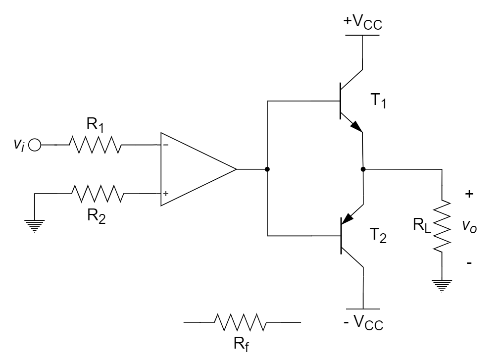
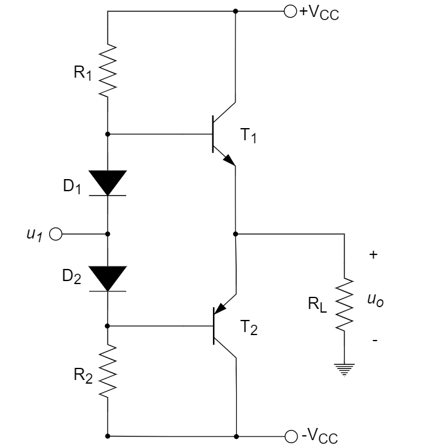
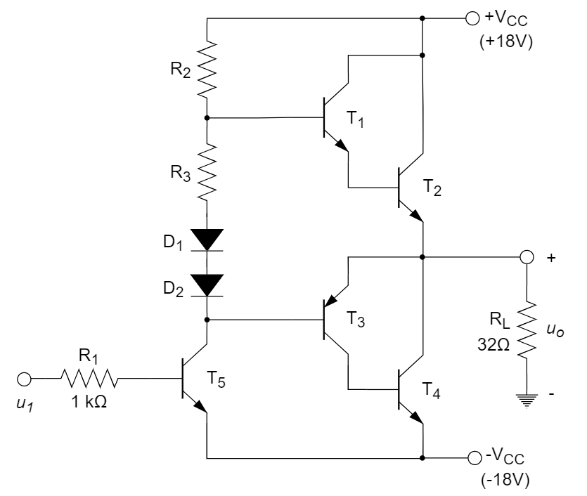
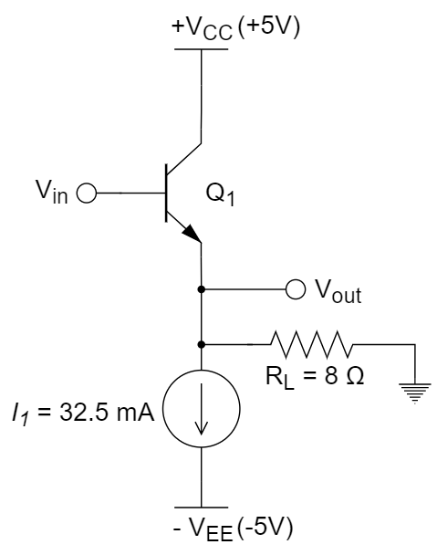

# 功率放大器

::: tip

功放分类与电路分析。

:::

# 习题及参考解答

## 知识点1：功放概述与分类

1、功率放大电路中，C类（或称为丙类）放大器的导通角为 ________ 。

A. 360°		B. 180°		C. 小于180°		D. 大于180°

2、B类（或称为乙类）功率放大电路中，功放晶体管静态电流 ${I_{CQ}} =$ ________ ，这种功放存在 ________ 失真。

3、A类功放的导通角为 ________ ；B类功放的导通角为 ________ 。

4、相比乙类功率放大器，甲乙类功率放大器的主要优点是消除了 ________ 。

A. 饱和失真		B. 交越失真		C. 截止失真		D. 谐波失真

5、一个功率放大器，其导通角为 180°，那么它属于 ________ 。

A. A类功放		B. B类功放		C. C类功放		D. AB类功放

6、乙类互补对称功率放大电路容易产生 ________ ，可以通过使该电路工作在 ________ 状态消除这一影响。

A. 截止失真、甲类				B. 交越失真、甲乙类

C. 截止失真、甲乙类			D. 交越失真、甲类

7、要提高电源的利用效率，又避免信号产生交越失真，应选用 ________ 功率放大器。

A. A类				B. AB类				C. B类				D. C类

**参考解答**

1. C
2. 0      交越
3. 360°      180°
4. B
5. B
6. B
7. B

## 知识点2：功率放大器的分析计算

1、下图为一不完整的放大电路，运放为理想的，三极管的饱和压降为零，已知 ${R_1} = {R_2} = 10{\rm{ k}}\Omega$，${R_f} = 100{\rm{ k}}\Omega$，${R_L} = 8{\rm{ }}\Omega$，${V_{CC}} = 15{\rm{ V}}$​。回答以下问题：

(1) 将 ${R_f}$ 接入电路，组成完整的负反馈放大器，并说明反馈类型；

(2)  ${v_i}$ 为正弦交流信号，估计最大输出功率 ${P_{L\max }}$ ；

(3) 求每个三极管的最大耗散功率 ${P_{CM}}$ 和耐压 ${V_{BR{\rm{ }}CEO}}$。

2、如下图所示电路，已知 $T_1$ 和 $T_2$ 管的饱和管压降 $|V_{CES}|=3{\rm V}$，$V_{CC}=15{\rm V}$，$R_L=8{\rm Ω}$。当输入为正弦波时，若 $R_1$ 虚焊（断开），则输出电压 ________ 。

A. 为正弦波		B. 仅有正半波		C. 仅有负半波		D. 始终为零

3、在下图所示电路中，已知 $V_{CC}=16{\rm V}$，$R_L=4{\rm Ω}$。 $T_1$ 和 $T_2$ 管的饱和管压降 $|V_{CES}|=2{\rm V}$。若输入电压足够大，则晶体管的最大输出功率 $P_{omax}=$ ________ 和 $\eta\approx$  ________ 。

4、在下图所示电路中，已知 $V_{CC}=16{\rm V}$，$R_L=4{\rm Ω}$。 $T_1$ 和 $T_2$ 管的饱和管压降 $|V_{CES}|=2{\rm V}$。若输入电压足够大，则晶体管的最大功耗 $P_{Tmax}\approx$  ________ ；为了达到最大输出功率，输入电压的有效值约为 ________ 。

5、在下图所示电路中，已知复合管 $T_1$、$T_2$ 和复合管 $T_3$、$T_4$ 的饱和管压降均为 $|V_{CES}|=2{\rm V}$，求：

(1)  负载上可以获得的最大输出功率 ${P_{om}}$ 和最大效率 $\eta$ ；

(2)  $T_2$ 和 $T_4$ 管的最大集电极电流、最大管压降和集电极最大功耗。

6、如图所示 B 类功率放大器，已知电源电压为正负 15 V，负载电阻 $R_L=8{\rm \Omega}$，求负载上得到的最大输出功率、电源提供功率和最大电路效率。（忽略晶体管的饱和压降）

7、要求设计一个平均输出功率为 20 W 的 B 类放大器，负载为 8 ${\rm \Omega}$，选择的电源电压 $V_{CC}$​ 比放大器峰值输出电压大 5 V，回答以下问题：

(1) 计算需要的电源电压 $V_{CC}$；

(2) 计算从每个电源获取的最大电流；

(3) 计算电源提供的总功率 $P_s$ 和功率转换效率 $\eta$ ；

(4) 计算在正弦波输入情况下每个晶体管能够承受的最大功率。

8、下图所示功放电路中，设运放 A 的最大输出电压幅度为 $\pm 10{\rm V}$ ，晶体管 $T_1$、$T_2$ 的 $|V_{BE}|=0.7{\rm V}$ 。

(1)	求该电路的电压放大倍数 $A_v$ 。

(2)	求最大不失真输出功率 $P_{om}$、此时输出级的效率和每个管子的管耗。

9、如图所示放大电路，$T_1$、$T_2$ 完全匹配，$v_i$ 为正弦电压，$V_{CC}=10{\rm V}$，$R_L=16{\rm \Omega}$。回答下列问题：

(1)	若输出电压波形出现交越失真，应调整哪个电阻?如何调整?

(2)	若 $R_1=R_3=1.2{\rm k \Omega}$，$T_1$、$T_2$ 管的 $\beta=50$ ，$|V_{BE}|=0.7{\rm V}$，最大集电极耗散功率 $P_{cm}=200{\rm mW}$。若 $D_1$、$D_2$、$R_2$ 中任意一个开路，晶体管是否会烧毁？

10、如下图所示放大电路，已知 $V_{CC}=35{\rm V}$ ，$R_L=35{\rm \Omega}$，流过负载的电流 $i_L=0.45\cos\omega t({\rm A})$ 。求：

(1)	负载 $R_L$ 所能得到的信号功率 $P_o$ ；

(2)	电源供给的功率 $P_E$ ；

(3)	两个管子的总管耗 $P_T$ 。

11、如下图所示电路，已知电压放大倍数为 -100，输入电压 $v_i$ 为正弦波，$T_2$ 和 $T_3$ 管的饱和压降 $V_{CES}=1{\rm V}$ 。

(1)	在不失真情况下，求输入电压最大有效值 ${V_{i\max }}$ 。

(2)	若输入电压有效值 ${V_i} = 10{\rm{ mV}}$ ，求输出电压有效值 ${V_o}$ 。若 $R_3$ 短路，求输出电压有效值 $V_o$ 。

(2020-2021年秋冬学期-期末卷补考-第九题)

12、如下图所示，三极管 $Q_1$ 的 $I_S=5×10^{-15}{\rm{A}}$，300 K 时 $V_T≈26{\rm{mV}}$，

(1) 假如 $Q_1$ 处于正向放大区域时，$V_{BE}≈0.8{\rm{V}}$，请分别计算当输入电压 $V_{in}=0.7{\rm{V}}、0.6{\rm{V}}$ 时，流经 $Q_1$ 的电流值；

(2) 若流经 $Q_1$ 的电流只有 $I_1$ 的 1％，请估算此时的输入电压 $V_{in}$ 和输出电压 $V_{out}$ 。

> (1) $V_{in}=0.7{\rm{V}}$ ⇒ $V_{out}≈-0.1{\rm{V}}$ ⇒ 流经 $R_L$ 的电流为 12.5 mA ⇒ 流经 $Q_1$ 的电流为 20 mA；
>
> ​	 $V_{in}=0.6{\rm{V}}$ ⇒ $V_{out}≈-0.2{\rm{V}}$ ⇒ 流经 $R_L$ 的电流为 25 mA ⇒ 流经 $Q_1$ 的电流为 7.5 mA；
>
> (2) $I_{C1}≈0.01I_1=0.325{\rm{mA}}$，
>
> ​     $V_{out} = -0.99 \times I_1 \times R_L = -257.4 mV$ 
>
> ​	 $V_{in}=V_T\ln\frac{I_{C1}}{I_S}+V_{out} = 390{\rm{mV}}$ 

**参考解答**

1. 解：

   (1)  ${R_f}$ 两端分别接到运放的反相端和三极管的发射极，组成电压采样串联接入负反馈放大器。

   (2)  ${P_{L\max }} = \frac{{{V_{om}}^2}}{{2{R_L}}} = \frac{{{{15}^2}}}{{2 \times 8}} \approx 14.06{\rm{ W}}$ 

   (3)  管耗 ${P_D} = {P_S} - {P_L} = \frac{2}{\pi }\frac{{{{\hat V}_O}}}{{{R_L}}}{V_{CC}} - \frac{1}{2}\frac{{{{\hat V}_O}^2}}{{{R_L}}}$ 

   ​	  求极限得到，当 ${\hat V_O} = \frac{2}{\pi }{V_{CC}}$ 时，${P_{D\max }} = {P_S} - {P_L} = \frac{{2{V_{CC}}^2}}{{{\pi ^2}{R_L}}} = \frac{4}{{{\pi ^2}}}{P_{L\max }}$ 

   ​	  因此，每个三极管的最大耗散功率 ${P_{CM}} = \frac{2}{{{\pi ^2}}}{P_{L\max }} \approx 2.85{\rm{ W}}$ 

   ​	  ${V_{BR{\rm{ }}CEO}} = 2{V_{CC}} = 30{\rm{ V}}$ 

   

2. C

3. 24.5 W      68.7％

4. 6.4 W      9.9 V

5. 解：

   (1)  最大输出功率

   ​	  ${P_{om}} = \frac{{{{({V_{CC}} - \left| {{V_{CES}}} \right|)}^2}}}{{2{R_L}}} = \frac{{{{(18 - 2)}^2}}}{{2 \times 32}} = 4{\rm W}$ 

   ​	  效率

   ​	  $\eta  = \frac{\pi }{4} \times \frac{{{V_{CC}} - \left| {{V_{CES}}} \right|}}{{{V_{CC}}}} = \frac{\pi }{4} \times \frac{{18 - 2}}{{18}} \approx 69.8\%$ 

   (2)  最大集电极电流

   ​	  ${I_{C\max }} = \frac{{{V_{CC}} - \left| {{V_{CES}}} \right|}}{{{R_L}}} = \frac{{18 - 2}}{{32}} = 0.5{\rm A}$ 

   ​	  最大管压降

   ​	  ${V_{CE\max }} = 2{V_{CC}} - \left| {{V_{CES}}} \right| = 2 \times 18 - 2 = 34{\rm V}$ 

   ​	  集电极最大功率

   ​	  $P{}_{T\max } = \frac{{V_{CC}^2}}{{{\pi ^2}{R_L}}} = \frac{{{{18}^2}}}{{{\pi ^2} \times 32}} \approx 1.03{\rm W}$ 

   

6. 解：

   由图可知：

   ​		$v_{om}=V_{CC}=15{\rm V}$ 

   ​		$i_{om}=\frac{V_{CC}}{R_L}=\frac{15}{8}=1.875{\rm A}$ 

   ​		$P_{om}=\frac{V_{CC}^2}{2R_L}=\frac{225}{16}=14.06{\rm W}$ 

   ​		$P_S=\frac{2V_{CC}^2}{\pi R_L}=17.9{\rm W}$ 

   ​		$\eta=\frac{P_{Lm}}{P_S}=\frac{\pi}{4}=78.5\%$ 	

   

7. 解：

   (1)   ${V_o} = \sqrt {2{P_L} \cdot {R_L}}  = \sqrt {2 \times 20 \times 8}  = 17.89 \approx 18{\rm V}$ 

   ​		${V_{CC}} = 18 + 5 = 23{\rm V}$ 

   (2)   ${I_o} = \frac{{17.89}}{8} = 2.24{\rm A}$ 

   (3)   ${P_s} = \frac{2}{\pi } \cdot {V_{cc}} \cdot {I_o} = \frac{2}{\pi } \times 23 \times 2.24 = 32.8{\rm W}$ 

   ​		$\eta  = \frac{{20}}{{32.8}} \times 100\%  = 61\%$ 

   (4)   ${P_{DN\max }} = {P_{DP\max }} = \frac{{V_{CC}^2}}{{{\pi ^2} \cdot {R_L}}} = \frac{{{{23}^2}}}{{{\pi ^2} \cdot 8}} = 6.7{\rm W}$ 

   

8. 解：

   (1)	${A_{vf}} = \frac{{{v_o}}}{{{v_i}}} =  - \frac{{100k}}{{10k}} =  - 10$ 

   (2)	${V_{om}} = 10 - 0.7 = 9.3{\rm{V}}$ 

   ​		${P_{om}} = \frac{{V_{om}^2}}{{2{R_L}}} = \frac{{{{9.3}^2}}}{{2 \times 8}} \approx 5.41{\rm{(W)}}$ 

   ​		${P_V} = 2 \times \frac{1}{{2\pi }}\int_0^\pi  {{V_{CC}} \cdot \frac{{{V_{om}}}}{{{R_L}}}\sin \omega td(\omega t)} = 2 \times \frac{1}{{2\pi }} \times 15 \times \frac{{9.3}}{8} \times 2 \approx 11.1{\rm{(W)}}$ 

   ​		$\eta  = \frac{{{P_{om}}}}{{{P_V}}} \approx 48.7\%$ 

   ​		${P_{T1}} = {P_{T2}} = \frac{1}{2}({P_V} - {P_{om}}) \approx 2.85{\rm{(W)}}$ 

   

9. 解：

   (1)	若出现交越失真，应调大 $R_2$，使 $T_1$、$T_2$ 的基极间电压增大，提供较大的静态电流。

   (2)	若 $D_1$、$D_2$、$R_2$ 中任意一个开路，则 $I_{B1}=I_{B2}=\frac{V_{CC}-2V_{BE}}{2R_1}=3.58{\rm mA}$ 

   ​		 $I_{C1}=I_{C2}=\beta I_{B1}=179{\rm mA}$ 

   ​		 $V_{CE}=5{\rm V}$ 

   ​		 $P_C=I_{C1} \cdot V_{CE}=896 {\rm mW}>P_{cm}$ 

   ​		 $\therefore$ 功率管会烧坏

   

10. 解：

    (1)	${P_o} = {(\frac{{{i_{Lm}}}}{{\sqrt 2 }})^2}{R_L} \approx 3.54{\rm{(W)}}$ 

    (2)	${P_E} = \frac{1}{{2\pi }}\int_{ - \frac{\pi }{2}}^{\frac{\pi }{2}} {{V_{CC}} \cdot {i_L}d\omega t}  = \frac{1}{{2\pi }}\int_{ - \frac{\pi }{2}}^{\frac{\pi }{2}} {{V_{CC}} \cdot 0.45\cos \omega td\omega t} =\frac{1}{{2\pi }} \times {V_{CC}} \times 0.45 \times 2 \approx 5{\rm{(W)}}$ 

    (3)	${P_T} = {P_E} - {P_o} \approx 1.46{\rm{(W)}}$ 

    

11. 解：

    (1)	最大不失真输出电压有效值为：${V_{o\max }} = \frac{{{V_{CC}} - {V_{CES}}}}{{\sqrt 2 }} \approx {\rm{7}}{\rm{.78 V}}$ 

    ​		故在不失真的情况下，输入电压最大有效值：${V_{i\max }} = \frac{{{V_{o\max }}}}{{\left| {{A_v}} \right|}} \approx 77.{\rm{8 mV}}$ 

    (2)	$V_i=10{\rm mV}$，则 $V_o=1{\rm V}$ 。

    ​		若 $R_3$ 短路，则 $V_o=11.3{\rm V}$ 。

