# 正弦交流电路

::: tip

1. 三角函数图示记忆方法

2. 正弦交流电量的概念与特性参数

   - $v(t) = V_m \sin(\omega t + \phi)$

     - $V_m$, 幅值（amplitude），或振幅

     - $\omega$, 角频率（angular frequency）

     - $\phi$, 相位（phase），或“初始相位”

     - $\omega t + \phi$, 幅角（argument），或“相位”
     - **正弦函数的三要素：幅值、角频率、初始相位**

   - $v_2 = V_m \sin(\omega t + \phi)$ 瞬时电压**超前（leads）** $v_1 = V_m \sin(\omega t)$ 瞬时电压 $\phi$ 相位

   - 有效值：一个时变周期电压在一个周期内消耗在电阻上的功率，可以用一个恒定的电压来等效，该恒定电压就是该时变电压的有效值。当时变电压为**正弦函数时**，有效值为其峰值的 $\frac{1}{\sqrt{2}}$

3. 相量形式与相量图

   - 相量（phasor）是由正弦信号的振幅（$V_m$）和相位（$\phi$）构成的一个复数

     

   - 时域 to 相量域（频域），好处是少了时间量，代价是需要复数运算

     - 时域 to 相量域：pick up 振幅和相位，构成一个复数，隐含频率信息 ($\omega$)

     - 相量域 to 时域：乘以 $e^{j \omega t}$ 取实部，$v(t) = \rm{Re}(\textbf{V} e^{j \omega t})$

     - 在相量域更容易处理积分和微分

       

   - 电路分析中，时域量常用余弦形式表示，但正弦形式也是可以的

   - 相量分析法：

     - step 1: 电源、RLC元件等相关电路参量转换到相量域；

     

     - step 2: 在相量域进行电路分析；
     - step 3: 将结果从相量域转换到时域；
     - tips: 如果初始电路含有不同的 $\omega$，则需对不同 $\omega$ 单独分析，**在时域上叠加**；

   - 阻抗和导纳：电阻和电导在频域中的推广

     - $Z = R + jX$；$Z$（阻抗），$R$（电阻），$X$（电抗） ；
     - $Y = G + jB$，$Y$（导纳），$G$（电导），$B$（电纳）；

   - 相量图即复平面图

     - 因为较多情况是“施加电压，求电流”，所以在描述相位关系时，常用“电流超前/滞后电压多少相位”的形式

     - 感性电路，电流滞后电压

     - 容性电路，电流超前电压

       

4. 频域（相量域）的相关电路定理：
   - 时域中的电路定理**在相量域中同样适用**
   - 叠加定理需注意：电路中若有不同的频率，只能时域叠加，不能相量域叠加

5. 交流功率分析

   - **瞬时功率**：元件两端瞬时电压 $v(t) = V_m \cos (\omega t + \theta_v)$ 和流经元件瞬时电流 $i(t) = I_m \cos(\omega t + \theta_i)$ 的乘积，等于 “常数项 $\frac{1}{2} V_m I_m \cos(\theta_v - \theta_i)$ " + "$2\omega$ 时变项”
   - **平均功率**：瞬时功率在一个周期内的平均值，即瞬时功率的常数项 $\frac{1}{2} V_m I_m \cos(\theta_v - \theta_i)$
     - 也可以从相量计算 $\frac{1}{2} \textbf{Re}[\textbf{V} \textbf{I}^*]$
   - 最大功率传输：
     - 共轭匹配；
     - 若负载指定为纯电阻，则匹配阻值为戴维南阻抗的**模，而非实部**；
   - **复功率**（$\textbf{S}$）：电压相量和电流相量共轭的乘积，系数0.5，即 $\textbf{S} = \frac{1}{2} \textbf{V} \textbf{I}^* = \textbf{V}_{rms} \textbf{I}^*_{rms}$ ，单位 VA
   - **视在功率**（$S$）：复功率的模， 单位 VA
   - **有功功率**（$P$）：即平均功率，是复功率的实部，单位 W
   - **无功功率（$Q$）**：复功率的虚部，单位 VAR
   - **功率因数（$pf = \frac{P}{S}$）**：复功率角度的余弦 
   - 对于复功率的理解，掌握复平面的表示即可

   

   - 功率因数校准：减小无功功率，即减小上图中的 $Q$ 部分
   - 复功率守恒，视在功率不守恒

:::

# 习题及参考解答

## 知识点1：正弦交流量的概念与特性参数

1、有效值为 1V 的正弦交流电压信号衰减 3dB 之后的信号最大值是 ________  V。

A.$\frac{1}{2}$	B.$\frac{1}{\sqrt{2}}$	C.1	D.$\sqrt{2}$

2、正弦交流激励下，电容两端的电压 ________ 通过它的电流 ________ 度。

A. 超前	B. 滞后	C. 45	D. 90	E. 180

3、正弦交流激励下，电感两端的电压 ________ 通过它的电流 ________ 度。

A. 超前	B. 滞后	C. 45	D. 90	E. 180

4、电流 $i_1=10\cos(100πt+30°)$ 和 $i_2=10\sin(100πt-15°)$ 相位差是 ________ ，其中相位超前的是 ________ 。

5、正弦电压 $u(t)=\sqrt{2}Ucos(wt+θ_u)$ 对应的相量表示为 ________ 。

A. $U=U∠θ_u$ 		B. $\vec{U}=U∠θ_u$ 		C. $U=\sqrt{2}U∠θ_u$ 		D. $\vec{U}=\sqrt{2}U∠θ_u$ 

6、正弦量的三要素为________ 、________ 和 ________。

7、电流 $i_1(t)=5\cos(100πt-30°)$ 的相位 ________ （超前/滞后）$i_2(t)=-10\cos(100πt+30°)$ ________ 度。

8、电压 $u=20\sin(219t+18°)$ 与电流 $i=2\cos(219t-18°)$ 相比，相位差为 ________ 。

A. 超前54°		B. 滞后54°		C. 超前36°		D. 滞后36°

9、正弦电压向量为 $\vec{U}=15∠26°$ （15是有效值），频率为 50 Hz ，则它对应的瞬时表达式为 ________ 。

A. $u(t) = 15\cos(314t + 26°)$          B. $u(t) = 15\cos(50t+26°)$

C. $u(t) = 21.21\cos(50t+26°)$      D. $u(t) = 21.21\cos(314t+26°)$

10、已知两个支路的电流分别可表示为 $i_1(t)=10\cos(100πt+\frac{3\pi}{4})$，$i_2(t)=10\cos(100πt-\frac{\pi}{2})$，比较两者的相位，前者 ________ （超前/滞后）后者 ________ 度。

11、两同频率的正弦电压可表示为 $v_1=-10\sin(\omega t+30°){\rm V}$，$v_2=4\cos(\omega t+60°){\rm V}$，则它们的相位差为 ________ 。

A. 30°		B. 60°		C. 120°		D. 150°

12、(1)  根据下图的相量图，求 $\vec{V_1}+\vec{V_2}$ 的相量；

​		(2)  正弦变量 $v_s=-10\sin(\omega t -\pi/3)$ 对应的相量为？

**参考解答**

1. C，对于正弦波，有效值为峰值的 $\frac{1}{\sqrt{2}}$; 3dB 表示半功率，也即电压幅度为峰值$\frac{1}{\sqrt{2}}$

2. B      D

3. A      D

4. 135°      $i_1$ ， 将 $i_2$ 转换成 $\cos$ 形式后再比较

5. D

6. 幅值      角频率      初相位

7. 超前      120

8. B

9. D

10. 滞后      135

11. B

12. (1)  方法1：图解法

    

    ​	  由图可得：$\vec{V}=\vec{V_1}+\vec{V_2}=6\angle90°{\rm V}$ 

    ​	  方法2：

    ​	  由图可知：$\vec{V_2}=(4+j4){\rm V}$，$\vec{V_1}=(-4+j2){\rm V}$ 

    ​	  故而，$\vec{V}=\vec{V_1}+\vec{V_2}=j6{\rm V}=6\angle90°{\rm V}$ 

    (2)  $v_s=-10\sin(\omega t -\pi/3)=10\cos(\omega t+\pi/6)=10\angle30°{\rm V}$ 

## 知识点2：非纯电阻电路的分析

1、以下电桥的平衡条件是 ________ 。

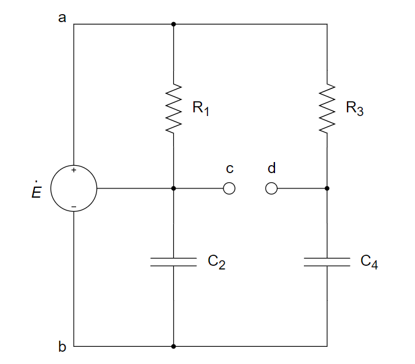

A.$\frac{R~1~}{R~3~}=\frac{C~4~}{C~2~}$ 	B.$\frac{R~1~}{R~3~}=\frac{C~2~}{C~4~}$ 	C.$R_1 R_3=C_2 C_4$	D.无法平衡

2、若在一个 50 μF 的电容两端施加一电压 $v = 10\cos(100 t + 30°) \rm{V}$，则流经该电容的电流值为 ________ 。

3、若 *RC* 串联电路对频率为 100 Hz 的正弦波的阻抗为 (2 - j6) Ω，则该串联电路对频率为 300 Hz 的正弦波的阻抗为 ________ 。

4、如果 RL 串联电路对频率为 300Hz 的正弦信号的阻抗为 (1 + j3) Ω，则对频率为 100Hz 的正弦信号，该串联电路的阻抗为 ________ ，构成并联电路时的导纳为 ________ 。

5、若 *RC* 串联电路对频率为 100 Hz 的正弦波的阻抗为 (3 - j9) Ω，则该串联电路对频率为 300 Hz 的正弦波的阻抗为 ________ 。

6、右图所示电路中， $\vec{I_s}=4∠90°A,Z_1=Z_2=-j30Ω,Z_3=30Ω，Z=45Ω$ 。则 $\vec{I}$ = ________ （用极坐标形式表示）

7、下图中，若电流 $i=\cos(4t)$，电压 $v=\sin(4t)$，那么该元件是 ________ 。

A. 电感				B. 电容				C. 电阻

8、下图所示电桥的平衡条件是 ________ 。

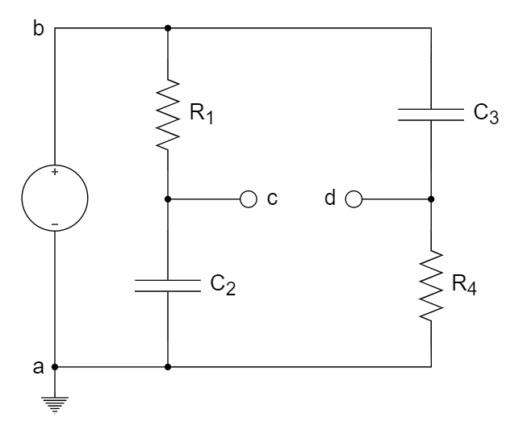

A. $\frac{R_1}{R_4}=\frac{C_3}{C_2}$		B. $\frac{R_1}{R_4}=\frac{C_2}{C_3}$		C. $R_1R_4=C_2C_3$		D. 无法平衡

9、下图所示电路中，$i_S=(2+4\cos10t){\rm A}$，通过 $10{\rm \Omega}$ 电阻电流的有效值应为<u>__  __</u>。

A. 4 A				B. $2\sqrt{2}{\rm A}$				C. $\sqrt{12}{\rm A}$				D. 2 A

10、若 *RC* 串联电路对频率为 100 Hz 的正弦波的阻抗为 (4 - j16) Ω，则该串联电路对频率为 400 Hz 的正弦波的阻抗为 ________ 。

11、下图为三个阻抗串联的电路：$Z_1=5\angle30°\Omega$，$Z_2=4\angle60°\Omega$，$Z_3= (3+j3) \Omega$，外加电压 $\vec{U_{AB}}=10\angle0°{\rm V}$。求电流及各阻抗上的电压。

**参考解答**

1. A
1. $‒ 50\sin(100 t + 30°)$ mA 或 $50\cos(100 t +120°)$ mA
1. (2 - j2) Ω
1. (1 + j) Ω      (1 - j) S
1. (3 - j3) Ω
1. 1.131∠81.87° A
1. B
1. D
1. B
1. (4 - j4) Ω
1. 解：

   $\vec{I}=\frac{\vec{U_{AB}}}{Z_1+Z_2+Z_3}=0.7729\angle-43.85°{\rm A}$ 

   $\vec{U_1}=\vec{I} \times Z_1=3.864\angle-13.85°{\rm V}$ 

   $\vec{U_2}=\vec{I} \times Z_2=3.092\angle16.15°{\rm V}$ 

   $\vec{U_3}=\vec{I} \times Z_3=3.279\angle1.146°{\rm V}$ 

   

## 知识点3：电路定理在相量域的推广

1、用叠加原理求解下图所示电路中的 $u_x(t)$ 。

2、正弦稳态电路中，系统可以用戴维南定理等效为电源 $V_{Th}$ 和等效阻抗 $Z_{Th}$ 。要使系统传输到负载 $Z_L$ 上的平均功率最大，负载和系统等效阻抗之间的关系是 ________ 。

A. $Z_L=Z_{Th}$ 		B. $Z_L=-Z_{Th}$ 		C. $Z_L=Z_{Th}^*$ 		D. $Z_L=|Z_{Th}|$ 

3、用节点电压法求下图所示电路在稳态下的 $u_1(t)$ 。

4、已知下图所示电路中 $i(t)=2\cos(1000t)A$ ， $v(t)=10\sin(\frac{4000}{3}t)V$ ，求流过电容的电流 $i_C(t)$ 。

5、下图中，ab 左侧部分可用诺顿等效电路等效，求

(1)  诺顿等效电流源 $I_N$ 和等效阻抗 $Z_N$；

(2)  $I_o$。

6、计算输出电阻 Z 。

7、请使用节点电压法，分析下面电路，计算 $v_1$ 和 $v_2$

8、计算下图中的电流 $I_o$

9、采用叠加定理分析以下电路，计算 $v_o$

10、下面电路中，求 $ab$ 端的戴维南等效电路

**参考解答**

1. 解：采用叠加定理，

   先考虑电压源 12cos3t V 独立作用时， 电容阻抗为$-4j$，电感阻抗为 $6j$

   得到 $u_{x1} = 9.6000 - 4.8000j = 10.7331\cos(3t - 26.5651°) \rm{V}$；

   考虑电流源 4sin2t V = 4cos(2t - 90°) V 独立作用时，电容阻抗为$-6j$，电感阻抗为 $4j$

   得到 $u_{x2} = 19.2000 + 9.6000j = 21.4663\cos(2t - 63.4349°) \rm{V}$;

   考虑电压源 10V 独立作用时：

   得到 $u_{x3} = 10$ V;

   故 $u_x = u_{x1} + u_{x2} + u_{x3} = [10.7331\cos(3t - 26.5651°) + 21.4663\cos(2t - 63.4349°) + 10] \rm{V}$。

2. C

3. 解：

   在频域内求解，给出电路图的相量表示。

   

   对节点 1 和节点 2 分别用 KCL，得到：
   $$
   \begin{cases}
   \frac{\vec{U_1}}{10} + \frac{\vec{U_1} - \vec{U_2}}{-j5} = 2∠-90° \\
   \frac{\vec{U_2}}{j10} + \frac{\vec{U_2} - \vec{U_1}}{-j5} = 1.5∠0°
   \end{cases}
   $$
   将上述两式变成标准形式
   $$
   \begin{cases}
   (0.1 + j0.2)\vec{U_1} - j0.2\vec{U_2} = -j2 \\
   -j0.2\vec{U_1} + j0.1\vec{U_2} = 1.5
   \end{cases}
   $$
   对上述方程组求解，得到
   $$
   \vec{U_1} = 16.1∠29.7° \rm{V}
   $$
   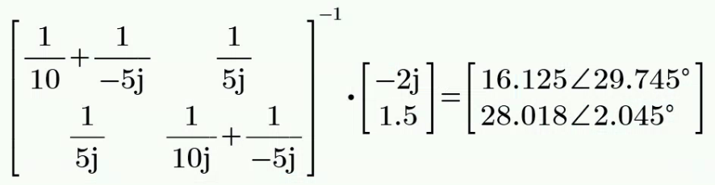

   转变到时域形式，得到
   $$
   u_1(t) = 16.1\cos(100t + 29.7°) \rm{V}
   $$

4. 解：

   (1) 仅考虑电流源，turn off 电压源

   ​	  $I_{C1}=\frac{20}{20-j20}×2=1+j=\sqrt{2}∠45°=1.4142∠45° \rm{A}$ 

   ​	  $∴i_{C1}(t)=1.414\cos(1000t+45°) \rm{A}$ 

   (2) 仅考虑电压源，turn off 电流源

   ​	  $I_{C2}=\frac{10}{20-j15}=\frac{2}{25}(4+j3)=0.4∠36.87° \rm{A}$ 

   ​	  $∴i_{C2}(t)=0.4\sin(\frac{4000}{3}t+36.87°) \rm{A}$ 

   (3) 时域叠加

   综上，$i_C(t)=[1.414\cos(1000t+45°)+0.4\sin(\frac{4000}{3}t+36.87°)] \rm{A}$ 

5. 解：

   (1)  输出端短路，求 $I_N$。

   ​	  $I_N=4\angle-90° \times \frac{8}{8+(1-j3)}+\frac{20\angle0°}{(4+j2)||(8+1-j3)}=(\frac{106}{15}-j\frac{68}{15}){\rm A}=8.396\angle-32.68°$ 

   (2)  独立源置零，在端口处施加一 1∠0° V 的电压，求等效阻抗 $Z_N$。

   ​	  $Z_N=(4+j2)||(8+1-j3)=3.244\angle12.53°$ 

6. 解：

   对左上方小 $\Delta$ 电阻网络和下方小 $\Delta$ 电容网络使用 $\Delta \rightarrow Y$ 转换，得到：

   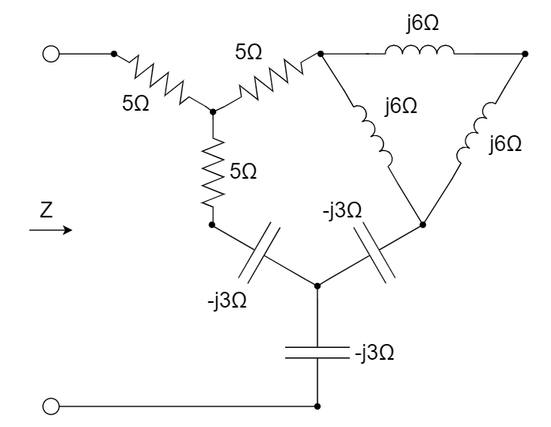

   那么可以得到，电路的等效输出阻抗为

   $Z=5+(5-j3)||[5+(j6)||(j6+j6)-j3]-j3$ 

   ​	 $=5+(5-j3)||(5+j4-j3)-j3$ 

   ​	 $=5+(\frac{75}{26}-j\frac{11}{26})-j3$ 

   ​	 $=(\frac{205}{26}-j\frac{89}{26}){\rm \Omega}$ 

   ​	 $=(7.885-j3.423){\rm \Omega}$ 

7. 

8. 

9. 

10. 

## 知识点4：交流功率分析

1、正弦交流电路中，哪个功率是不守恒的 ________ 。

A. 有功功率	B. 无功功率	C. 视在功率	D. 复功率

2、为提高电路的功率因数，对感性负载，应（串/并）________ 接 ________ 元件。

3、如下图所示正弦交流电路，已知电源电压 $u_s = 60\sqrt{2}\cos(\omega t-36.9°) \rm{V}$ ，负载2的电压 $u_2 = 60\sqrt{2}\cos(\omega t-53.1°) \rm{V}$ ，电流 $i = 3\sqrt{2}\cos \omega t \rm{A}$ ，则负载1吸收的有功功率为 ________ ，负载2吸收的无功功率为 ________ 。

4、当负载获取最大功率时，电路的传输效率 ________ 是50%。

A. 一定				B. 不一定

5、复功率的模等于 ________ 。

A. 平均功率	B. 瞬时功率	C. 视在功率	D. 功率因数

6、右图（元件参数单位欧姆）所示正弦交流电路的功率因数为<u>__  __</u>。

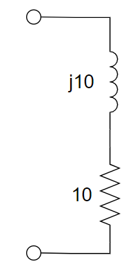

A. 1		B. 0.707		C. 0.5		D. 0.25

7、瞬时功率的单位是 ________  ，有功功率的单位是 ________ ，无功功率的单位是  ________ ，视在功率的单位是  ________ ，复功率的单位是 ________ 。

8、欲使下图所示正弦交流电路的功率因素为0.707，$\frac{1}{\omega c}$ 应等于 ________ 。

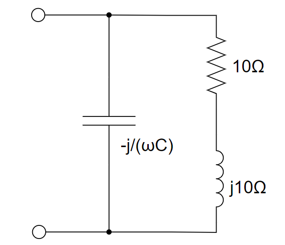

A. 0		B. 5Ω		C. 20Ω		D. 10Ω

9、无功功率的物理意义是 ________ 。

10、有功功率、无功功率、视在功率和复功率中守恒的是 ________ ，不守恒的是 ________ 。

11、在市电交流激励电路中，对于感性负载，提高电路功率因素的方法是 ________ 。

12、复功率的实部等于 ________ 。

A. 平均功率		B. 瞬时功率		C. 视在功率		D. 无功功率

13、电路如下，阻抗 $Z$ 的平均功率可以表示为 $P=\frac{1}{2}V_mI_mcos(θ_v-θ_i)$ ，则其无功功率 ________ 。

14、已知正弦电源 *f* = 50 Hz，$V_{rms}$ =220 V，*P* =10 kW，$\cos \phi$ = 0.6，要使功率因数提高到 0.9，应并联多大的电容，求改进前后电路的总电流各为多大？

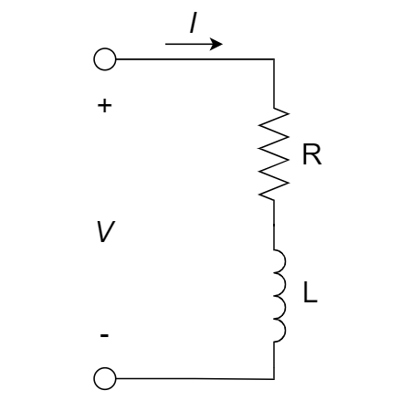

15、当负载从电源获得相同有功功率情况下，若系统功率因数偏低，以下 ________ 的描述是不正确的。

A.  电源设备不能充分利用		B.  增加输电线路的电能损失

C.  线路电压降增大					D. 不影响电网企业经济效益

16、如下图所示电路，若在 a、b 两端之间接一负载，那么该负载取何值时可以实现最大平均功率输出，此时负载是容性的还是感性的？负载上的最大平均功率为多少？（图中 120 V 是指电压源电压的有效值）

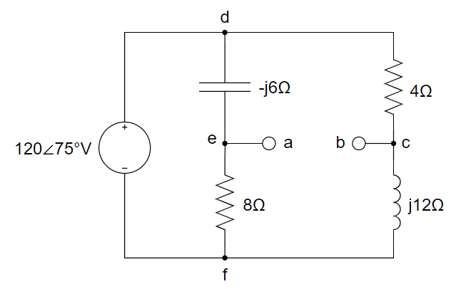

17、某阻抗 $Z=(2+j2)Ω$ 的负载与 $i_s(t)=5\sqrt{2}\cos2t \rm{A}$ 的电流源相联，求电源提供给该负载的视在功率、有功功率、无功功率、功率因数和复功率。

18、试求下图中负载阻抗  $Z_L$  为何值时获得的功率最大，并求出此最大功率（图中电流源输出电流标注的是有效值）。

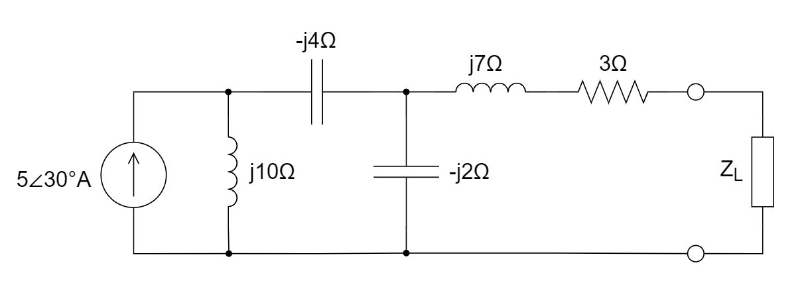

19、下图所示正弦交流电路中，已知 $u(t)=20\sqrt{10}\cos5t \rm{V}$ ，求： 

(1) 该电路的(复)阻抗 $Z$ ，将该电路简化为两个元件串联，并求元件参数。

(2) 该单口网络的平均功率和功率因数。

20、系统提高功率因数后，对于负载来说理论上保持不变的参量是 ________ 。

A. 有功功率		B. 无功功率		C. 复功率		D. 视在功率

21、电路如图所示，求出获得最大功率的纯电阻 $Z_L$ 。

22、电路中 $R_1=R_2=100{\rm \Omega}$，$L_1=L_2=1{\rm H}$，$C=100{\rm \mu F}$，$\vec{V_s}=100\angle0°{\rm V}$，$\omega=100{\rm rad/s}$。求 $Z_L$ 获得的最大功率。

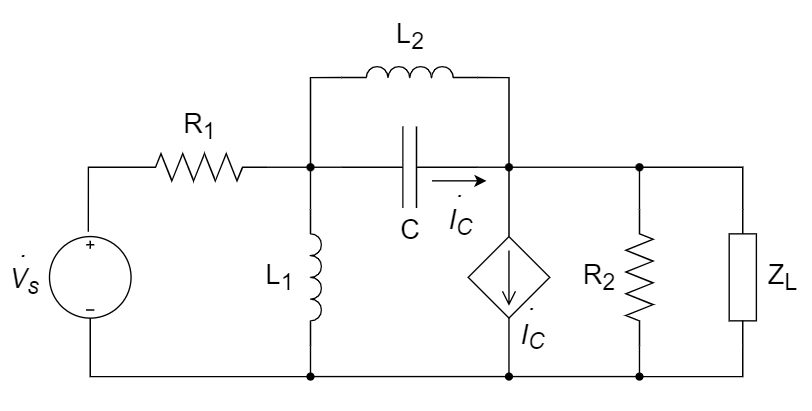

23、下面电路中，分析 $Z_L$ 取何值时，可以获得最大功率，该最大功率是多少

24、某一负载上的电压为 $V_{rms} = 110\angle85^\circ$V，电流为 $I_{rms} = 3 \angle 15^\circ$ A，试求(a)复功率和视在功率；(b)有功功率和无功功率；(c)功率因数和负载阻抗

25、某负载的无功功率为 140 kVAR，功率因数为0.85 lagging，求并联多大的电容，可以使功率因数校正到1。假设220V (rms)，60Hz供电。

**参考解答**

1. C

2. 串或并      电容

3. 36W         -144VAR

   

4. B

5. C

6. B

7. W      W      VAR      VA      VA

8. D   (10 Ω 或 ∞)

9. 无功功率 Q > 0，表示网络吸收无功功率；Q < 0，表示网络发出无功功率。Q 的大小反映网络与外电路交换功率的速率，是由储能元件 L、C 的性质决定的。

10. 有功功率、无功功率、复功率      视在功率

11. 在电感性负载两端并联合适大小的电容

12. A

13. $Q=\frac{1}{2}V_mI_msin(θ_v-θ_i)$ 

14. 解：
    $$
    \cos\phi_1 = 0.6	⇒	\phi_1 = 53.13°
    $$

    $$
    \cos\phi_2 = 0.9	⇒	\phi_2 = 25.84° 
    $$

    $$
    C = \frac{P}{\omega V^2}(\tan \phi_1 - \tan \phi_2) = \frac{10×10^3}{314×220^2}(\tan 53.13° - \tan 25.84°)=558 \mu F
    $$

    $$
    I_1 = I_L = \frac{P}{V\cos \phi_1} = \frac{10×10^3}{220×0.6} = 75.8 A
    $$

    $$
    I_2 = \frac{P}{V\cos \phi_2} = \frac{10×10^3}{220×0.9} = 50.5 A
    $$

15. D

16. 解：

    (1) 求 a、b 两端的戴维南等效电路
    $$
    \begin{cases}
    V_{Th}=120∠75°(\frac{8}{8-j6}-\frac{j12}{4+j12})=(-28.939-j24.546)V=37.947∠-139.695°V \\
    Z_{Th}=8||(-6j)+4||12j=\frac{-48j}{8-6j}+\frac{48j}{4+12j}=(6.480-j2.640)Ω=6.997∠-22.166°Ω
    \end{cases}
    $$
    (2) 共轭匹配
    $$
    Z_L=Z_{Th}^*=(6.480+j2.640)Ω=6.997∠22.166°Ω
    $$
    此时，为感性负载。

    (3) 当共轭匹配时，负载上有最大平均功率
    $$
    I_L=\frac{V_{Th}}{Z_{Th}+Z_L}=(-2.233-j1.894)Ω=2.928∠-139.695° A
    $$

    $$
    V_L=I_L·Z_L=(-9.469-j18.168)V=20.488∠-117.529°V
    $$

    $$
    P=V_L·I_L^*=(55.556+j22.634)W=59.989∠22.166°W
    $$

    故而负载上的最大平均功率为  $P_{AV}=55.556 W$  

    

17. 解：

    ​		$I_s=5A$ 		$U=|Z|I_s=\sqrt{2^2+2^2}×5=10\sqrt{2}V$ 		$φ=arctg(\frac{2}{2})=45°$ 

    

    ​		视在功率 $S=UI_s=10\sqrt{2}×5=50\sqrt{2} VA$ 

    

    ​		有功功率 $P=UI_scosφ=10\sqrt{2}×5×cos(45°)=50W$ 

    

    ​		无功功率 $Q=UI_ssinφ=10\sqrt{2}×5×sin(45°)=50 \rm{VAR}$ 

    

    ​		功率因数 $λ=cosφ=cos(45°)=0.707$ 

    

    ​		复功率 $\vec{S}=P+jQ=(50+j50) \rm{VA}$ 

    

18. 解：

    ​		$\vec{U_{oc}}=\frac{50∠120°}{j10-j4-j2}×(-j2)=25∠-60°V$ 

    ​		$Z_s=3+j7+\frac{(j10-j4)×(-j2)}{j10-j4-j2}=(3+j4)Ω$ 

    ​		$Z_L=Z_s^*=(3-j4)Ω$ 

    ​		$P_{Lmax}=\frac{U_{oc}^2}{4×3}=\frac{625}{12}=52.083W$ 

    

19. 解：

    ​		$Z=(10+j10)Ω$ 

    ​		最简模型为 10 Ω 电阻与 2 H 电感串联。

    ​		平均功率：$P=U^2Re[Y]=(20\sqrt{10})^2×\frac{10}{10^2+10^2}=100W$ 

    ​		功率因数：$λ=cos45°=\frac{\sqrt{2}}{2}≈0.707$ ，电感性

    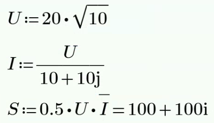

20. A

21. 解：

    对端口 ab 进行戴维南等效，得到：

    $V_{Th}=20\angle0° \times \frac{20||(j3-j6)}{5+[20||(j3-j6)]}\times \frac{-j6}{j3-j6}=(11.52-j15.36){\rm V}$ 

    $R_{Th}=[(5||20)+j3]||(-j6)=(5.76-j1.68){\rm \Omega}$ 

    根据最大功率传输定理，获取最大功率的纯电阻 $Z_L$ 满足

    $Z_L=|R_{Th}|=6{\rm \Omega}$ 

22. 解：

    (1)  方法1：对除负载 $Z_L$ 外的电路做戴维南等效：

    ​	  记流经 $R_2$ 的电流为 $\vec{I}$ ，方向为由上至下；以底端节点作为参考节点。

    ​	  则电容右侧节点电压为 $\vec{I}R_2$ ，左侧节点为 $\vec{I}R_2+\vec{I_C}\times\frac{1}{j\omega C}$；流经 $L_2$ 的电流为 $\vec{I}$，方向从左至右。

    ​	  对左侧节点列 KCL 方程，有

    ​	  $\frac{\vec{I}R_2+\vec{I_C}\times\frac{1}{j\omega C}-\vec{V_s}}{R_1}+\frac{\vec{I}R_2+\vec{I_C}\times\frac{1}{j\omega C}}{j\omega L_1}+\vec{I_C}+\vec{I}=0$ 

    ​	  根据 $\vec{V_C}=\vec{V_{L_2}}$ ，得到增补方程：

    ​	  $\vec{I_C}\times\frac{1}{j\omega C}=\vec{I}\times(j\omega L_2)$ 

    ​	  联立得到：

    ​	  $\vec{I}\times[1+\frac{L_2}{L_1}+\frac{R_2}{R_1}+\frac{j\omega L_2}{R_1}+\frac{R_2}{j\omega L_1}+(j\omega C)(j\omega L_2)]=\frac{\vec{V_s}}{R_1} \Rightarrow \vec{I}=\frac{1}{2}\angle0°{\rm A}$  

    ​	  故而	$\vec{V_{Th}}=R_2\times \vec{I}=50\angle0°{\rm V}$ 

    ​    方法2： $L_2$和$C$构成开路，用分压计算

    (2)  电压源短路，在外施加一大小为 $1\angle0°{\rm V}$ 的电压，求等效电阻：

    ​	  以底端节点作为参考节点，则上方节点电压从左至右依次为为 $\vec{V_1}$，$\vec{V_2}$。

    ​	  列节点电压方程

    ​	  $\frac{\vec{V_1}}{R_1} +\frac{\vec{V_1}}{j\omega L_1}+\frac{\vec{V_1}-\vec{V_2}}{j\omega L_2}+\vec{I_C}=0$ 

    ​	  $\vec{V_2}=1\angle0°$ 

    ​	  其中，$\vec{I_C}=\frac{\vec{V_1}-\vec{V_2}}{\frac{1}{j\omega C}}$ 

    ​	  解得：$\vec{V_1}=0{\rm V}$，$\vec{V_2}=1\angle0{\rm V}°$，$\vec{I_C}=-j10{\rm mA}$ 

    ​	  			$\vec{I_i}=\frac{\vec{V_2}}{R_2}+\frac{\vec{V_2}-\vec{V_1}}{j\omega L_2}=\frac{1-j}{100}{\rm A}$ 

    ​	  得到：$R_{Th}=\frac{100}{1-j}=50\sqrt{2}\angle45°{\rm \Omega}$ 

    (3)  当 $Z_L=R_{Th}^*=50\sqrt{2}\angle-45°{\rm \Omega}=(50-j50){\rm \Omega}$ 时，有最大功率

    ​		   $\vec{I_L}=\frac{\vec{V_{Th}}}{R_{Th}+Z_L}=\frac{1}{2}\angle0°{\rm A}$ 

    ​		   $\vec{V_L}=\vec{I_L} \cdot Z_L=25\sqrt{2}\angle-45°{\rm V}$ 
    
    ​		   $\vec{S}=\frac{1}{2} \vec{V_L} \cdot \vec{I_L}^*=\frac{25\sqrt{2}}{4} \angle-45°{\rm W}$ 
    
    ​	  故而负载上的最大平均功率为
    
    ​	  	 $P_{Av}=6.25{\rm W}$ 

23. 
24. 
25. 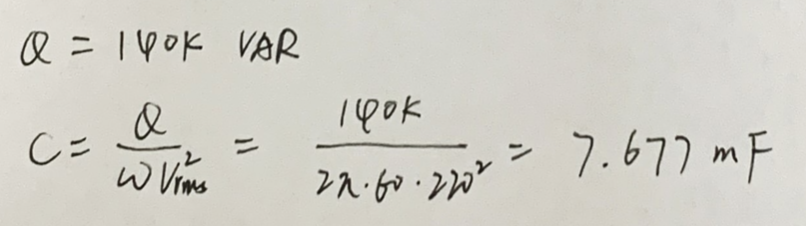

## 知识点5：其他

1、下列哪种说法不正确？

A. 理想直流电流源的输出电流始终是一个定值，与它两端的电压无关

B. 双端网络的端口电压超前电流时，该网络一定是感性的

C. 受控源在电路分析中的作用和理想源相同，都可视为激励源看待

D. 戴维南定理和诺顿定理仅适用于线性电路

**参考解答**

1. C

