# 过渡过程的经典解法

::: tip

1. 动态电路和过渡过程的概念：

   * 电感、电容的“电压电流约束关系”与时间 *t* 有关，所以电感、电容又称为**动态元件**，含电感、电容的电路也被称为**动态电路**；

   * 动态电路的一个**特征**是：当电路结构发生变化时（一般通过“开关”的切换来实现），可能使电路从原来的工作状态，转变到一个新的工作状态，这种转变往往需要一定的时间，这一过程被称为动态电路的**过渡过程；**

   * 开关切换的动作也被称为“**换路**”，一般认为换路是在 $t=0$ 时刻进行的，把换路前的最终时刻记为  $t = 0^-$，把换路后的最初时刻记为 $t = 0^+$;

   * 分析动态电路的方法：根据KCL、KVL、元件的电压电流约束关系，写出微分方程，并求解；这一方法在**时域**中进行，称为**经典解法**；

     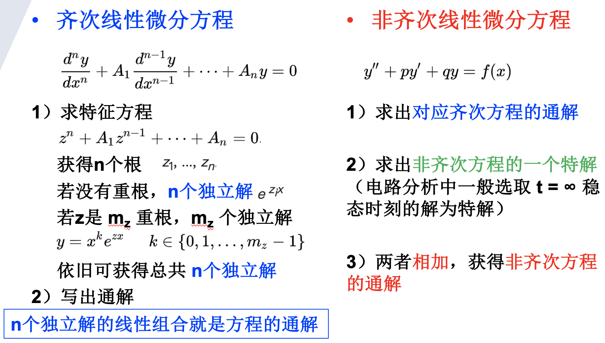

2. 一阶电路的响应、二阶电路的响应；

   * 一阶电路：化简后的电路仅含一个储能元件
   * 解一阶微分方程需要知道变量初始值
   * $0^+$ 时刻的电路状态由 $0^-$ 时刻的电路状态获得，且基于
     * 电感电流不能突变
     * 电容电压不能突变
   * 一阶电路的衰减常数：$\tau = RC$, 或 $\tau = \frac{L}{R}$

3. 零输入响应、零状态响应、全响应及其分解方式、三要素法分析；

   *  输入指 $t = 0^+$ 时刻，电路中有无电源； 状态指 $t = 0^+$ 时刻，电路中的储能元件有无初始储能
   *  零输入响应：无**外加激励**电源（零**输入**），仅由动态元件初始储能所产生的响应
   *  零状态响应：动态元件**初始储能**为零（零**状态**），由外加激励电源引起的响应
   *  实际情况往往是$t = 0^+$ 时刻电源和初始储能都有的，即全响应
   *  三要素法：初始值、稳态值、时间常数；**初始与稳态的差值随时间常数的指数衰减**，所以
     
      $$v(t) = v(\infty) + [v(t_0) - v(\infty)] \cdot e^{-(t - t_0)/\tau} $$

4. 二阶电路的响应

   * 二阶电路：化简后的电路含两个储能元件

   * 解二阶微分方程需要知道变量初始值，以及变量导数的初始值

   * **focus on 不能突变的量**，即电感电流、电容电压，寻找变量初始值；变量导数的初始值由元件的外围电路决定

     * 如电感，求电流导数的初始值，因 $v = L \frac{di}{dt}$ ，需经由电感两端电压初始值获得
     * 如电容，求电压导数的初始值，因 $i = C \frac{dv}{dt}$，需经由流经电容电流初始值获得

   * 求解二阶微分方程，即获得二阶电路的解

     * step 1: 求变量及变量导数的初始值
     * step 2: 求微分方程的特解，即变量的稳态响应 $x_{ss}(t) = x(\infty)$
     * step 3: $0^+$ 时刻，turn off 独立源，求齐次微分方程的通解，即变量的瞬态响应 $x_t(t)$
     * step 4: 写出非齐次微分方程的通解，即稳态响应和瞬态响应相加 $x(t) = x_t(t) + x_{ss}(t)$
     * step 5: 结合初始条件，求待定系数

   * 对于串联 RLC、并联 RLC 这两种特殊的二阶电路，可根据衰减常数和谐振频率直接写出解的表达式

     * **衰减常数**，对于串联 RLC，$\alpha = \frac{R}{2L}$ ；对于并联 RLC，$\alpha = \frac{1}{2RC}$

     * **谐振频率**，$\omega_0 = \frac{1}{\sqrt{LC}}$

     * 典型的二阶电路有过阻尼（$\alpha > \omega_0$）、临界阻尼（$\alpha = \omega_0$）、欠阻尼（$\alpha < \omega_0$）三个 cases；临界阻尼衰减最快；以下以电容电压为例

       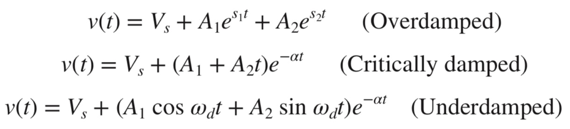
     
       
       $$
       s_{1,2} = -\alpha \pm \sqrt{\alpha^2 - \omega_0^2}
       $$
     
       $$
       \omega_d = \sqrt{\omega_0^2 - \alpha^2}
       $$
     
     * 选取电感电流还是电容电压作为变量？都可以。有激励时，取激励的量比较方便（即稳态时容易获得的是电压量还是电流量）；无激励时，并联取电压比较方便，串联取电流比较方便

5. 阶跃响应、冲激响应。

   * 单位斜坡函数是单位阶跃函数的积分
   * 单位冲激函数是单位阶跃函数的导数
   * 一阶电路：单位冲激响应可当作电容两端初始电压为1/C （或流经电感的初始电流为1/L）的零输入响应来处理；
   * 二阶电路：冲激响应可以按阶跃激励的一阶导数求得

:::

# 习题及参考解答

## 知识点1： 一阶电路的响应

1、已知电感无初始储能，开关 $S_1$ 和 $S_2$ 处于打开状态。*t* = 0 时开关 $S_1$ 闭合，*t* = 0.2s 时开关 $S_2$ 闭合，分别求两次换路后的电感电流 $i(t)$。

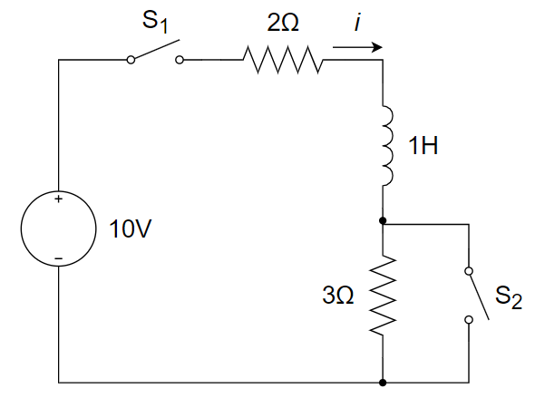

2、图示电路中开关断开时的电容电压 $u_c(0^+)$ 等于 ________ 。

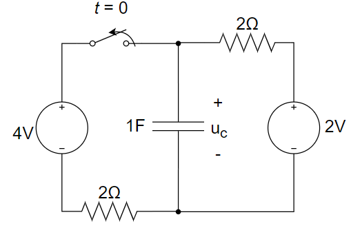

A. 2 V		B. 3 V		C. 4 V		D. 0 V

3、如下图所示电路，开关 K 原长时间停留在位置 1，t = 0时转换到位置 2，求 $v_c(t)$ 和 $i(t)$ 。

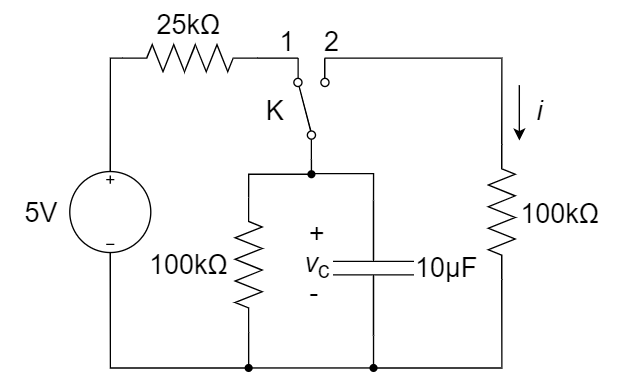

4、求下左图所示电路中电流 $i_c(t)$ ，独立电压源的伏安特性曲线见下右图。

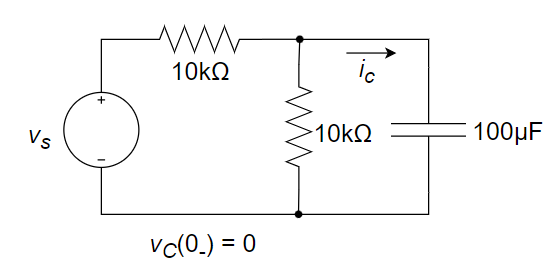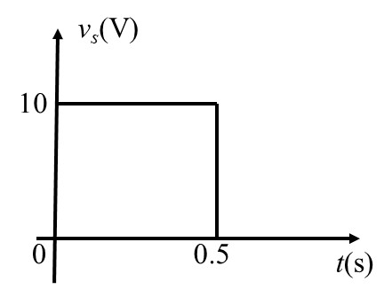

5、某 *RL* 一阶电路的全响应为 $i(t)=4-2e^{-t}(A)$ ，若初始状态不变，而输入电源幅度增加一倍，则全响应变为 ________ 。

A. $i(t)=8-4e^{-t}$ 		B. $i(t)=8+4e^{-t}$ 		C. $i(t)=8-6e^{-t}$ 		D. $i(t)=8+6e^{-t}$ 

6、如下图所示电路，开关闭合时电路已进入稳态，在 t = 0 时刻开关打开，求 t > 0 时电流 $i$ 的表达式。

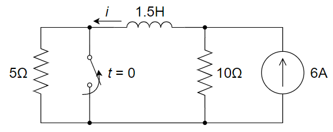

7、如下图所示电路，在 t = 0 时刻前，开关 S 在位置 1 时电路已达到稳定状态，t = 0 时开关由位置 1 合向位置 2，求 t ≥ 0 时的电压 $v_L$ 。

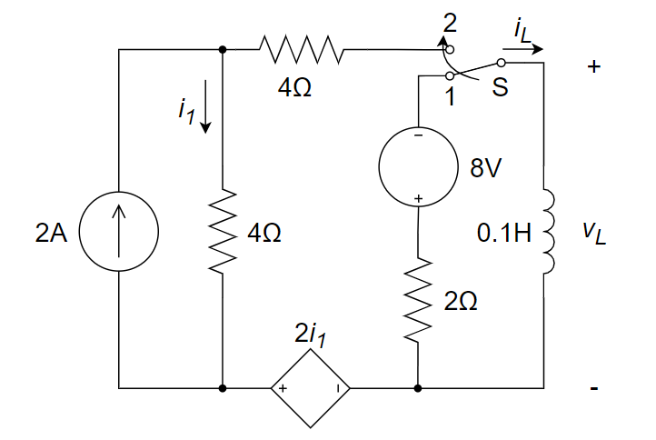

8、在下图所示电路中，电路换路前电容未储能，当 *t* = 0 时开关 S 闭合，求开关闭合后的 $i$ 和 $v_c$ 。

9、下图所示电路中，$t = 0^-$ 时刻已经处于稳定状态，开关于 $t=0$ 时闭合，则 $t > 0$ 时流过电感的电流为 ________ A。

10、下图所示电路中，换路前电路已处于稳态，开关闭合后，支路电流 $i(t)=$ ________ 。

11、电路如图所示，开关已长时间处于 A 位置，t = 0 时刻转向 B 位置，求 t ≥ 0 时的 $v_o(t)$。

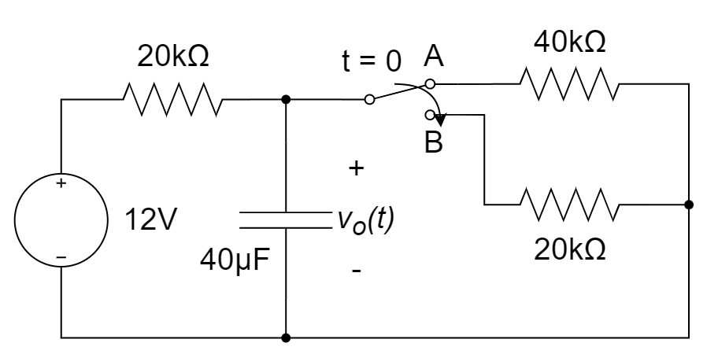

12、如图所示，若电感的初始电流 $i(0)=12{\rm A}$，求 $t>0$ 时刻的 $i(t)$ 和 $v_x(t)$。

13、在下图中 $t=0^-$ 时刻，S1、S2 开关是开启的；$t=0^+$ 开始，S1 开关关闭，但是 S2 开关在 $t=2{\rm s}$ 时关闭，请计算通过电感的电流（可分段表示）。

14、下图中，开关在 $t=0$ 时刻断开，求 $t \geq 0$ 时的 $v(t)$ 和 $t=0$ 时刻电容的储能 $w_C(0)$

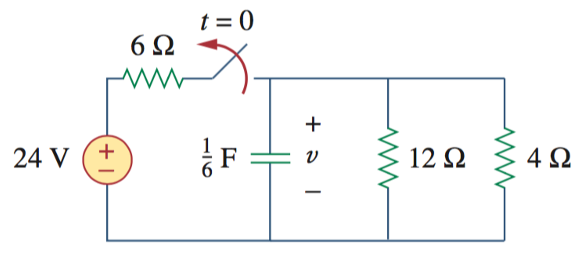

15、下图中，开关在 $t=0$ 时刻闭合，求 $t \geq 0$ 时的 $v(t)$ ，并计算 $t=0.5s$时刻的 $v(t)$ 值

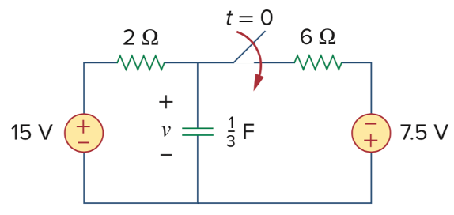

16、下图中，开关在 $t=0$ 时刻闭合，求全时刻的 $i(t)$ 和 $v(t)$

**参考解答**

1. 解：

   

2. B

3. 解：

   开关在位置 1 时，可解得：

   ​		 $v_c(0_{-})=\frac{5}{100+25}×100=4V$ 

   ​		 $t=0$ 时转换到位置 2 后，从电容两端看进去的等效电阻为

   ​		 $R_{eq}=\frac{100×100}{100+100}=50kΩ$ 

   ​		 $∴τ=R_{eq}C=50×10^3×10×10^{-6}=0.5s$ 

   因此，可得：

   ​		 $v_c(t)=4e^{-2t}V$ 

   ​		 $i(t)=\frac{v_c}{100}=0.04e^{-2t}mA$ 

4. 解：

   对左侧电路进行戴维南等效，化简电路图如下所示：

   

$$
   v_s=10ε(t)-10ε(t-0.5) 
$$

$$
   τ=RC=5×10^{3}×100×10^{-6}=0.5s
$$

   

   该电路的单位阶跃响应为
$$
   v_C(t)=(1-e^{-2t})ε(t) 
$$

$$
   i_C=C\frac{dv_C}{dt}=\frac{1}{5}e^{-2t}ε(t)(mA)
$$

   

   由齐次性和叠加性得实际响应为：
$$
   i_C=5×[\frac{1}{5}e^{-2t}ε(t)-\frac{1}{5}e^{-2(t-0.5)}ε(t-0.5)]=e^{-2t}ε(t)-e^{-2(t-0.5)}ε(t-0.5)(mA)
$$

   另外，也可以分段表示结果：

   $0<t<0.5,ε(t)=1,ε(t-0.5)=0$ 
$$
   i_C=e^{-2t}(mA)
$$
   $t>0.5,ε(t)=1,ε(t-0.5)=1$ 
$$
   i_C=e^{-2t}-e^{-2(t-0.5)}=e^{-2(t-0.5)}(e^{-1}-1)=-0.632e^{-2(t-0.5)}(mA)
$$

5. C。$i(0)$ 和时间常数不变，$i(\infty)$ 加倍，写成三要素表示形式，可获得结果

6. 解：
   $$
   i(0^+)=i(0^-)=6A
   $$

   $$
   i(∞)=6×\frac{10}{5+10}=4A
   $$

   $$
   τ=\frac{L}{R}=\frac{1.5}{15}=\frac{1}{10}s
   $$

   $$
   i(t)=i(∞)+[i(0^+)-i(∞)]e^{-t/τ}=(4+2e^{-10t})A
   $$

7. 解：

   开关在 1 位置时，$i_L(0^-)=-4A$ 。

   $0^+$ 时刻之后，将电感以外电路进行戴维南等效，求得：$v_{oc}=12V，R_{eq}=10Ω$ 

   时间常数为 $τ=\frac{L}{R_{eq}}=0.01s$ 

   边界条件为 $i_L(0^+)=i_L(0^-)=-4A,i_L(∞)=\frac{v_{oc}}{R_{eq}}=1.2A$ 

   应用三要素法，得到：

   ​		$i_L(t)=1.2+(-4-1.2)e^{-\frac{1}{0.01}t}=(1.2-5.2e^{-100t})A$ 

   ​		$v_L(t)=L\frac{di_L}{dt}=52e^{-100t}V$ 

   

8. 解：

   由题意可知，其为零状态响应，$v_c(0^-) = 0V$。

   ​		$2i(∞)+6i(∞)+4i(∞)=12⇒i(∞)=1A$ 

   ​		$v_C(∞)=6i(∞)+4i(∞)=10V$ 

   外施电源法（端口电压 $v'$，端口电流 $i'$）求等效电阻：

   ​		$v^{'}=6(i^{'}-\frac{v^{'}}{2})-4×\frac{v^{'}}{2},R_o=\frac{v^{'}}{i^{'}} = 1\ohm$

   ​        $τ=R_oC=1Ω×0.2F=0.2s$ 

   因此，$v_C(t)=10(1-e^{-5t})V,i(t)=\frac{12-v_C}{2}=(1+5e^{-5t})A$ 

9. $5(1-e^{-2t})$ 

10. $(10-6e^{-2t}){\rm A}$ 

11. 解：

    开关在位置 A 时，可解得：

    ​		$v_c(0_{+})=v_c(0_{-})=\frac{40}{20+40}×12=8{\rm V}$ 

    $t=0$ 时转换到位置 B 后，从电容两端看进去的等效电阻为

    ​		$R_{eq}=\frac{20×20}{20+20}=10{\rm kΩ}$ 

    ​		$∴τ=R_{eq}C=10×10^3×40×10^{-6}=0.4{\rm s}$ 

    电路稳定后，有 $v_{C}(\infty)=\frac{20}{20+20}\times 12=6{\rm V}$ 

    因此，可得：

    ​		$v_o(t)=v_C(\infty)+[v_c(0_{+})-v_C(\infty)]e^{-\frac{t}{\tau}}=(6+2e^{-2.5t}){\rm V}$ 

12. 解：

    初始条件 $i(0^+)=12{\rm A}$ 

    边界条件 $i(\infty)=0$ 

    对除了电感外的部分电路外施加电压 $U$ 求等效电阻：

    ​		$\frac{U-v_x}{6}+\frac{U-v_x-2v_x}{2}=\frac{v_x}{1}$ 

    不妨取 $U=1{\rm V}$，得：$v_x=0.25{\rm V}$ 

    ​		$R_{eq}=\frac{U}{I}=\frac{1}{\frac{0.25}{1}}=4{\rm \Omega}$ 

    ​		$\therefore \tau=\frac{L}{R_{eq}}=\frac{2}{4}=0.5{\rm s}$ 

    因此，$i(t)=i(\infty)+[i(0^+)-i(\infty)]e^{-\frac{t}{\tau}}=12e^{-2t}{\rm A}$ 

    ​			$v_x(t)=-i \times 1=-12e^{-2t}{\rm A}$ 

13. 解：

    (1)  0 < t < 2 s 时

    ​	  $i(0^+)=i(0^-)=0$ 

    ​	  $i(\infty)=\frac{15}{15+(10+20)}\times 6=2{\rm A}$ 

    ​	  $\tau=\frac{L}{R}=\frac{5}{45}=\frac{1}{9}{\rm s}$ 

    ​	  $i(t)=k_1e^{-9t}+k_2$ ，0 < t < 2

    代入边界条件，解得：$k1=-2,k_2=2$ 

    ​	  $i(t)=(2-2e^{-9t}){\rm A},0<t<2$ 

    (2)  t ≥ 2 s 时

    ​	  $i(2^+)=i(2^-)=(2-2e^{18}){\rm A}\approx2{\rm A}$ 

    ​	  $i(\infty)=\frac{15}{15+10} \times 6=3.6{\rm A}$ 

    ​	  $\tau=\frac{L}{R}=\frac{5}{25}=0.2{\rm s}$ 

    ​	  $i(t)=i(\infty)+[i(2^+)-i(\infty)]e^{-\frac{t-2}{\tau}}=[3.6-1.6e^{-5(t-2)}]{\rm A},t≥2$ 

14. 

15. 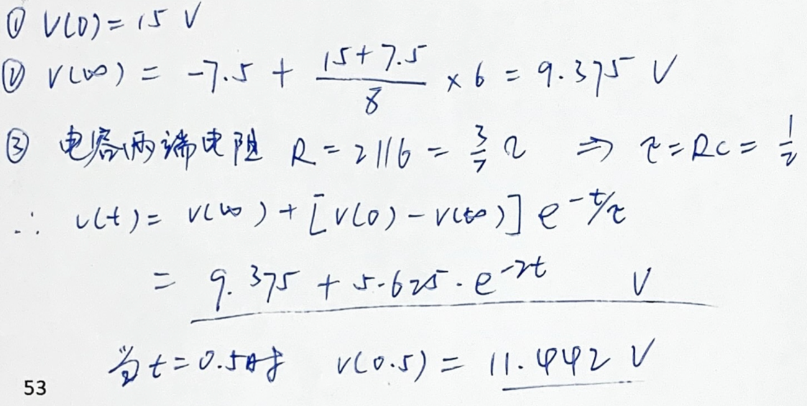

16. 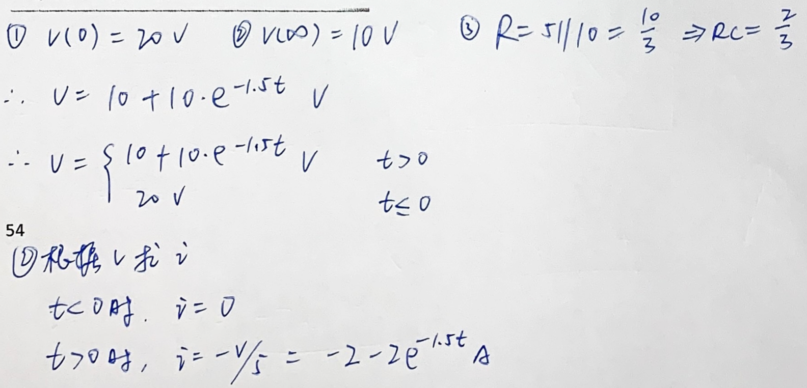

    

## 知识点2：二阶电路的响应

1、如下图所示电路，开关已长时间处于A位置，*t* = 0 时刻转向B位置。求 *t*＞0 时的  $i(t)$ 和 $v_c(t)$ 。

2、如图所示电路中，已知 $R_1$ = 5 Ω，$R_2$ = 1 Ω，L = 1 H，C = 0.25 F，V = 24 V。t = 0时开关断开。求 t > 0 时的 $v_c(t)$ 和 $i(t)$ 。

3、如图所示电路，开关置于 a 已经很久，在 t = 0 时开关打至b，求电流 $i(t)$ 。

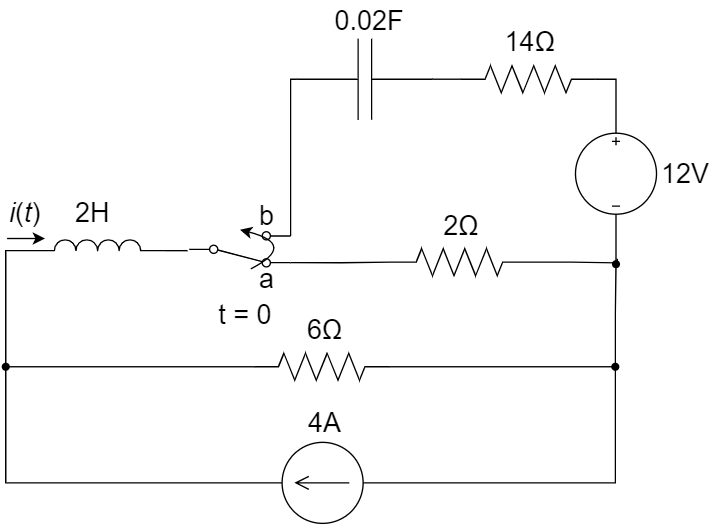

4、如下图所示电路，开关闭合时电路处于稳态，在 t = 0 时开关打开，求 t > 0 时的 $v_c(t)$ 。

5、如下图所示电路，在 t = 0 时刻前，开关在位置 1 时电路已达到稳定状态，t = 0 时开关由位置 1 合向位置 2 ，求 t > 0 时，流过电感的电流。

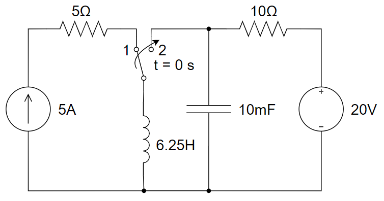

6、下图所示电路中，电容原先已经充电，$u_C(0^-)=6V,R=2.5Ω,L=0.25H,C=0.25F$ 。试求：

(1) 开关闭合后的 $u_C(t)$ 和 $i(t)$ 

(2) 见第5章-知识点1-第12题

7、如下图所示电路，当 *t* = 0 时刻打开开关，求电流 $i$ 的响应。

8、下图中，开关在 $t=0$ 时刻从 $a$ 切换到 $b$ ，求 $t>0$ 时刻的 $i(t)$

9、下图中，求  $t>0$ 时刻的 $v(t)$

10、下图中，求  $t>0$ 时刻的 $v(t)$ 和 $v_R(t)$

11、下图中，求  $t>0$ 时刻的 $v$ 和 $i$

**参考解答**

1. 

2. 

   

3. 解：

(1)在 $t = 0^-$ 时， $v_C=0,i_L(0)=i(0)=\frac{6}{6+2}×4=3A$ 

(2)当 $t>0$ 时，可以将 RLC 电路简化如下：

$$
\omega_0=\frac{1}{\sqrt{LC}}=\frac{1}{\sqrt{2×0.02}}=5rad/s
$$

$$
\alpha = \frac{R}{2L}=\frac{6+14}{2×2}=5rad/s
$$

因为 $\alpha =\omega_0$ ，所以为临界阻尼响应。故有：
$$
\begin{cases}
v(t)=V_s+(A+Bt)e^{-5t},V_s=24-12=12V \\
v(0)=0=12+A \\
⇒ A=-12 \\
\\
i=C\frac{dv}{dt}=C[Be^{-5t}+(-5)×(A+Bt)e^{-5t}] \\
i(0)=3=C(-5A+B)=0.02×(60+B) \\
⇒ B=90 \\
\\
∴i(t) = 0.02[90e^{-5t} + (-5)×(-12 + 90t)e^{-5t}] \\
⇒ i(t) = [(3 - 9t)e^{-5t}] A
\end{cases}
$$

4. 解：

(1)   $v_c(0^-)=v_c(0^+)=0$ ，$i_L(0^-)=i_L(0^+)=\frac{30}{30}=1A$ 

​		$\frac{dv_C(0^+)}{dt}=\frac{1}{C}i_C(0^+)=\frac{1}{0.05}×1=20 V/s$ 

​		$v_C(∞)=30V$ 

(2)   求解 natural response

​	   $RC\frac{dv_C}{dt}+LC\frac{d^2v_C}{dt^2}+v_C=0⇒\frac{30}{20}\frac{dv_C}{dt}+\frac{10}{20}\frac{d^2v_C}{dt^2}+v_C=0$ 

​	   $s^2+3s+2=(s+1)(s+2)⇒v_C(t)=(30+Ae^{-t}+Be^{-2t})V$ 

​	   将(1)中的边界条件代入上式，得到：

​	   $v_C(t)=(30-40e^{-t}+10e^{-2t})V,t>0$ 

5. 解：

   根据诺顿等效转换为二阶并联RLC电路，$I_s=2A$。

   列出方程 $\frac{d^2i_L}{dt^2}+10\frac{di_L}{dt}+16=32$ 

   可得：$i_L=2+Ae^{s_1t}+Be^{s_2t},s_1=-8,s_2=-2$ 

   初始条件，$i_L(t=0)=5A,\frac{di_L}{dt}(t=0)=\frac{V_C}{L}=3.2A/s$ 

   ​			$i_L(t=0)=2+A+B=5$ 

   ​			$\frac{di_L}{dt}(t=0)=-8A-2B=3.2$ 

   解得：$A=-\frac{23}{15},B=\frac{68}{15}$ 

   $∴i_L=[2-\frac{23}{15}e^{-8t}+\frac{68}{15}e^{-2t}]A$ 

6. 解：

   ​		$LC\frac{d^2u_C}{dt^2}+RC\frac{du_C}{dt}+u_C=0$ 

   代入R、L、C值，计算得到特征根

   ​		$s_1=-2,s_2=-8$ 

   初始条件

   ​		$u_c(0^+)=u_C(0^-)=6V$ 

   ​		$i_L(0^+)=i_L(0^-)=-C\frac{du_C}{dt}|_{0^+}=0$ 

   代入初始条件，求解得到

   ​		$u_C(t)=(8e^{-2t}-2e^{-8t})V$ 

   ​		$i(t)=4(e^{-2t}-e^{-8t})A$ 

7. 解：

   电流 $i$ 的响应方程为：

   ​		$2(2-i)=2(2i-2)+6\int(2i-2)dt+\frac{di}{dt}+2i$ 

   ​		$⇒\frac{d^2i}{dt^2}+8\frac{di}{dt}+12i=12$ 

   ​		$i=i^{'}+i^{''}$ 

   特征根为：$s_1=-2,s_2=-6$ 

   ​		$i^{''}=k_1e^{-2t}+k_2e^{-6t}$ 

   由稳态模型有：$i^{'}=0.5v_1$ 

   ​		$v_1=2(2-0.5v_1)⇒v_1=2V$ 

   ​		$i^{'}=1A$ 

   ​		$i=1+k_1e^{-2t}+k_2e^{-6t}$ 

   将边界条件

   ​		$i(0^+)=i(0^-)=0$ 

   ​		$L\frac{di}{dt}(0^+)=v_L(0^+)$ 

   其中，$v_L(0^+)=0.5v_1×2+v_1=2v_1=8V$  

   代入得到：

   ​		$\begin{cases} 0=1+k_1+k_2 \\ 8=-2k_1-6k_2 \end{cases}⇒\begin{cases} k_1=0.5 \\ k_2=-1.5 \end{cases}$ 

   故而  $i=(1+0.5e^{-2t}-1.5e^{-6t})A$ 

8. 
9. 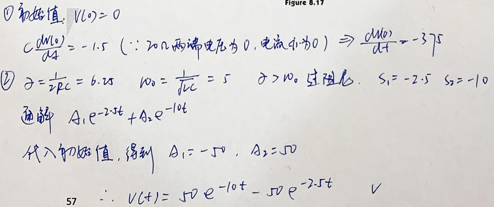
10. 
11. 

## 知识点3：阶跃响应与冲激响应

1、如下图所示电路，已知两个电容的初始电压均为 0，求 t > 0 时 vo 的表达式，其中 u(t) 为单位阶跃函数。

**参考解答**

1. 解：

   

   
   $$
   \begin{cases}
   v_1(0^+)=v_2(0^+)=0 \\
   v_1(∞)=v_2(∞)=35V \\
   i_1(0^+)=\frac{35}{1}⇒\frac{dv_1(0^+)}{dt}=70 \\
   i_2(0^+)=0⇒\frac{dv_2(0^+)}{dt}=0 \\
   \end{cases}
   $$
   ​		turn off 电压源，求齐次方程的通解
   $$
   \begin{cases}
   \frac{v_1}{1}+\frac{1}{2}\frac{dv_1}{dt}+v_1-v_2=0 ····(1) \\
   \frac{v_1-v_2}{1}=\frac{1}{3}\frac{dv_2}{dt}····(2)
   \end{cases}
   $$
   ​		将 $v_1=v_2+\frac{1}{3}\frac{dv_2}{dt}$ 代入 (1) 式中，得：
   $$
   \begin{cases}
   \frac{d^2v_2}{dt^2}+7\frac{dv_2}{dt}+6v_2=0 \\
   s^2+7s+6=0 \\
   s_1=-1,s_2=-6 \\
   ∴v_2=Ae^{-t}+Be^{-6t}+35
   \end{cases}
   $$
   ​		将 $v_2(0^+)=0,\frac{dv_2(0^+)}{dt}=0$ 代入上式，得到：
   $$
   \begin{cases}
   A+B+35=0 \\
   -A-6B=0
   \end{cases}
   ⇒A=-42,B=7
   $$

   $$
   ∴v_2=(-42e^{-t}+7e^{-6t}+35)V
   $$

   ​		流过 $\frac{1}{3}F$ 的电流 $i=\frac{1}{3}\frac{dv_2}{dt}=\frac{1}{3}(42e^{-t}-42e^{-6t})=14(e^{-t}-e^{-6t})A$ 

   ​		故 $v_o=-i×1Ω=14(e^{-6t}-e^{-t})V$ 

   

## 知识点4：其他

1、换路是指电路的结构与参数突然改变，或激励的突然变化。换路时，电路服从的规则称为换路定则。换路定则1：如果流经电容的电流 $i_c$ 为有限值，那么电容上的 ________ 在换路瞬间不会突变。换路定则2：当电感电压 $v_L$ 为有限值时，电感中 ________ 在换路瞬间不会突变。

2、电路时域全响应可分解为零输入响应与零状态响应的组合，零输入响应是指当电路没有 ________ 信号时的激励响应；零状态响应是指电路无 ________ 时，电路的响应仅由外加信号的激励响应。

**参考解答**

1. 电压      电流
2. 外加      初始储能
